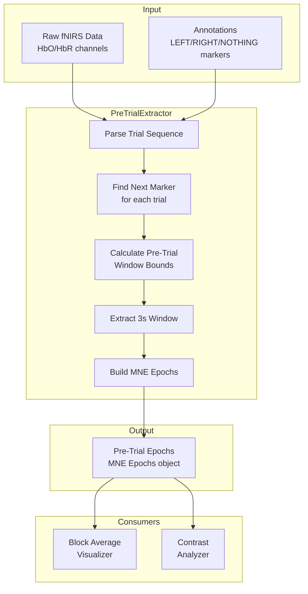

# Design Document: fNIRS Pre-Trial Epoch Extraction

## Overview

This design describes the implementation of a pre-trial epoch extraction system for fNIRS data analysis. The system extracts 3-second windows immediately preceding trial markers to capture stable hemodynamic baseline states, replacing the traditional stimulus-onset epoch extraction for block average and contrast analyses.

The key insight is that the last 3 seconds before a new trial represents a "stable baseline" state:
- For MOV trials: captures hemodynamic return-to-baseline after motor execution
- For NO MOV trials: captures true resting state just before motor task onset

## Architecture



## Components and Interfaces

### 1. Pre-Trial Epoch Extractor

**Location:** `src/affective_fnirs/fnirs_analysis.py`

**New Function:** `extract_pre_trial_epochs()`

```python
def extract_pre_trial_epochs(
    raw: mne.io.Raw,
    pre_trial_duration_sec: float = 3.0,
    mov_conditions: list[str] = ["LEFT", "RIGHT"],
    nomov_conditions: list[str] = ["NOTHING"],
) -> tuple[mne.Epochs, dict[str, int]]:
    """
    Extract fNIRS epochs from the pre-trial window before next marker.
    
    For MOV (LEFT/RIGHT) trials:
        - Extract last 3s before next trial marker
        - Captures hemodynamic return-to-baseline after motor execution
    
    For NO MOV (NOTHING) trials:
        - Extract last 3s before next LEFT/RIGHT marker
        - Captures true resting state before motor onset
    
    Args:
        raw: MNE Raw object with fNIRS HbO/HbR data and annotations.
        pre_trial_duration_sec: Duration of pre-trial window (default 3.0s).
        mov_conditions: List of motor condition names (default ["LEFT", "RIGHT"]).
        nomov_conditions: List of rest condition names (default ["NOTHING"]).
    
    Returns:
        epochs: MNE Epochs object with pre-trial windows.
        stats: Dictionary with extraction statistics:
            - 'n_mov_extracted': Number of MOV epochs extracted
            - 'n_nomov_extracted': Number of NO MOV epochs extracted
            - 'n_skipped': Number of trials skipped (edge cases)
    
    Raises:
        ValueError: If no valid trials found or raw has no annotations.
    """
```

### 2. Trial Sequence Parser

**Internal Helper:** `_parse_trial_sequence()`

```python
def _parse_trial_sequence(
    annotations: mne.Annotations,
    mov_conditions: list[str],
    nomov_conditions: list[str],
) -> list[dict]:
    """
    Parse annotations into ordered trial sequence with metadata.
    
    Returns list of trial dictionaries:
        {
            'onset': float,           # Trial onset time (seconds)
            'condition': str,         # 'LEFT', 'RIGHT', or 'NOTHING'
            'is_mov': bool,           # True for motor trials
            'next_marker_onset': float | None,  # Onset of next relevant marker
        }
    """
```

### 3. Pre-Trial Window Calculator

**Internal Helper:** `_calculate_pre_trial_bounds()`

```python
def _calculate_pre_trial_bounds(
    trial: dict,
    pre_trial_duration_sec: float,
    recording_duration_sec: float,
) -> tuple[float, float] | None:
    """
    Calculate start and end times for pre-trial window.
    
    Returns:
        (start_time, end_time) tuple in seconds, or None if invalid.
    """
```

### 4. Updated Block Average Visualizer

**Location:** `scripts/run_analysis_sub012.py`

**Modified Function:** `generate_fnirs_block_average_mov_nomov()`

The function signature remains unchanged, but internal logic switches to use pre-trial epochs:

```python
def generate_fnirs_block_average_mov_nomov(
    fnirs_epochs: mne.Epochs,  # Now expects pre-trial epochs
    output_path: Path,
    config: SubjectConfig,
    good_channels: Optional[list[str]] = None,
) -> Optional[Path]:
    """
    Generate block-averaged comparison of MOV vs NO MOV pre-trial states.
    
    Changes from original:
    - Input epochs are 3-second pre-trial windows (not 35-second HRF windows)
    - Plots show stable baseline amplitude, not HRF time course
    - Labels updated to indicate "Pre-Trial" extraction method
    """
```

### 5. Updated Contrast Analyzer

**Location:** `scripts/run_analysis_sub012.py`

**Modified Function:** `generate_fnirs_contrast_map_anterior()`

```python
def generate_fnirs_contrast_map_anterior(
    fnirs_epochs: mne.Epochs,  # Now expects pre-trial epochs
    output_path: Path,
    config: SubjectConfig,
) -> Optional[Path]:
    """
    Generate contrast maps using pre-trial epoch amplitudes.
    
    Changes from original:
    - Amplitude computed as mean across 3-second window (not task window)
    - Title/labels updated to indicate pre-trial analysis
    """
```

## Data Models

### Trial Metadata Structure

```python
@dataclass
class TrialInfo:
    """Metadata for a single trial in the sequence."""
    
    onset_sec: float
    """Trial marker onset time in seconds from recording start."""
    
    condition: str
    """Trial condition: 'LEFT', 'RIGHT', or 'NOTHING'."""
    
    is_mov: bool
    """True if this is a motor trial (LEFT or RIGHT)."""
    
    next_marker_onset_sec: float | None
    """Onset time of the next relevant marker, or None if last trial."""
    
    pre_trial_start_sec: float | None
    """Start time of pre-trial window, or None if cannot be extracted."""
    
    pre_trial_end_sec: float | None
    """End time of pre-trial window (equals next_marker_onset_sec)."""
```

### Extraction Statistics

```python
@dataclass
class PreTrialExtractionStats:
    """Statistics from pre-trial epoch extraction."""
    
    n_mov_extracted: int
    """Number of MOV (LEFT/RIGHT) epochs successfully extracted."""
    
    n_nomov_extracted: int
    """Number of NO MOV (NOTHING) epochs successfully extracted."""
    
    n_skipped_insufficient_data: int
    """Trials skipped due to insufficient data before next marker."""
    
    n_skipped_no_next_marker: int
    """Trials skipped because no subsequent marker exists."""
    
    n_skipped_last_trial: int
    """Trials skipped because they are the last in the recording."""
```

## Correctness Properties

*A property is a characteristic or behavior that should hold true across all valid executions of a system—essentially, a formal statement about what the system should do. Properties serve as the bridge between human-readable specifications and machine-verifiable correctness guarantees.*

