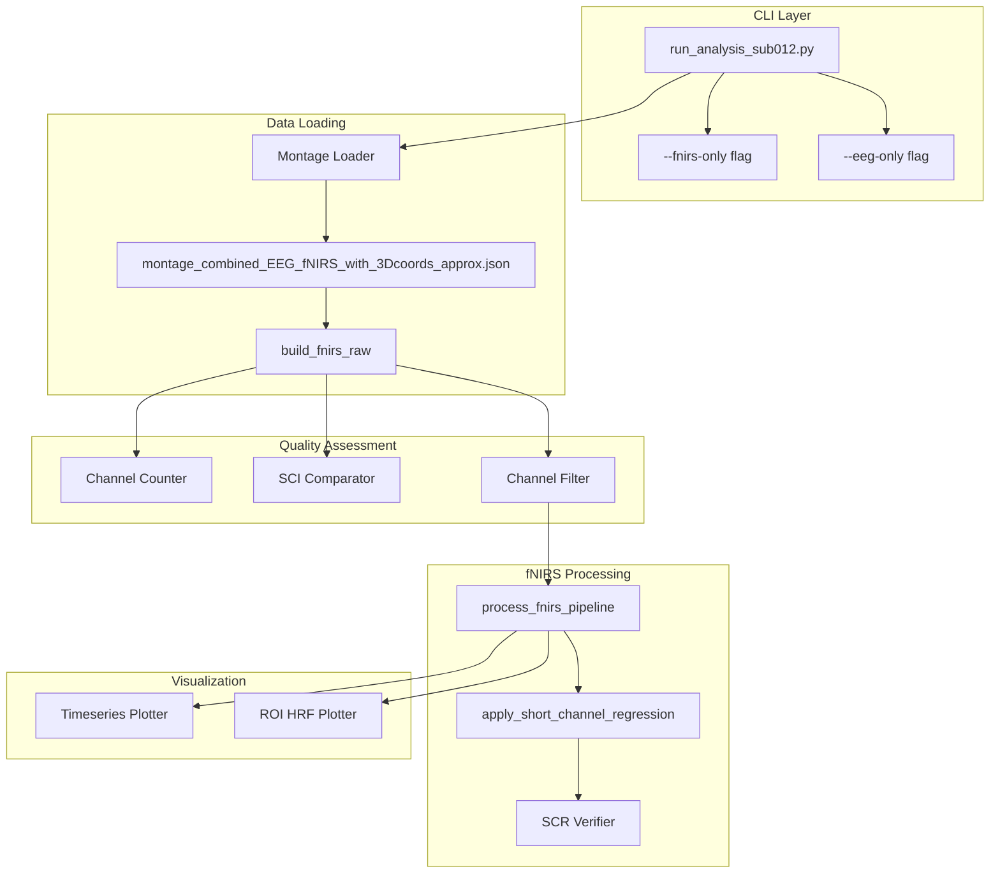

# Design Document: fNIRS Sub-012 Enhancements

## Overview

This design document specifies the technical implementation for enhancing the fNIRS processing pipeline for subject 012 in the affective-fnirs project. The enhancements target `scripts/run_analysis_sub012.py` and supporting modules to add single-modality CLI flags, load a new 24-pair montage, correct QA channel counts, verify SCI plots, filter bad channels, and add new visualization functions (full-experiment time series and 4-ROI HRF plots), plus verify ROI-specific short channel regression.

The implementation follows the existing architecture patterns in `src/affective_fnirs/` and maintains compatibility with the MNE-NIRS processing workflow.

## Architecture



## Components and Interfaces

### 1. CLI Argument Parser Enhancement

Modify the `argparse` configuration in `main()` to add mutually exclusive modality flags.

```python
def create_argument_parser() -> argparse.ArgumentParser:
    """
    Create argument parser with single-modality flags.
    
    Returns:
        Configured ArgumentParser with --fnirs-only and --eeg-only flags.
    """
    parser = argparse.ArgumentParser(description="Sub-012 Analysis")
    parser.add_argument(
        "--config", 
        type=Path, 
        default=Path("configs/sub-012.yml"),
        help="Path to config file"
    )
    
    modality_group = parser.add_mutually_exclusive_group()
    modality_group.add_argument(
        "--fnirs-only",
        action="store_true",
        help="Run fNIRS pipeline only, skip EEG processing"
    )
    modality_group.add_argument(
        "--eeg-only",
        action="store_true",
        help="Run EEG pipeline only, skip fNIRS processing"
    )
    
    return parser
```

### 2. Montage Loader Component

The montage loading logic already exists in `main()`. Enhance it with explicit error handling and validation.

```python
def load_sub012_montage(config: SubjectConfig) -> dict[str, Any]:
    """
    Load the extended 24-pair montage JSON for sub-012.
    
    Args:
        config: Subject configuration with data_root path.
        
    Returns:
        Parsed montage JSON containing ChMontage key.
        
    Raises:
        FileNotFoundError: If montage file does not exist.
        ValueError: If ChMontage key is missing.
    """
    montage_path = (
        config.data_root 
        / f"sub-{config.subject.id}" 
        / f"ses-{config.subject.session}" 
        / "montage_combined_EEG_fNIRS_with_3Dcoords_approx.json"
    )
    
    if not montage_path.exists():
        raise FileNotFoundError(
            f"Montage file not found: {montage_path}"
        )
    
    with open(montage_path, "r") as f:
        montage_json = json.load(f)
    
    if "ChMontage" not in montage_json:
        raise ValueError(
            f"Montage file missing 'ChMontage' key: {montage_path}"
        )
    
    return montage_json
```

### 3. Channel Counter Fix

Modify the QA results post-processing to count only `fnirs_cw_amplitude` channels.

```python
def count_fnirs_channels(raw_fnirs: mne.io.Raw) -> int:
    """
    Count only fNIRS wavelength channels, excluding misc/AUX.
    
    Args:
        raw_fnirs: MNE Raw object with fNIRS data.
        
    Returns:
        Number of fnirs_cw_amplitude channels.
    """
    fnirs_picks = mne.pick_types(raw_fnirs.info, fnirs=True, exclude=[])
    return len(fnirs_picks)
```

### 4. Channel Filter Component

Create a function to identify and mark bad channels based on SCI threshold.

```python
def filter_channels_by_sci(
    raw_fnirs: mne.io.Raw,
    sci_threshold: float = 0.50,
) -> tuple[list[str], list[str]]:
    """
    Classify channels as good/bad based on SCI threshold.
    
    Args:
        raw_fnirs: MNE Raw object with fNIRS intensity data.
        sci_threshold: SCI threshold (channels with SCI <= threshold are bad).
        
    Returns:
        Tuple of (good_channel_pairs, bad_channel_pairs).
        Channel pairs are in format "S1_D1".
    """
    # Pick only fNIRS channels
    fnirs_picks = mne.pick_types(raw_fnirs.info, fnirs=True, exclude=[])
    raw_fnirs_only = raw_fnirs.copy().pick(fnirs_picks)
    
    # Calculate SCI for all channels
    sci_values = calculate_sci(raw_fnirs_only, sci_threshold=0.0)
    
    good_pairs = [pair for pair, sci in sci_values.items() if sci > sci_threshold]
    bad_pairs = [pair for pair, sci in sci_values.items() if sci <= sci_threshold]
    
    return good_pairs, bad_pairs


def mark_bad_channels_in_info(
    raw: mne.io.Raw,
    bad_pairs: list[str],
) -> None:
    """
    Mark all wavelength channels belonging to bad pairs as bads in MNE info.
    
    Args:
        raw: MNE Raw object (modified in place).
        bad_pairs: List of bad channel pairs (e.g., ["S1_D1", "S2_D3"]).
    """
    bad_channels = []
    for ch_name in raw.ch_names:
        # Channel names are "S1_D1 760" or "S1_D1 hbo"
        base_pair = ch_name.split(" ")[0]
        if base_pair in bad_pairs:
            bad_channels.append(ch_name)
    
    raw.info["bads"] = bad_channels
```

### 5. Timeseries Plotter Component

The function `generate_fnirs_timeseries_plot()` already exists. Enhance it to filter by good channels.

```python
def generate_fnirs_timeseries_plot(
    raw_haemo: mne.io.Raw,
    output_path: Path,
    config: SubjectConfig,
    good_channels: Optional[list[str]] = None,
) -> Optional[Path]:
    """
    Generate full-experiment HbO/HbR time series plot.
    
    Args:
        raw_haemo: Preprocessed hemoglobin data (hbo/hbr channels).
        output_path: Directory to save the plot.
        config: Subject configuration.
        good_channels: List of good channel pairs (e.g., ["S1_D1"]).
                       If None, uses all channels.
    
    Returns:
        Path to saved PNG file, or None if no good channels.
    """
    # Implementation filters channels, computes mean ± std,
    # plots HbO/HbR in stacked subplots with stimulus markers
```

### 6. ROI HRF Plotter Component

The function `generate_fnirs_hrf_by_condition_4roi()` already exists. Verify ROI assignments match the montage.

```python
# ROI definitions for sub-012 montage
ROI_DEFINITIONS: dict[str, list[str]] = {
    "Left Anterior": ["S1_", "S9_"],
    "Right Anterior": ["S2_", "S10_"],
    "Left Posterior": ["S3_", "S4_", "S5_"],
    "Right Posterior": ["S6_", "S7_", "S8_"],
}

def generate_fnirs_hrf_by_condition_4roi(
    epochs: mne.Epochs,
    output_path: Path,
    config: SubjectConfig,
    good_channels: Optional[list[str]] = None,
) -> Optional[Path]:
    """
    Generate 4-ROI HRF-by-condition plot (4 rows × 2 columns).
    
    Args:
        epochs: fNIRS epochs with HbO/HbR data.
        output_path: Directory to save the plot.
        config: Subject configuration.
        good_channels: List of good channel pairs to include.
        
    Returns:
        Path to saved PNG file.
    """
    # Implementation creates 8-subplot figure,
    # assigns channels to ROIs by source prefix,
    # plots condition-averaged HRF traces
```

### 7. SCR Verifier Component

Add verification and logging for short channel regression pairing.

```python
# Short channel to ROI mapping for sub-012
SHORT_CHANNEL_ROI_MAP: dict[str, dict[str, Any]] = {
    "S13_D1": {
        "roi": "Left Anterior",
        "long_sources": ["S1", "S9"],
    },
    "S14_D3": {
        "roi": "Right Anterior", 
        "long_sources": ["S2", "S10"],
    },
    "S15_D6": {
        "roi": "Left Posterior",
        "long_sources": ["S3", "S4", "S5"],
    },
    "S16_D9": {
        "roi": "Right Posterior",
        "long_sources": ["S6", "S7", "S8"],
    },
}


def verify_scr_pairing(
    raw_od: mne.io.Raw,
    short_channels: list[str],
    long_channels: list[str],
) -> dict[str, Any]:
    """
    Verify short channel regression pairing matches expected ROI mapping.
    
    Args:
        raw_od: MNE Raw object in optical density space.
        short_channels: List of short channel names.
        long_channels: List of long channel names.
        
    Returns:
        Dictionary with verification results:
            - pairing_correct: bool
            - actual_pairing: dict mapping short → list of long channels
            - expected_pairing: dict from SHORT_CHANNEL_ROI_MAP
            - mismatches: list of mismatch descriptions
    """


def log_scr_noise_reduction(
    raw_od_before: mne.io.Raw,
    raw_od_after: mne.io.Raw,
    roi_map: dict[str, list[str]],
) -> dict[str, float]:
    """
    Log mean power reduction in systemic band (0.1-0.4 Hz) per ROI.
    
    Args:
        raw_od_before: OD data before SCR.
        raw_od_after: OD data after SCR.
        roi_map: Mapping of ROI name to channel list.
        
    Returns:
        Dictionary mapping ROI name to percent power reduction.
    """
```

## Data Models

### Modality Mode Enum

```python
from enum import Enum, auto

class ModalityMode(Enum):
    """Pipeline execution mode based on CLI flags."""
    FULL_MULTIMODAL = auto()  # Default: both EEG and fNIRS
    FNIRS_ONLY = auto()       # --fnirs-only flag
    EEG_ONLY = auto()         # --eeg-only flag
```

### ROI Definition Dataclass

```python
from dataclasses import dataclass

@dataclass(frozen=True)
class ROIDefinition:
    """Definition of a region of interest for fNIRS analysis."""
    name: str
    source_prefixes: tuple[str, ...]
    short_channel: Optional[str]  # e.g., "S13_D1"
    
    def matches_channel(self, channel_name: str) -> bool:
        """Check if channel belongs to this ROI based on source prefix."""
        base_pair = channel_name.split(" ")[0]
        source = base_pair.split("_")[0]
        return any(source.startswith(prefix.rstrip("_")) for prefix in self.source_prefixes)
```

### SCR Verification Result

```python
@dataclass
class SCRVerificationResult:
    """Result of short channel regression verification."""
    pairing_correct: bool
    actual_pairing: dict[str, list[str]]
    expected_pairing: dict[str, list[str]]
    mismatches: list[str]
    noise_reduction_by_roi: dict[str, float]
```


## Correctness Properties

*A property is a characteristic or behavior that should hold true across all valid executions of a system—essentially, a formal statement about what the system should do. Properties serve as the bridge between human-readable specifications and machine-verifiable correctness guarantees.*

### Property 1: CLI Flag Mutual Exclusivity

*For any* argument parser configuration, providing both `--fnirs-only` and `--eeg-only` flags simultaneously shall raise an argument error, and providing exactly one flag shall set the corresponding modality mode without error.

**Validates: Requirements 1.1, 1.2, 1.6**

### Property 2: Single-Modality Flag Skips Other Modality

*For any* pipeline execution with `--fnirs-only` flag, no EEG-related functions (build_eeg_raw, run_eeg_analysis, generate_tfr_maps, etc.) shall be called; conversely, with `--eeg-only` flag, no fNIRS-related functions shall be called.

**Validates: Requirements 1.3, 1.4, 1.5**

### Property 3: Channel Count Excludes Misc Channels

*For any* MNE Raw object containing both `fnirs_cw_amplitude` and `misc` channel types, the channel counter shall return only the count of `fnirs_cw_amplitude` channels.

**Validates: Requirements 3.1, 3.2**

### Property 4: Channel Type Assignment from Montage

*For any* valid montage configuration with N source-detector pairs at 2 wavelengths plus M auxiliary columns, `build_fnirs_raw()` shall produce an MNE Raw object with exactly 2N channels typed as `fnirs_cw_amplitude` and M channels typed as `misc`.

**Validates: Requirements 2.4**

### Property 5: SCI-Based Channel Classification and Marking

*For any* source-detector pair with SCI value V and threshold T, the pair shall be classified as Good_Channel if V > T and Bad_Channel otherwise; furthermore, both wavelength channels (760nm and 850nm) belonging to a Bad_Channel pair shall be added to `raw.info['bads']`.

**Validates: Requirements 5.2, 5.3**

### Property 6: Timeseries Plot Structure

*For any* valid hemoglobin data with at least one good HbO and one good HbR channel, the timeseries plotter shall produce a figure with exactly 2 vertically stacked subplots where the top subplot contains HbO data and the bottom contains HbR data, each showing mean trace with ±1 standard deviation shaded band.

**Validates: Requirements 6.1, 6.2**

### Property 7: Stimulus Markers in Timeseries Plot

*For any* annotation in the hemoglobin data, the timeseries plot shall contain a vertical dashed line at the annotation onset time, with color determined by condition (LEFT=green, RIGHT=purple, NOTHING=gray).

**Validates: Requirements 6.4**

### Property 8: ROI HRF Plot Structure

*For any* valid fNIRS epochs object, the ROI HRF plotter shall produce a figure with exactly 8 subplots arranged as 4 rows (one per ROI: Left Anterior, Right Anterior, Left Posterior, Right Posterior) × 2 columns (HbO, HbR).

**Validates: Requirements 7.1**

### Property 9: ROI Channel Assignment and Filtering

*For any* fNIRS channel with source label matching prefix P, the channel shall be assigned to the ROI whose source_prefixes contains P; furthermore, channels not in the good_channels list shall be excluded from ROI averages.

**Validates: Requirements 7.2, 7.6**

### Property 10: SCR Pairing Matches Expected ROI Mapping

*For any* execution of short channel regression on the sub-012 montage, the proximity-based pairing shall assign short channel S13_D1 to regress Left Anterior long channels (S1, S9), S14_D3 to Right Anterior (S2, S10), S15_D6 to Left Posterior (S3, S4, S5), and S16_D9 to Right Posterior (S6, S7, S8).

**Validates: Requirements 8.2**

### Property 11: SCR Processing Order

*For any* fNIRS processing pipeline execution with `apply_scr=True`, short channel regression shall be applied to optical density data before the modified Beer-Lambert law conversion to hemoglobin concentrations.

**Validates: Requirements 8.7**

## Error Handling

### Montage Loading Errors

| Error Condition | Handling Strategy |
|-----------------|-------------------|
| Montage file not found | Log error with attempted path, terminate pipeline with exit code 1 |
| ChMontage key missing | Log error identifying missing key, terminate pipeline |
| Invalid channel count | Log warning, continue with available channels |

### Channel Quality Errors

| Error Condition | Handling Strategy |
|-----------------|-------------------|
| All channels fail SCI threshold | Log warning, proceed with empty good_channels list |
| All ROI channels are bad | Display empty subplot with "No good channels" annotation |
| SCI calculation fails | Log error, fall back to including all channels |

### Short Channel Regression Errors

| Error Condition | Handling Strategy |
|-----------------|-------------------|
| Short channel missing from montage | Log warning identifying ROI, skip SCR for that ROI only |
| Short channel marked as bad | Log warning, skip SCR for that ROI only |
| Incorrect proximity pairing detected | Log warning with mismatch details, fall back to explicit ROI-based pairing |
| MNE-NIRS SCR function fails | Log error, continue without SCR (preserve OD data) |

### Visualization Errors

| Error Condition | Handling Strategy |
|-----------------|-------------------|
| Zero good HbO/HbR channels | Log warning, return None without saving file |
| No epochs for condition | Skip condition in legend, continue with available conditions |
| Plot save fails | Log error with path, continue pipeline |

## Testing Strategy

### Unit Tests

Unit tests verify specific examples and edge cases:

1. **CLI Argument Parsing**
   - Test `--fnirs-only` sets correct mode
   - Test `--eeg-only` sets correct mode
   - Test both flags together raises error
   - Test neither flag runs full pipeline

2. **Montage Loading**
   - Test successful load from valid path
   - Test FileNotFoundError for missing file
   - Test ValueError for missing ChMontage key

3. **Channel Counting**
   - Test count with mixed channel types
   - Test count with only fnirs_cw_amplitude
   - Test count with only misc channels (returns 0)

4. **SCI Classification**
   - Test boundary case: SCI exactly at threshold (should be bad)
   - Test SCI above threshold (good)
   - Test SCI below threshold (bad)

5. **ROI Assignment**
   - Test each source prefix maps to correct ROI
   - Test unknown source prefix handling

### Property-Based Tests

Property-based tests use Hypothesis library (already in environment.yml) to verify universal properties:

```python
from hypothesis import given, strategies as st

# Property 3: Channel count excludes misc
@given(n_fnirs=st.integers(1, 100), n_misc=st.integers(0, 20))
def test_channel_count_excludes_misc(n_fnirs: int, n_misc: int):
    """
    Feature: fnirs-sub012-enhancements, Property 3: Channel count excludes misc
    """
    raw = create_mock_raw_with_types(n_fnirs, n_misc)
    count = count_fnirs_channels(raw)
    assert count == n_fnirs

# Property 5: SCI classification
@given(sci_value=st.floats(0.0, 1.0), threshold=st.floats(0.0, 1.0))
def test_sci_classification(sci_value: float, threshold: float):
    """
    Feature: fnirs-sub012-enhancements, Property 5: SCI-based classification
    """
    is_good = sci_value > threshold
    # Verify classification matches expected
```

### Test Configuration

- Minimum 100 iterations per property test
- Tests tagged with feature name and property number
- Property tests located in `tests/test_fnirs_sub012_properties.py`
- Unit tests located in `tests/test_fnirs_sub012.py`

### Integration Tests

Integration tests verify end-to-end behavior:

1. **Single-modality pipeline execution**
   - Run with `--fnirs-only`, verify no EEG outputs
   - Run with `--eeg-only`, verify no fNIRS outputs

2. **Full pipeline with new montage**
   - Verify 48 fNIRS channels in output
   - Verify SCI comparison plot generated
   - Verify timeseries plot generated
   - Verify 4-ROI HRF plot generated

3. **SCR verification**
   - Verify short-to-long pairing logged
   - Verify noise reduction metrics logged
