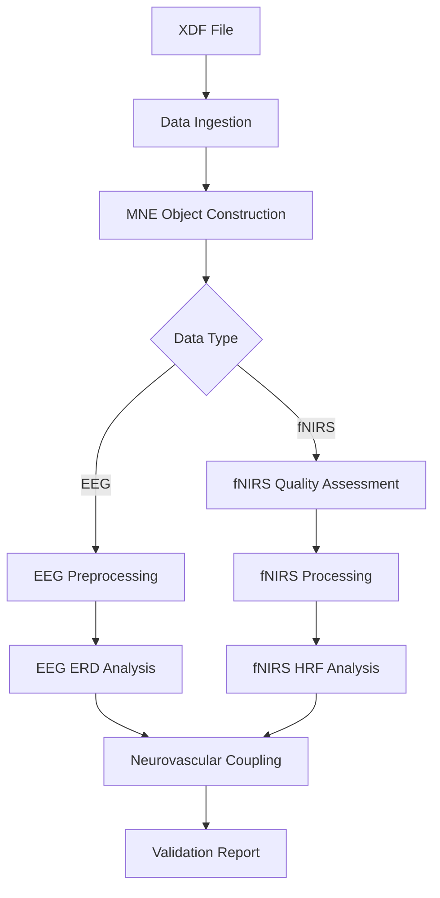

# Design Document: Multimodal Validation Pipeline

## Overview

This document describes the design for a validation and analysis pipeline that processes simultaneous EEG + fNIRS recordings during a finger tapping task. The pipeline validates signal quality, detects expected neural patterns (ERD/ERS), hemodynamic responses (HRF), and quantifies neurovascular coupling.

The system follows a modular architecture with clear separation between data ingestion, quality assessment, signal processing, analysis, and reporting. All processing adheres to BIDS standards and maintains data immutability (read-only access to raw data).

### Key Design Principles

1. **Modularity**: Each processing stage is independent and testable
2. **BIDS Compliance**: All inputs/outputs follow BIDS naming and structure
3. **Configurability**: All parameters (filters, thresholds, windows) are configurable
4. **Reproducibility**: Deterministic outputs with seed control for stochastic operations
5. **Quality-First**: Automated quality metrics guide channel selection before analysis
6. **Scientific Validity**: All algorithms follow established neuroscience best practices

### Technology Stack

- **Language**: Python 3.11
- **Core Libraries**: 
  - MNE-Python (EEG/fNIRS data structures and processing)
  - MNE-NIRS (fNIRS-specific algorithms)
  - pyXDF (XDF file loading)
  - NumPy, SciPy (numerical operations)
  - Pandas (tabular data)
  - Matplotlib (visualization)
- **Environment**: micromamba with pinned dependencies

## Architecture


The pipeline follows a sequential processing architecture with six main stages:



### Stage 1: Data Ingestion
- Load XDF file and identify streams (EEG, fNIRS, Markers)
- Extract raw data arrays and metadata
- Validate stream integrity

### Stage 2: MNE Object Construction
- Build MNE Raw objects with proper channel info
- Apply montages (10-20 for EEG, custom for fNIRS)
- Embed event markers with synchronized timestamps

### Stage 3: Quality Assessment (fNIRS only)
- Calculate Scalp Coupling Index (SCI)
- Detect saturation and noise (CV)
- Mark bad channels before processing

### Stage 4: Signal Processing
- **EEG**: Bandpass filter → ICA artifact removal → Re-referencing
- **fNIRS**: Motion correction → Short channel regression → Hemoglobin conversion

### Stage 5: Analysis
- **EEG**: Time-frequency analysis (TFR) → ERD/ERS detection
- **fNIRS**: Epoching → HRF extraction → Temporal dynamics validation
- **Multimodal**: Cross-correlation for neurovascular coupling

### Stage 6: Reporting
- Generate quality tables, spectrograms, HRF plots
- Summarize validation results


## Detailed Design: Data Ingestion and MNE Object Construction

This section provides detailed implementation guidance for the critical first stages of the pipeline: loading XDF files, extracting synchronized streams, and constructing properly configured MNE objects.

### Temporal Alignment of XDF Streams

**Objective**: Ensure EEG, fNIRS, and marker streams are perfectly synchronized with <1ms latency tolerance.

**Implementation Strategy**:

1. **Extract timestamps from PyXDF**: Each stream in the XDF file contains a `time_stamps` array with LSL timestamps for every sample. These timestamps are in the LSL clock domain and must be used for synchronization.

2. **Create MNE Annotations**: Convert marker timestamps to sample indices in the continuous data:
   ```python
   # For each marker event
   marker_time_lsl = marker_stream['time_stamps'][event_idx]
   
   # Find corresponding sample index in EEG/fNIRS
   # Assuming raw.times contains timestamps aligned with LSL
   sample_idx = raw.time_as_index(marker_time_lsl)
   
   # Create annotation
   onset_sec = marker_time_lsl - raw.first_samp / raw.info['sfreq']
   annotation = mne.Annotations(onset=[onset_sec], 
                                 duration=[0], 
                                 description=[event_name])
   ```

3. **Validate synchronization**: After embedding events, verify that marker onsets align with expected data features (e.g., movement onset should precede ERD). If temporal drift exceeds 1ms, raise a detailed error:
   ```python
   if abs(expected_time - actual_time) > 0.001:
       raise DataIngestionError(
           f"Temporal misalignment detected: "
           f"Expected marker at {expected_time:.6f}s, "
           f"found at {actual_time:.6f}s. "
           f"Drift: {(actual_time - expected_time)*1000:.2f}ms"
       )
   ```

4. **Handle clock drift**: If streams have different clock sources, use LSL's built-in clock synchronization. PyXDF automatically applies clock offset corrections when loading.

**Reference**: [LSL timestamp synchronization](https://pmc.ncbi.nlm.nih.gov) ensures sub-millisecond accuracy across streams.

### EEG Montage: 10-20/10-10 Standard

**Objective**: Assign anatomical coordinates to all EEG channels for spatial analysis and visualization.

**Channel List Analysis**: The pilot data contains:
- Standard 10-20 channels: Fp1, Fp2, F3, F4, C3, C4, P3, P4, O1, O2, F7, F8, T7, T8, P7, P8, Fz, Cz, Pz
- Extended 10-10 channels: F9, F10, P9, P10 (not in basic 10-20)
- Auxiliary channels: AUX_1, AUX_2, AUX_3 (no anatomical position)

**Implementation**:

1. **Use extended montage**: The `standard_1020` montage in MNE includes ~94 positions covering both 10-20 and 10-10 systems:
   ```python
   montage = mne.channels.make_standard_montage("standard_1020")
   ```

2. **Mark auxiliary channels**: Before applying montage, set auxiliary channels to type 'misc' to prevent warnings:
   ```python
   aux_channels = [ch for ch in raw.ch_names if 'AUX' in ch]
   raw.set_channel_types({ch: 'misc' for ch in aux_channels})
   ```

3. **Apply montage**: This adds 3D coordinates to all recognized channels:
   ```python
   raw.set_montage(montage, on_missing='warn')
   ```

4. **Validate coverage**: After montage application, verify that all EEG channels (excluding AUX) have positions:
   ```python
   eeg_channels = [ch for ch in raw.ch_names 
                   if raw.get_channel_types([ch])[0] == 'eeg']
   missing_positions = [ch for ch in eeg_channels 
                        if raw.info['chs'][raw.ch_names.index(ch)]['loc'][:3].sum() == 0]
   
   if missing_positions:
       raise ValueError(
           f"Channels without positions after montage: {missing_positions}. "
           f"Verify channel names match standard 10-20/10-10 nomenclature."
       )
   ```

**Reference**: [MNE montage documentation](https://mne.tools) provides details on standard montages.

### fNIRS Raw Object Construction

**Objective**: Create MNE Raw object with correct channel types and wavelength pairing for hemoglobin conversion.

**Critical Considerations**:

1. **Channel type assignment**: fNIRS continuous wave amplitude data must be labeled as `fnirs_cw_amplitude`:
   ```python
   # After creating Raw object with generic channel types
   fnirs_channel_types = {ch: 'fnirs_cw_amplitude' for ch in raw.ch_names}
   raw.set_channel_types(fnirs_channel_types)
   ```

2. **Wavelength pairing**: Each source-detector pair must have two channels (760nm and 850nm) correctly identified. The current JSON naming (`...Hb` vs `...HbO`) is misleading at this stage—these are raw intensities, not hemoglobin concentrations yet.

   **Recommended naming convention**:
   ```python
   # Example: Source 1 to Detector 1
   "S1_D1 760"  # 760nm wavelength
   "S1_D1 850"  # 850nm wavelength
   ```

3. **Wavelength metadata**: Store wavelength information in channel metadata:
   ```python
   for ch_name in raw.ch_names:
       ch_idx = raw.ch_names.index(ch_name)
       if '760' in ch_name:
           raw.info['chs'][ch_idx]['loc'][9] = 760e-9  # Store in meters
       elif '850' in ch_name:
           raw.info['chs'][ch_idx]['loc'][9] = 850e-9
   ```

4. **Validate channel-data alignment**: The order of channels in the JSON must match the column order in the data matrix:
   ```python
   json_channels = montage_config['ChMontage']['Channels']
   data_n_channels = data.shape[1]
   
   if len(json_channels) != data_n_channels:
       raise ValueError(
           f"Channel count mismatch: JSON defines {len(json_channels)} channels, "
           f"but data matrix has {data_n_channels} columns. "
           f"Verify JSON 'ChMontage' matches XDF stream channel count."
       )
   
   # Validate each channel index
   for ch_info in json_channels:
       ch_idx = ch_info['Index']
       if ch_idx >= data_n_channels:
           raise ValueError(
               f"Channel '{ch_info['Name']}' has Index={ch_idx}, "
               f"but data matrix only has {data_n_channels} columns (0-indexed). "
               f"Check JSON channel indices."
           )
   ```

5. **Source-detector distance**: Store optode positions and compute distances for short channel identification:
   ```python
   # Extract source and detector positions from montage_config
   sources = montage_config['ChMontage']['Sources']
   detectors = montage_config['ChMontage']['Detectors']
   
   # For each channel, compute source-detector distance
   for ch_info in json_channels:
       src_idx = ch_info['SourceIndex']
       det_idx = ch_info['DetectorIndex']
       
       src_pos = np.array(sources[src_idx]['Position'])
       det_pos = np.array(detectors[det_idx]['Position'])
       
       distance_mm = np.linalg.norm(src_pos - det_pos)
       
       # Store in channel metadata (loc field)
       ch_idx = raw.ch_names.index(ch_info['Name'])
       raw.info['chs'][ch_idx]['loc'][10] = distance_mm / 1000  # Store in meters
   ```

**Reference**: [MNE-NIRS channel types](https://mne.tools) documentation.

### Event Marker Synchronization

**Objective**: Embed task events into MNE Raw objects with precise temporal alignment.

**Implementation**:

1. **Extract marker stream**: Identify the markers stream from XDF:
   ```python
   marker_stream = streams['markers']
   marker_data = marker_stream['time_series']  # Event names/codes
   marker_times = marker_stream['time_stamps']  # LSL timestamps
   ```

2. **Map event names to codes**: Create a human-readable event dictionary:
   ```python
   # Example for finger tapping task
   event_mapping = {
       'task_start': 1,
       'block_start': 2,
       'tap_cue': 3,
       'block_end': 4,
       'task_end': 5
   }
   
   # If XDF contains numeric codes, reverse map
   if marker_data[0].isdigit():
       reverse_mapping = {v: k for k, v in event_mapping.items()}
       marker_names = [reverse_mapping.get(int(m), f'unknown_{m}') 
                       for m in marker_data]
   else:
       marker_names = marker_data
   ```

3. **Convert to MNE Annotations**: Calculate onset times relative to recording start:
   ```python
   # Assuming raw.first_samp is 0 and raw.times[0] corresponds to first LSL timestamp
   recording_start_lsl = raw.times[0]  # Or extract from XDF header
   
   onsets = marker_times - recording_start_lsl
   durations = [0] * len(onsets)  # Point events
   descriptions = marker_names
   
   annotations = mne.Annotations(onset=onsets, 
                                  duration=durations, 
                                  description=descriptions)
   raw.set_annotations(annotations)
   ```

4. **Validate event presence**: Check that all expected events are present:
   ```python
   expected_events = ['task_start', 'block_start', 'tap_cue', 'block_end']
   found_events = set(annotations.description)
   missing_events = set(expected_events) - found_events
   
   if missing_events:
       raise ValidationError(
           f"Missing expected events: {missing_events}. "
           f"Found events: {found_events}. "
           f"Verify marker stream contains all task markers."
       )
   ```

5. **Verify temporal precision**: For critical events (e.g., movement onset), validate alignment:
   ```python
   # Example: Check that tap_cue events are evenly spaced
   tap_cues = [onset for onset, desc in zip(annotations.onset, annotations.description) 
               if desc == 'tap_cue']
   
   if len(tap_cues) > 1:
       intervals = np.diff(tap_cues)
       expected_interval = 2.0  # 2 seconds between taps
       tolerance = 0.001  # 1ms
       
       deviations = np.abs(intervals - expected_interval)
       if np.any(deviations > tolerance):
           max_deviation = np.max(deviations)
           raise ValidationError(
               f"Tap cue timing irregular: max deviation {max_deviation*1000:.2f}ms. "
               f"Expected {expected_interval}s intervals. "
               f"Check marker stream synchronization."
           )
   ```

**Reference**: [MNE Annotations](https://mne.tools) for event handling.

### Error Handling for Data Ingestion

**Comprehensive error reporting** is critical for debugging multimodal data issues:

1. **Stream identification failure**:
   ```python
   if 'eeg' not in identified_streams:
       available = [s['info']['name'][0] for s in streams]
       raise DataIngestionError(
           f"EEG stream not found. Available streams: {available}. "
           f"Expected stream name pattern: 'EEG' or 'BioSemi'. "
           f"Verify XDF file contains EEG data."
       )
   ```

2. **Channel mismatch**:
   ```python
   if json_ch_count != data_ch_count:
       raise DataIngestionError(
           f"Channel count mismatch in fNIRS data:\n"
           f"  JSON sidecar: {json_ch_count} channels\n"
           f"  XDF data matrix: {data_ch_count} columns\n"
           f"  JSON channels: {[ch['Name'] for ch in json_channels]}\n"
           f"Action: Verify JSON 'ChMontage' matches recording configuration."
       )
   ```

3. **Temporal misalignment**:
   ```python
   if temporal_drift > 0.001:
       raise DataIngestionError(
           f"Temporal drift detected between streams:\n"
           f"  EEG-Markers drift: {eeg_marker_drift*1000:.2f}ms\n"
           f"  fNIRS-Markers drift: {fnirs_marker_drift*1000:.2f}ms\n"
           f"  Tolerance: 1.0ms\n"
           f"Action: Check LSL clock synchronization during recording."
       )
   ```

4. **Missing markers**:
   ```python
   if not found_events:
       raise DataIngestionError(
           f"No marker events found in XDF file.\n"
           f"  Expected stream: 'Markers' or 'Events'\n"
           f"  Available streams: {available_stream_names}\n"
           f"Action: Verify marker stream was recorded and saved in XDF."
       )
   ```

### Summary Checklist

Before proceeding to quality assessment, verify:

- [ ] All three streams (EEG, fNIRS, Markers) successfully loaded from XDF
- [ ] EEG Raw object has 10-20/10-10 montage applied with spatial coordinates
- [ ] fNIRS Raw object has `fnirs_cw_amplitude` channel types
- [ ] fNIRS wavelength pairing (760nm, 850nm) is correct for each source-detector pair
- [ ] Event annotations embedded with <1ms temporal precision
- [ ] All expected task markers present in annotations
- [ ] Channel names match between JSON metadata and data matrix
- [ ] Auxiliary/misc channels properly labeled (not treated as EEG/fNIRS)

## Components and Interfaces

### 1. Data Ingestion Module (`ingestion.py`)

**Purpose**: Load XDF files and extract synchronized streams

**Key Functions**:

```python
def load_xdf_file(file_path: Path) -> tuple[list[dict], dict]:
    """
    Load XDF file and return streams and header.
    
    Args:
        file_path: Path to .xdf file
        
    Returns:
        streams: List of stream dictionaries
        header: XDF file header
        
    Raises:
        FileNotFoundError: If file doesn't exist
        ValueError: If file is corrupted
    """
    pass

def identify_streams(streams: list[dict]) -> dict[str, dict]:
    """
    Identify EEG, fNIRS, and Markers streams by name patterns.
    
    Args:
        streams: List of stream dictionaries from XDF
        
    Returns:
        Dictionary with keys 'eeg', 'fnirs', 'markers' mapping to stream dicts
        
    Raises:
        ValueError: If required streams are missing
    """
    pass

def extract_stream_data(stream: dict) -> tuple[np.ndarray, float, np.ndarray]:
    """
    Extract data array, sampling rate, and timestamps from stream.
    
    Args:
        stream: Stream dictionary from XDF
        
    Returns:
        data: (n_samples, n_channels) array
        sfreq: Sampling frequency in Hz
        timestamps: (n_samples,) array of timestamps
    """
    pass
```


### 2. MNE Construction Module (`mne_builder.py`)

**Purpose**: Convert raw stream data to MNE objects with metadata

**Key Functions**:

```python
def build_eeg_raw(
    data: np.ndarray,
    sfreq: float,
    channel_names: list[str],
    json_sidecar: dict
) -> mne.io.Raw:
    """
    Construct MNE Raw object for EEG with 10-20 montage.
    
    Args:
        data: (n_samples, n_channels) EEG data
        sfreq: Sampling frequency
        channel_names: List of channel names from JSON
        json_sidecar: Metadata from .json file
        
    Returns:
        MNE Raw object with montage applied
    """
    pass

def build_fnirs_raw(
    data: np.ndarray,
    sfreq: float,
    montage_config: dict
) -> mne.io.Raw:
    """
    Construct MNE Raw object for fNIRS with wavelength info.
    
    Args:
        data: (n_samples, n_channels) fNIRS data
        sfreq: Sampling frequency
        montage_config: Channel mapping from JSON (ChMontage)
        
    Returns:
        MNE Raw object with fNIRS channel types
        
    Raises:
        ValueError: If channel indices mismatch data matrix
    """
    pass

def embed_events(
    raw: mne.io.Raw,
    marker_stream: dict,
    event_mapping: dict[str, int]
) -> mne.io.Raw:
    """
    Add event annotations to Raw object from marker stream.
    
    Args:
        raw: MNE Raw object
        marker_stream: Markers stream from XDF
        event_mapping: Map marker names to integer codes
        
    Returns:
        Raw object with annotations embedded
    """
    pass
```


### 3. fNIRS Quality Assessment Module (`fnirs_quality.py`)

**Purpose**: Calculate quality metrics and identify bad channels following PHOEBE framework and neuroimaging best practices

**Scientific Background**:

Quality assessment in fNIRS is critical because poor optode-scalp coupling leads to weak signals dominated by noise rather than neural activity. The PHOEBE framework (Pollonini et al., 2016) established validated metrics for automated quality assessment:

1. **Scalp Coupling Index (SCI)**: Measures correlation between wavelengths in cardiac band (0.5-2.5 Hz). Good coupling → high correlation (>0.75-0.80).
2. **Peak Spectral Power (PSP)**: Quantifies cardiac pulsation strength. Clear pulse → PSP > 0.1.
3. **Coefficient of Variation (CV)**: Detects excessive noise in baseline periods. Stable signal → CV < 7.5-15%.
4. **Saturation Detection**: Identifies ADC overflow. Saturated channels → unreliable data.

**References**:
- Pollonini et al. (2016). PHOEBE: A method for real-time mapping of optodes-scalp coupling in functional near-infrared spectroscopy. [PMC4752525](https://pmc.ncbi.nlm.nih.gov)
- Hernandez & Pollonini (2020). NIRSplot: A tool for quality assessment of fNIRS scans. [PMC7677693](https://pmc.ncbi.nlm.nih.gov)
- Artinis Medical Systems. Quality assessment guidelines. [artinis.com](https://artinis.com)

**Key Functions**:

```python
def calculate_sci(
    raw: mne.io.Raw,
    freq_range: tuple[float, float] = (0.5, 2.5),
    sci_threshold: float = 0.8
) -> dict[str, float]:
    """
    Calculate Scalp Coupling Index for each channel pair using MNE-NIRS.
    
    Algorithm (following Pollonini et al., 2016):
    1. Verify Nyquist criterion: sfreq >= 2 * freq_range[1] (8.12 Hz > 5 Hz ✓)
    2. Bandpass filter 0.5-2.5 Hz (cardiac band) using FIR filter
    3. For each source-detector pair:
       - Extract 760nm and 850nm signals
       - Compute Pearson correlation at zero lag
       - SCI = correlation coefficient (0-1)
    
    Implementation:
    - Use mne_nirs.preprocessing.scalp_coupling_index() for validated calculation
    - Alternative: Manual implementation with raw.copy().filter(0.5, 2.5, method='fir')
      followed by np.corrcoef() between wavelength pairs
    
    Args:
        raw: MNE Raw object with fNIRS data (fnirs_cw_amplitude type)
        freq_range: Bandpass filter range for cardiac isolation
        sci_threshold: Minimum acceptable SCI (default 0.8 per literature)
        
    Returns:
        Dictionary mapping channel names to SCI values (0-1)
        
    Notes:
        - Literature recommends SCI > 0.75-0.80 for good channels
        - Default threshold of 0.8 is more stringent than 0.5 to align with standards
        - Channels with SCI < threshold indicate poor optode-scalp coupling
        
    References:
        - PMC4752525: Original SCI validation
        - PMC7677693: SCI implementation in NIRSplot
    """
    pass

def calculate_coefficient_of_variation(
    raw: mne.io.Raw,
    baseline_annotations: list[tuple[float, float]],
    cv_threshold: float = 15.0
) -> dict[str, float]:
    """
    Calculate Coefficient of Variation during baseline periods only.
    
    Algorithm:
    1. Extract baseline segments (e.g., 5s before each task block)
    2. For each channel in RAW INTENSITY (not optical density):
       - Compute mean and std across baseline samples
       - CV = (std / mean) * 100%
    3. High CV indicates noisy/unstable signal
    
    CRITICAL: Must use raw intensity values, not optical density.
    OD has mean ≈ 0, which distorts CV calculation.
    
    Args:
        raw: MNE Raw object with fNIRS data (raw intensity, before OD conversion)
        baseline_annotations: List of (start_time, end_time) tuples for baseline periods
        cv_threshold: Maximum acceptable CV percentage (default 15%)
        
    Returns:
        Dictionary mapping channel names to CV percentages
        
    Notes:
        - Typical thresholds: 7.5-15% depending on study requirements
        - Movement artifacts increase std → higher CV
        - Restricting to baseline avoids task-related variance (Req. 3.8)
        - CV is informative but may not be strict exclusion criterion if SCI/PSP pass
        
    References:
        - PMC7677693: CV calculation in baseline periods
        - PMC4752525: CV as complementary quality metric
    """
    pass

def detect_saturation(
    raw: mne.io.Raw,
    adc_max: float | None = None,
    saturation_threshold: float = 0.95,
    max_saturation_percent: float = 5.0
) -> dict[str, float]:
    """
    Detect signal saturation in raw intensity data.
    
    Algorithm:
    1. Determine ADC maximum:
       - If provided: use adc_max parameter
       - If unknown: estimate as max(data) * 1.05 (assumes some headroom)
       - For 16-bit ADC: typically 65,535
    2. For each channel:
       - Count samples where intensity > saturation_threshold * adc_max
       - Saturation % = (saturated_samples / total_samples) * 100
    3. Mark channel as bad if saturation % > max_saturation_percent
    
    Args:
        raw: MNE Raw object with fNIRS data (raw intensity)
        adc_max: Maximum ADC value (if None, estimated from data)
        saturation_threshold: Fraction of ADC range (0.95 = 95%)
        max_saturation_percent: Maximum allowed saturation percentage (default 5%)
        
    Returns:
        Dictionary mapping channel names to saturation percentages
        
    Notes:
        - Saturation indicates optode too close to scalp or excessive light
        - Saturated channels produce clipped, unreliable data
        - Both thresholds are configurable via QualityThresholds dataclass
        
    Example:
        If adc_max=65535 and saturation_threshold=0.95:
        Samples > 62,258 are considered saturated
    """
    pass

def assess_cardiac_power(
    raw: mne.io.Raw,
    freq_range: tuple[float, float] = (0.5, 2.5),
    power_threshold: float = 0.1
) -> dict[str, float]:
    """
    Compute Peak Spectral Power (PSP) in cardiac band following PHOEBE framework.
    
    Algorithm (Pollonini et al., 2016):
    1. Bandpass filter 0.5-2.5 Hz (cardiac band)
    2. Compute Power Spectral Density using Welch's method:
       - Window: Hamming, length = 2 * sfreq (2-second windows)
       - Overlap: 50%
    3. Identify peak power within 0.5-2.5 Hz (typically ~1 Hz for heart rate)
    4. Normalize peak power:
       - PSP = peak_power / total_power_in_band
       - Or: PSP = peak_power / signal_variance
    5. PSP > 0.1 indicates clear cardiac pulsation (good coupling)
    
    Implementation:
    - Consider using mne_nirs.preprocessing.peak_power() if available
    - Alternative: scipy.signal.welch() for PSD calculation
    
    Args:
        raw: MNE Raw object with fNIRS data (raw intensity)
        freq_range: Cardiac frequency band (0.5-2.5 Hz)
        power_threshold: Minimum normalized PSP (default 0.1 per PHOEBE)
        
    Returns:
        Dictionary mapping channel names to normalized PSP values
        
    Notes:
        - PSP complements SCI: both assess cardiac pulsation quality
        - PSP < 0.1 suggests weak/absent pulse → poor coupling
        - Threshold 0.1 is empirically validated in PHOEBE framework
        
    References:
        - PMC4752525: PSP definition and validation
        - artinis.com: PSP implementation guidelines
    """
    pass

def mark_bad_channels(
    raw: mne.io.Raw,
    sci_values: dict[str, float],
    saturation_values: dict[str, float],
    cardiac_power: dict[str, float],
    cv_values: dict[str, float] | None = None,
    sci_threshold: float = 0.8,
    saturation_threshold: float = 5.0,
    psp_threshold: float = 0.1,
    cv_threshold: float = 15.0
) -> mne.io.Raw:
    """
    Mark channels as BAD based on multiple quality metrics.
    
    A channel is marked as BAD if ANY of the following conditions are met:
    1. SCI < sci_threshold (poor optode-scalp coupling)
    2. Saturation % > saturation_threshold (ADC overflow)
    3. PSP < psp_threshold (weak cardiac pulsation)
    4. CV > cv_threshold (excessive noise in baseline) [optional]
    
    Algorithm:
    1. For each channel, evaluate all quality criteria
    2. If any criterion fails, add channel to raw.info['bads']
    3. Record the reason(s) for marking as bad (e.g., "Low SCI", "Saturation")
    4. If ALL long channels are marked bad, emit warning (Req. 11.4):
       - Log: "All long channels marked as bad. Consider adjusting thresholds or improving optode contact."
       - Include in quality report with threshold adjustment suggestions
    
    Args:
        raw: MNE Raw object with fNIRS data
        sci_values: SCI for each channel
        saturation_values: Saturation percentage for each channel
        cardiac_power: PSP for each channel
        cv_values: CV for each channel (optional, informative)
        sci_threshold: Minimum acceptable SCI (default 0.8)
        saturation_threshold: Maximum acceptable saturation % (default 5%)
        psp_threshold: Minimum acceptable PSP (default 0.1)
        cv_threshold: Maximum acceptable CV % (default 15%)
        
    Returns:
        Raw object with bad channels marked in raw.info['bads']
        
    Notes:
        - All thresholds are configurable via QualityThresholds dataclass
        - CV is typically informative rather than strict exclusion criterion
        - Short channels (<15mm) may have different quality profiles
        - Quality report should list all metrics for transparency (Req. 3.9, 8.1)
        
    Example bad channel entry:
        raw.info['bads'] = ['S1_D1 760', 'S1_D1 850']
        # Reason stored in metadata: "Low SCI (0.45 < 0.8), High saturation (8.2% > 5%)"
    """
    pass

def generate_quality_heatmap(
    raw: mne.io.Raw,
    sci_values: dict[str, float],
    montage_config: dict,
    output_path: Path | None = None
) -> matplotlib.figure.Figure:
    """
    Generate spatial heatmap showing good/bad channel distribution.
    
    Visualization helps identify regions with poor optode contact (e.g., hair interference).
    
    Algorithm:
    1. Extract source/detector 3D positions from montage_config
    2. For each channel, determine quality status (good/bad) and SCI value
    3. Create spatial plot:
       - Option A: 3D head model with mne.viz.plot_alignment()
       - Option B: 2D schematic projection with channel labels
       - Color code: Green (good), Red (bad), gradient by SCI value
    4. Annotate with channel names (e.g., FCC3h-C1) for identification
    
    Args:
        raw: MNE Raw object with fNIRS data
        sci_values: SCI for each channel (used for color gradient)
        montage_config: Channel montage with 3D coordinates
        output_path: Optional save path for figure
        
    Returns:
        Matplotlib figure with spatial quality visualization
        
    Notes:
        - Requires 3D coordinates from Photon Cap C20 montage file
        - If coordinates unavailable, fall back to schematic diagram
        - Helps identify systematic issues (e.g., poor contact in frontal region)
        - Validates Req. 3.10: spatial quality visualization
        
    Example output:
        - Frontal channels (Fp1, Fp2): Red (SCI < 0.5, hair interference)
        - Motor cortex (C3, C4): Green (SCI > 0.85, good contact)
    """
    pass
```


### 4. fNIRS Processing Module (`fnirs_processing.py`)

**Purpose**: Motion correction, short channel regression, and hemoglobin conversion following MNE-NIRS best practices

**Scientific Background**:

The fNIRS processing pipeline must follow a specific order to maintain signal integrity and leverage validated algorithms:

1. **Intensity → Optical Density (OD)**: Logarithmic transformation linearizes the Beer-Lambert relationship
2. **Motion Artifact Correction in OD**: TDDR and wavelet methods designed for OD data
3. **Short Channel Regression in OD**: GLM-based removal of superficial noise
4. **OD → Hemoglobin Concentrations**: Modified Beer-Lambert Law (MBLL)
5. **Bandpass Filtering**: Remove slow drifts and high-frequency noise (0.01-0.5 Hz)

**Critical Pipeline Order**: All preprocessing (motion correction, short channel regression) must occur in OD space before converting to hemoglobin concentrations. MNE documentation explicitly recommends this workflow.

**References**:
- Fishburn et al. (2019). Temporal Derivative Distribution Repair (TDDR). Neurophotonics 6(3).
- Molavi & Dumont (2012). Wavelet-based motion artifact removal. Physiological Measurement 33(2).
- MNE-NIRS documentation: [preprocessing workflow](https://mne.tools)
- Artinis Medical Systems: Short channel regression guidelines

**Key Functions**:

```python
def convert_to_optical_density(
    raw_intensity: mne.io.Raw
) -> mne.io.Raw:
    """
    Convert raw intensity to optical density (OD).
    
    This MUST be the first step in fNIRS processing pipeline.
    
    Algorithm:
        OD = -log₁₀(I / I₀)
        
    Where:
        - I: measured light intensity
        - I₀: incident light intensity (baseline)
        - OD: optical density (unitless)
    
    Implementation:
        Uses mne.preprocessing.nirs.optical_density(raw_intensity)
        Modifies data in-place, changing channel types to 'fnirs_od'
    
    Args:
        raw_intensity: MNE Raw object with fnirs_cw_amplitude channels
        
    Returns:
        MNE Raw object with optical density data (fnirs_od type)
        
    Notes:
        - OD linearizes the Beer-Lambert relationship
        - All subsequent corrections (TDDR, SCR) operate on OD data
        - MNE automatically updates channel types to 'fnirs_od'
        - Negative OD values indicate intensity > baseline (physically implausible)
        
    References:
        - MNE optical_density: https://mne.tools/stable/generated/mne.preprocessing.nirs.optical_density.html
    """
    pass

def correct_motion_artifacts(
    raw_od: mne.io.Raw,
    method: str = "tddr",
    **method_params
) -> mne.io.Raw:
    """
    Apply motion artifact correction to optical density data.
    
    Motion artifacts appear as sharp spikes/steps in fNIRS signals caused by
    optode displacement. TDDR is the gold standard automated correction method.
    
    Supported methods:
    
    1. **'tddr'** (Temporal Derivative Distribution Repair) - RECOMMENDED
       - Detects abrupt changes in temporal derivative
       - Repairs spikes without manual parameter tuning
       - Validated in Fishburn et al. (2019)
       - Implementation: mne.preprocessing.nirs.temporal_derivative_distribution_repair()
       
    2. **'wavelet'** (Wavelet-based filtering)
       - Discrete Wavelet Transform (DWT) with outlier removal
       - Based on Molavi & Dumont (2012)
       - Requires manual threshold tuning
       - Implementation: Custom (not in MNE core)
       
    3. **'none'** (No correction)
       - Skip motion correction (for comparison/debugging)
    
    Args:
        raw_od: MNE Raw object with optical density data (fnirs_od type)
        method: Correction method ('tddr', 'wavelet', 'none')
        method_params: Method-specific parameters
            For 'tddr': No parameters needed (automatic)
            For 'wavelet': 
                - wavelet: str = 'db5' (Daubechies 5)
                - threshold_std: float = 3.0 (outlier detection)
        
    Returns:
        Corrected MNE Raw object (still in OD)
        
    Raises:
        ValueError: If method not in ['tddr', 'wavelet', 'none']
        ProcessingError: If correction fails
        
    Notes:
        - TDDR is fully automatic and robust (recommended default)
        - Wavelet method requires careful threshold selection
        - Log the number of corrected points per channel (Req. 4.10)
        - If method='none', return raw_od unchanged
        
    Example:
        >>> raw_od = convert_to_optical_density(raw_intensity)
        >>> raw_corrected = correct_motion_artifacts(raw_od, method='tddr')
        >>> # Log: "TDDR corrected 23 motion artifacts across 36 channels"
        
    References:
        - TDDR: Fishburn et al. (2019), Neurophotonics 6(3)
        - MNE TDDR: https://mne.tools/stable/generated/mne.preprocessing.nirs.temporal_derivative_distribution_repair.html
        - Wavelet: Molavi & Dumont (2012), Physiological Measurement 33(2)
    """
    pass

def identify_short_channels(
    raw_od: mne.io.Raw,
    montage_config: dict,
    short_threshold_mm: float = 15.0
) -> tuple[list[str], list[str]]:
    """
    Identify short (<15mm) and long (≥15mm) channels from montage configuration.
    
    Short channels measure primarily superficial (scalp/skull) hemodynamics,
    while long channels capture cortical activity plus superficial contamination.
    
    Algorithm:
    1. Extract channel metadata from montage_config JSON
    2. For each channel, check 'type' field or compute source-detector distance
    3. Classify as short if distance < short_threshold_mm
    4. Return separate lists of short and long channel names
    
    Alternative: Use mne.preprocessing.nirs.short_channels(raw_od, threshold=0.015)
    which returns boolean array based on channel distances stored in info['chs'].
    
    Args:
        raw_od: MNE Raw object with optical density data
        montage_config: Channel montage from JSON with 'type' field or positions
        short_threshold_mm: Maximum distance for short channels (default 15mm)
        
    Returns:
        short_channels: List of short channel names (e.g., ['S5_D5 760', 'S5_D5 850'])
        long_channels: List of long channel names (e.g., ['S1_D1 760', ...])
        
    Notes:
        - Pilot data has 2 short channels (8mm): one per hemisphere
        - Long channels are 30mm source-detector separation
        - JSON 'type' field: "Short" or "Long" (if available)
        - If positions available, compute: distance = ||source_pos - detector_pos||
        
    Example montage_config structure:
        {
            "ChMontage": {
                "Channels": [
                    {"Name": "S1_D1 760", "type": "Long", "SourceDetectorDistance": 30},
                    {"Name": "S5_D5 760", "type": "Short", "SourceDetectorDistance": 8},
                    ...
                ]
            }
        }
    """
    pass

def apply_short_channel_regression(
    raw_od: mne.io.Raw,
    short_channels: list[str],
    long_channels: list[str],
    max_distance_mm: float = 15.0
) -> mne.io.Raw:
    """
    Regress out short channel signals from long channels using GLM.
    
    Short channels capture superficial hemodynamics (scalp blood flow, systemic
    oscillations) without cortical contribution. Regressing these from long
    channels removes shared superficial noise while preserving cortical signals.
    
    Algorithm (GLM-based):
    1. For each long channel:
       - Identify nearest short channel(s) of same wavelength
       - Build design matrix: X = [short_channel_signal, intercept]
       - Fit GLM: long_signal = β₀ + β₁ * short_signal + ε
       - Compute residuals: cleaned_long = long_signal - (β₀ + β₁ * short_signal)
    2. Replace long channel data with residuals
    3. Short channels remain unchanged (for reference)
    
    Implementation:
    - RECOMMENDED: Use mne_nirs.signal_enhancement.short_channel_regression(raw_od)
      Automatically pairs long/short channels by proximity and wavelength
    - Manual alternative: Implement GLM per channel using numpy/scipy
    
    Args:
        raw_od: MNE Raw object with optical density data
        short_channels: List of short channel names
        long_channels: List of long channel names
        max_distance_mm: Maximum spatial distance for pairing (default 15mm)
        
    Returns:
        MNE Raw object with regressed long channels (still in OD)
        
    Notes:
        - Pairing by wavelength: 760nm short → 760nm long, 850nm short → 850nm long
        - Pilot data: 1 short channel per hemisphere → pairs with ipsilateral long channels
        - Verify noise reduction: PSD in 0.1-0.4 Hz should decrease (Req. 4.8)
        - Log regression statistics: β coefficients, R² per channel
        
    Validation (Req. 4.8):
        After regression, compute PSD in systemic band (0.1-0.4 Hz):
        - Mayer waves: ~0.1 Hz
        - Respiration: ~0.2-0.4 Hz
        Expected: 20-50% power reduction in this band for long channels
        
    Example:
        >>> raw_regressed = apply_short_channel_regression(raw_od, short_ch, long_ch)
        >>> # Log: "Short channel regression: mean R²=0.42, systemic power reduced by 35%"
        
    References:
        - Saager & Berger (2005). Direct characterization of superficial contamination. J Biomed Opt 10(4).
        - MNE-NIRS SCR: https://mne.tools/mne-nirs/stable/generated/mne_nirs.signal_enhancement.short_channel_regression.html
        - Artinis guidelines: https://artinis.com
    """
    pass

def verify_systemic_noise_reduction(
    raw_before: mne.io.Raw,
    raw_after: mne.io.Raw,
    long_channels: list[str],
    systemic_band_hz: tuple[float, float] = (0.1, 0.4)
) -> dict[str, float]:
    """
    Quantify systemic noise reduction after short channel regression.
    
    Validates that SCR successfully removed superficial oscillations (Req. 4.8).
    
    Algorithm:
    1. Compute PSD (Welch) for long channels before and after SCR
    2. Integrate power in systemic band (0.1-0.4 Hz)
    3. Calculate percent reduction: (power_before - power_after) / power_before * 100
    4. Average across long channels
    
    Args:
        raw_before: Raw OD before short channel regression
        raw_after: Raw OD after short channel regression
        long_channels: List of long channel names
        systemic_band_hz: Frequency range for systemic oscillations
        
    Returns:
        Dictionary with reduction metrics:
            - 'mean_reduction_percent': Average power reduction across channels
            - 'per_channel_reduction': Dict mapping channel → reduction %
            - 'power_before_mean': Mean systemic power before SCR
            - 'power_after_mean': Mean systemic power after SCR
            
    Notes:
        - Typical reduction: 20-50% in systemic band
        - If reduction < 10%, SCR may not be effective (log warning)
        - Include in quality report (optional, informative)
        
    Example output:
        {
            'mean_reduction_percent': 35.2,
            'per_channel_reduction': {'S1_D1 760': 38.1, 'S1_D1 850': 32.3, ...},
            'power_before_mean': 0.0042,
            'power_after_mean': 0.0027
        }
    """
    pass

def convert_to_hemoglobin(
    raw_od: mne.io.Raw,
    dpf: float = 6.0
) -> mne.io.Raw:
    """
    Convert optical density to hemoglobin concentration using Modified Beer-Lambert Law.
    
    This step converts OD (unitless) to concentration changes (μM or μmol/L) for
    oxygenated (HbO) and deoxygenated (HbR) hemoglobin.
    
    Modified Beer-Lambert Law:
        ΔOD(λ) = ε(λ) * Δ[Hb] * L * DPF
        
    Where:
        - ΔOD: change in optical density
        - ε: extinction coefficient (wavelength-dependent)
        - Δ[Hb]: change in hemoglobin concentration
        - L: source-detector distance
        - DPF: Differential Pathlength Factor (accounts for scattering)
    
    Solving for HbO and HbR requires two wavelengths (760nm, 850nm):
        Δ[HbO] = (ΔOD₈₅₀ * ε_HbR,760 - ΔOD₇₆₀ * ε_HbR,850) / (ε_HbO,850 * ε_HbR,760 - ε_HbO,760 * ε_HbR,850)
        Δ[HbR] = (ΔOD₇₆₀ * ε_HbO,850 - ΔOD₈₅₀ * ε_HbO,760) / (ε_HbO,850 * ε_HbR,760 - ε_HbO,760 * ε_HbR,850)
    
    Implementation:
        Use mne.preprocessing.nirs.beer_lambert_law(raw_od, ppf=dpf)
        - Automatically pairs 760nm and 850nm channels
        - Creates new channels with 'hbo' and 'hbr' suffixes
        - Doubles channel count: N_channels_OD → 2 * N_pairs (HbO + HbR)
    
    Args:
        raw_od: MNE Raw object with optical density data (fnirs_od type)
        dpf: Differential Pathlength Factor (default 6.0 for adults)
        
    Returns:
        MNE Raw object with hemoglobin concentration channels (hbo, hbr types)
        
    Notes:
        - DPF values: Adults ~6.0, Children ~5.5, Infants ~5.0
        - Channel naming: MNE appends ' hbo' and ' hbr' to original names
          Example: 'S1_D1 760' + 'S1_D1 850' → 'S1_D1 hbo', 'S1_D1 hbr'
        - Units: Typically μM (micromolar) or μmol/L
        - Extinction coefficients built into MNE (Cope, 1991 values)
        
    Channel Naming Considerations:
        - If original channels named with "HbO"/"Hb" (misleading), MNE may fail
        - Recommended: Use wavelength-based names before MBLL (e.g., "S1_D1 760")
        - After MBLL, names should clearly indicate chromophore (hbo/hbr)
        
    Post-Conversion Filtering:
        After MBLL, apply bandpass filter 0.01-0.5 Hz to hemoglobin data:
        - High-pass 0.01 Hz: Remove slow drifts
        - Low-pass 0.5 Hz: Remove cardiac pulsation and high-frequency noise
        
    Example:
        >>> raw_od = apply_short_channel_regression(raw_od, ...)
        >>> raw_haemo = convert_to_hemoglobin(raw_od, dpf=6.0)
        >>> raw_haemo.filter(l_freq=0.01, h_freq=0.5, picks='hbo')
        >>> raw_haemo.filter(l_freq=0.01, h_freq=0.5, picks='hbr')
        
    References:
        - Cope (1991). Extinction coefficients for NIR spectroscopy
        - MNE beer_lambert_law: https://mne.tools/stable/generated/mne.preprocessing.nirs.beer_lambert_law.html
        - Scholkmann et al. (2014). Review of fNIRS signal processing. NeuroImage 85.
    """
    pass

def filter_hemoglobin_data(
    raw_haemo: mne.io.Raw,
    l_freq: float = 0.01,
    h_freq: float = 0.5
) -> mne.io.Raw:
    """
    Apply bandpass filter to hemoglobin concentration data.
    
    Removes slow drifts (<0.01 Hz) and high-frequency noise (>0.5 Hz) while
    preserving hemodynamic response frequencies (~0.05-0.2 Hz).
    
    Args:
        raw_haemo: MNE Raw object with hemoglobin data (hbo, hbr types)
        l_freq: High-pass cutoff (default 0.01 Hz)
        h_freq: Low-pass cutoff (default 0.5 Hz)
        
    Returns:
        Filtered MNE Raw object
        
    Notes:
        - Filter only hbo/hbr channels, not short channels (if retained)
        - Use FIR filter for linear phase response
        - Hemodynamic response peak: ~0.1 Hz (10-second period)
        - Cardiac pulsation: ~1 Hz (removed by low-pass)
        
    Example:
        >>> raw_filtered = filter_hemoglobin_data(raw_haemo, l_freq=0.01, h_freq=0.5)
    """
    pass
```

**Processing Pipeline Summary**:

```python
# Complete fNIRS processing workflow
def process_fnirs_pipeline(
    raw_intensity: mne.io.Raw,
    montage_config: dict,
    config: PipelineConfig
) -> mne.io.Raw:
    """
    Complete fNIRS processing pipeline following best practices.
    
    Pipeline stages:
    1. Intensity → Optical Density
    2. Motion artifact correction (TDDR)
    3. Identify short/long channels
    4. Short channel regression (GLM)
    5. Verify systemic noise reduction
    6. OD → Hemoglobin concentrations (MBLL)
    7. Bandpass filter (0.01-0.5 Hz)
    
    Args:
        raw_intensity: Raw fNIRS intensity data
        montage_config: Channel montage configuration
        config: Pipeline configuration with processing parameters
        
    Returns:
        Processed Raw object with filtered HbO/HbR concentrations
    """
    # Stage 1: Convert to optical density
    raw_od = convert_to_optical_density(raw_intensity)
    
    # Stage 2: Motion artifact correction
    raw_od_corrected = correct_motion_artifacts(
        raw_od, 
        method=config.motion_correction_method
    )
    
    # Stage 3: Identify short/long channels
    short_channels, long_channels = identify_short_channels(
        raw_od_corrected, 
        montage_config
    )
    
    # Stage 4: Short channel regression (if enabled)
    if config.short_channel_regression:
        raw_od_before = raw_od_corrected.copy()
        raw_od_regressed = apply_short_channel_regression(
            raw_od_corrected, 
            short_channels, 
            long_channels
        )
        
        # Stage 5: Verify noise reduction
        noise_reduction = verify_systemic_noise_reduction(
            raw_od_before, 
            raw_od_regressed, 
            long_channels
        )
        logger.info(f"Systemic noise reduced by {noise_reduction['mean_reduction_percent']:.1f}%")
    else:
        raw_od_regressed = raw_od_corrected
    
    # Stage 6: Convert to hemoglobin
    raw_haemo = convert_to_hemoglobin(raw_od_regressed, dpf=config.dpf)
    
    # Stage 7: Bandpass filter
    raw_haemo_filtered = filter_hemoglobin_data(
        raw_haemo,
        l_freq=config.filters.fnirs_highpass_hz,
        h_freq=config.filters.fnirs_lowpass_hz
    )
    
    return raw_haemo_filtered
```


### 5. EEG Processing Module (`eeg_processing.py`)

**Purpose**: Preprocessing, ICA artifact removal, and re-referencing following EEG best practices

**Scientific Background**:

EEG preprocessing aims to remove non-neural artifacts while preserving brain signals of interest (mu/alpha: 8-13 Hz, beta: 13-30 Hz for motor tasks). The pipeline follows established practices:

1. **Bandpass filtering (1-40 Hz)**: Removes DC drift and line noise while preserving motor rhythms
2. **ICA decomposition**: Separates neural sources from artifacts (eye movements, muscle activity)
3. **Artifact component identification**: Semi-automated detection with visual verification
4. **Bad channel interpolation**: Prevents contamination of common average reference
5. **Common Average Reference (CAR)**: Improves SNR by removing shared noise

**References**:
- Makeig et al. (1996). Independent Component Analysis of EEG data. NIPS.
- Delorme & Makeig (2004). EEGLAB: An open source toolbox for EEG analysis. J Neurosci Methods 134(1).
- Pfurtscheller & Lopes da Silva (1999). Event-related EEG/MEG synchronization and desynchronization. Clin Neurophysiol 110(11).
- MNE-Python ICA tutorial: https://mne.tools/stable/auto_tutorials/preprocessing/40_artifact_correction_ica.html

**Key Functions**:

```python
def preprocess_eeg(
    raw: mne.io.Raw,
    l_freq: float = 1.0,
    h_freq: float = 40.0,
    show_progress: bool = True
) -> mne.io.Raw:
    """
    Apply bandpass filter to EEG data.
    
    Removes DC drift (<1 Hz) and high-frequency noise (>40 Hz) while preserving
    motor-related rhythms (mu: 8-13 Hz, beta: 13-30 Hz).
    
    Filter Design:
    - Type: FIR (Finite Impulse Response) for zero-phase distortion
    - Method: Hamming window design
    - Transition bandwidth: Automatic (MNE default)
    
    Args:
        raw: MNE Raw object with EEG data
        l_freq: High-pass cutoff (default 1.0 Hz)
            - Removes slow drifts and DC offset
            - Preserves delta band (1-4 Hz) if needed
        h_freq: Low-pass cutoff (default 40.0 Hz)
            - Removes line noise (50/60 Hz) and high-frequency artifacts
            - Preserves gamma band (30-40 Hz) if needed
        show_progress: Display progress bar for long recordings (Req. 11.6)
        
    Returns:
        Filtered MNE Raw object
        
    Notes:
        - FIR filter ensures zero phase shift (no temporal distortion)
        - Filter separately from fNIRS data (different Raw objects)
        - Filtering can be slow for long recordings (show progress)
        - Verify preserved bands: mu (8-12 Hz), beta (13-30 Hz) for ERD/ERS
        
    Example:
        >>> raw_eeg_filtered = preprocess_eeg(raw_eeg, l_freq=1.0, h_freq=40.0)
        >>> # Progress: [████████████████████] 100% | Filtering EEG (32 channels)
        
    References:
        - MNE filter: https://mne.tools/stable/generated/mne.io.Raw.html#mne.io.Raw.filter
        - Widmann et al. (2015). Digital filter design for EEG. J Neurosci Methods 250.
    """
    pass

def detect_bad_eeg_channels(
    raw: mne.io.Raw,
    amplitude_threshold_uv: float = 500.0,
    rms_std_threshold: float = 5.0
) -> list[str]:
    """
    Detect bad EEG channels based on amplitude and noise criteria.
    
    Bad channels can contaminate Common Average Reference and should be
    interpolated before re-referencing (Req. 5.7).
    
    Detection criteria:
    1. **Saturation**: Peak amplitude > threshold (e.g., ±500 μV)
    2. **Excessive noise**: RMS amplitude > mean + N*std across channels
    3. **Flat signal**: RMS amplitude near zero (disconnected electrode)
    
    Args:
        raw: MNE Raw object with EEG data
        amplitude_threshold_uv: Maximum peak amplitude (default 500 μV)
        rms_std_threshold: Number of std deviations for RMS outlier detection
        
    Returns:
        List of bad channel names
        
    Notes:
        - BrainProducts 32-channel systems typically have good quality
        - May not find bad channels in pilot data, but mechanism should exist
        - Bad channels marked in raw.info['bads'] for exclusion
        
    Example:
        >>> bad_channels = detect_bad_eeg_channels(raw_eeg)
        >>> if bad_channels:
        >>>     print(f"Bad channels detected: {bad_channels}")
        >>>     raw_eeg.info['bads'] = bad_channels
    """
    pass

def apply_ica_artifact_removal(
    raw: mne.io.Raw,
    n_components: int | float = 0.99,
    random_state: int = 42,
    method: str = 'fastica'
) -> tuple[mne.io.Raw, mne.preprocessing.ICA]:
    """
    Apply ICA to remove EOG and EMG artifacts.
    
    ICA decomposes EEG into independent components (ICs), separating neural
    sources from artifacts. Artifact ICs are identified and removed.
    
    Algorithm:
    1. Fit ICA on filtered continuous data (1-40 Hz, before epoching)
    2. Identify EOG components (correlation with frontal channels)
    3. Identify EMG components (high-frequency power ratio)
    4. Exclude artifact components
    5. Reconstruct clean signal
    
    Component Selection:
    - If n_components is int: Use exactly N components
    - If n_components is float (0-1): Use components explaining N% variance
    - Recommendation: Use 0.99 (99% variance) or n_channels for full decomposition
    - Minimum: 15 components (Req. 5.3), but more is better for 32-channel data
    
    Args:
        raw: MNE Raw object (filtered, 1-40 Hz)
        n_components: Number of ICA components or variance fraction
            - int: Exact number (e.g., 30 for 32 channels)
            - float: Variance fraction (e.g., 0.99 for 99%)
            - Default: 0.99 (recommended for artifact separation)
        random_state: Random seed for reproducibility (Req. 10.2, 10.3)
        method: ICA algorithm ('fastica', 'infomax', 'picard')
            - 'fastica': Fast, robust (default)
            - 'picard': Faster convergence, good for large datasets
        
    Returns:
        cleaned_raw: Raw object with artifacts removed
        ica: Fitted ICA object for inspection and saving
        
    Notes:
        - More components (≈n_channels) better separate diverse artifacts
        - 15 components is minimum, not optimal for 32 channels
        - Random seed logged in metadata for reproducibility
        - ICA object should be saved to derivatives/ica/ for reuse
        
    Example:
        >>> raw_clean, ica = apply_ica_artifact_removal(raw_filtered, n_components=0.99)
        >>> # Log: "ICA fitted with 30 components (99.2% variance), random_state=42"
        >>> # Save ICA: ica.save('derivatives/ica/sub-001_ses-001_task-fingertapping_ica.fif')
        
    References:
        - Makeig et al. (1996). ICA of EEG data. NIPS.
        - MNE ICA: https://mne.tools/stable/generated/mne.preprocessing.ICA.html
        - Delorme & Makeig (2004). EEGLAB toolbox. J Neurosci Methods 134(1).
    """
    pass

def identify_eog_components(
    ica: mne.preprocessing.ICA,
    raw: mne.io.Raw,
    threshold: float = 0.8,
    frontal_channels: list[str] = ['Fp1', 'Fp2']
) -> list[int]:
    """
    Identify ICA components correlated with eye movements.
    
    Without dedicated EOG channels, use frontal electrodes (Fp1, Fp2) as
    proxy for blink artifacts. Blinks produce large frontal deflections.
    
    Algorithm:
    1. For each ICA component:
       - Compute correlation with Fp1 and Fp2 signals
       - If |correlation| > threshold with either channel, mark as EOG
    2. Alternative: Use MNE's ica.find_bads_eog(raw, ch_name='Fp1')
    3. Visual verification: EOG components show frontal topography
    
    Args:
        ica: Fitted ICA object
        raw: MNE Raw object with EEG data
        threshold: Correlation threshold for EOG detection (default 0.8)
        frontal_channels: Channels to use as EOG proxy (default ['Fp1', 'Fp2'])
        
    Returns:
        List of component indices identified as EOG
        
    Notes:
        - Frontal channels (Fp1, Fp2) capture blink artifacts
        - EOG components typically show:
          * High correlation (>0.8) with frontal channels
          * Frontal-positive topography (red at Fp1/Fp2)
          * Spike-like time series during blinks
        - Threshold configurable via ICAConfig (Req. 5.4)
        - Provide topographies for manual verification (Req. 5.6)
        
    Visual Verification:
        >>> ica.plot_components(picks=eog_components)  # Show topographies
        >>> ica.plot_sources(raw, picks=eog_components)  # Show time series
        
    Example:
        >>> eog_inds = identify_eog_components(ica, raw, threshold=0.8)
        >>> # Found: [0, 2] (components 0 and 2 correlated with Fp1/Fp2)
        >>> # Visual check: Component 0 shows frontal topography ✓
        
    References:
        - Jung et al. (2000). Removing EEG artifacts by blind source separation. Psychophysiology 37(2).
        - MNE find_bads_eog: https://mne.tools/stable/generated/mne.preprocessing.ICA.html#mne.preprocessing.ICA.find_bads_eog
    """
    pass

def identify_emg_components(
    ica: mne.preprocessing.ICA,
    raw: mne.io.Raw,
    freq_threshold: float = 20.0,
    power_ratio_threshold: float = 2.0
) -> list[int]:
    """
    Identify ICA components with high-frequency muscle activity.
    
    Muscle artifacts (EMG) produce high-frequency noise (>20 Hz) that
    contaminates EEG. ICA can isolate these into separate components.
    
    Algorithm:
    1. For each ICA component:
       - Compute Power Spectral Density (Welch's method)
       - Calculate power in high-freq band (20-40 Hz)
       - Calculate power in low-freq band (1-20 Hz)
       - Compute ratio: high_power / low_power
    2. If ratio > threshold (e.g., 2.0), mark as EMG
    3. Visual verification: EMG components show:
       - Spiky, irregular time series
       - Spatially localized or random topography
       - High power above 20 Hz
    
    Args:
        ica: Fitted ICA object
        raw: MNE Raw object
        freq_threshold: Frequency above which to measure power (default 20 Hz)
        power_ratio_threshold: Ratio of high-freq to low-freq power (default 2.0)
        
    Returns:
        List of component indices identified as EMG
        
    Notes:
        - EMG artifacts common in motor tasks (jaw clenching, neck tension)
        - Threshold 2.0 is initial estimate, adjust based on data
        - No direct MNE function; implement using PSD analysis
        - Configurable via ICAConfig (Req. 5.5)
        - Combine automatic detection with visual inspection
        
    Visual Verification:
        >>> ica.plot_components(picks=emg_components)  # Check topography
        >>> ica.plot_sources(raw, picks=emg_components)  # Check time series
        >>> ica.plot_properties(raw, picks=emg_components)  # Check PSD
        
    Example:
        >>> emg_inds = identify_emg_components(ica, raw, power_ratio_threshold=2.0)
        >>> # Found: [5, 12] (components with high-freq dominance)
        >>> # Visual check: Component 5 shows spiky time series ✓
        
    References:
        - Mognon et al. (2011). ADJUST: Automatic EEG artifact detector. Clin Neurophysiol 122(1).
        - Chaumon et al. (2015). A practical guide to ICA. Brain Topography 28(3).
    """
    pass

def interpolate_bad_channels(
    raw: mne.io.Raw
) -> mne.io.Raw:
    """
    Interpolate bad EEG channels using spherical spline interpolation.
    
    Bad channels must be interpolated BEFORE Common Average Reference to
    prevent contamination of the reference signal (Req. 5.7).
    
    Algorithm:
    1. Identify bad channels (from raw.info['bads'])
    2. For each bad channel:
       - Use spherical spline interpolation based on neighboring channels
       - Weighted by distance on scalp surface
    3. Replace bad channel data with interpolated values
    4. Remove channels from raw.info['bads'] (now repaired)
    
    Implementation:
        Uses raw.interpolate_bads(reset_bads=True)
        Requires channel positions (from montage)
    
    Args:
        raw: MNE Raw object with bad channels marked in info['bads']
        
    Returns:
        MNE Raw object with interpolated channels
        
    Notes:
        - Requires 10-20 montage with 3D positions
        - Interpolation quality depends on number of good neighbors
        - If >20% channels are bad, interpolation may be unreliable
        - Log interpolated channels for transparency
        
    Example:
        >>> raw.info['bads'] = ['T7', 'P8']  # Mark bad channels
        >>> raw_interp = interpolate_bad_channels(raw)
        >>> # Log: "Interpolated 2 bad channels: T7, P8"
        >>> # raw_interp.info['bads'] is now empty
        
    References:
        - Perrin et al. (1989). Spherical splines for scalp potential mapping. EEG Clin Neurophysiol 72(2).
        - MNE interpolate_bads: https://mne.tools/stable/generated/mne.io.Raw.html#mne.io.Raw.interpolate_bads
    """
    pass

def rereference_eeg(
    raw: mne.io.Raw,
    ref_channels: str = "average"
) -> mne.io.Raw:
    """
    Apply Common Average Reference (CAR) to EEG.
    
    CAR subtracts the mean of all electrodes from each electrode, removing
    shared noise and improving SNR for localized sources (e.g., motor cortex).
    
    Algorithm:
    1. Compute reference signal: ref = mean(all_good_channels)
    2. For each channel: channel_new = channel_old - ref
    3. Result: All channels referenced to their collective average
    
    Critical: Bad channels must be excluded/interpolated before CAR to
    prevent noise propagation (Req. 5.7).
    
    Args:
        raw: MNE Raw object with EEG data
            - Bad channels should be interpolated beforehand
            - Montage should be applied (for spatial context)
        ref_channels: Reference type
            - 'average': Common Average Reference (recommended)
            - List of channel names: Reference to specific channels
            - None: Keep original reference
        
    Returns:
        Re-referenced MNE Raw object
        
    Notes:
        - CAR improves SNR for motor rhythms (mu, beta)
        - If original reference was Cz or mastoids, CAR transforms to average
        - MNE automatically excludes channels in info['bads'] from average
        - After CAR, no single channel is "reference" (all are relative to average)
        - Document reference transformation in processing log
        
    Example:
        >>> # After interpolation
        >>> raw_car = rereference_eeg(raw_interp, ref_channels='average')
        >>> # Log: "Applied Common Average Reference (32 channels)"
        >>> # Original reference (e.g., Cz) is now transformed
        
    References:
        - Nunez & Srinivasan (2006). Electric Fields of the Brain. Oxford University Press.
        - MNE set_eeg_reference: https://mne.tools/stable/generated/mne.io.Raw.html#mne.io.Raw.set_eeg_reference
        - Yao (2001). A method to standardize EEG reference. Physiol Meas 22(4).
    """
    pass
```

**Complete EEG Preprocessing Pipeline**:

```python
def preprocess_eeg_pipeline(
    raw_eeg: mne.io.Raw,
    config: PipelineConfig
) -> tuple[mne.io.Raw, mne.preprocessing.ICA]:
    """
    Complete EEG preprocessing pipeline following best practices.
    
    Pipeline stages:
    1. Bandpass filter (1-40 Hz)
    2. Detect bad channels
    3. Fit ICA (artifact decomposition)
    4. Identify EOG components (frontal correlation)
    5. Identify EMG components (high-freq power)
    6. Apply ICA (remove artifacts)
    7. Interpolate bad channels
    8. Common Average Reference
    
    Args:
        raw_eeg: Raw EEG data with 10-20 montage applied
        config: Pipeline configuration with ICA and filter parameters
        
    Returns:
        cleaned_raw: Preprocessed EEG ready for analysis
        ica: Fitted ICA object (save for reproducibility)
    """
    import logging
    logger = logging.getLogger(__name__)
    
    # Stage 1: Bandpass filter
    logger.info("Stage 1/8: Bandpass filtering (1-40 Hz)")
    raw_filtered = preprocess_eeg(
        raw_eeg,
        l_freq=config.filters.eeg_highpass_hz,
        h_freq=config.filters.eeg_lowpass_hz,
        show_progress=True
    )
    
    # Stage 2: Detect bad channels
    logger.info("Stage 2/8: Detecting bad channels")
    bad_channels = detect_bad_eeg_channels(raw_filtered)
    if bad_channels:
        logger.warning(f"Bad channels detected: {bad_channels}")
        raw_filtered.info['bads'] = bad_channels
    else:
        logger.info("No bad channels detected")
    
    # Stage 3: Fit ICA
    logger.info(f"Stage 3/8: Fitting ICA (n_components={config.ica.n_components}, seed={config.ica.random_state})")
    ica = mne.preprocessing.ICA(
        n_components=config.ica.n_components,
        random_state=config.ica.random_state,
        method='fastica',
        max_iter=200
    )
    ica.fit(raw_filtered)
    n_components_fitted = ica.n_components_
    variance_explained = ica.pca_explained_variance_.sum() / raw_filtered.get_data().var()
    logger.info(f"ICA fitted: {n_components_fitted} components, {variance_explained*100:.1f}% variance")
    
    # Stage 4: Identify EOG components
    logger.info("Stage 4/8: Identifying EOG components")
    eog_components = identify_eog_components(
        ica, 
        raw_filtered, 
        threshold=config.ica.eog_threshold
    )
    logger.info(f"EOG components: {eog_components}")
    
    # Stage 5: Identify EMG components
    logger.info("Stage 5/8: Identifying EMG components")
    emg_components = identify_emg_components(
        ica,
        raw_filtered,
        freq_threshold=config.ica.emg_freq_threshold_hz,
        power_ratio_threshold=config.ica.emg_power_ratio
    )
    logger.info(f"EMG components: {emg_components}")
    
    # Stage 6: Apply ICA (exclude artifacts)
    artifact_components = list(set(eog_components + emg_components))
    logger.info(f"Stage 6/8: Applying ICA (excluding {len(artifact_components)} components: {artifact_components})")
    ica.exclude = artifact_components
    raw_clean = ica.apply(raw_filtered.copy())
    
    # Stage 7: Interpolate bad channels
    if raw_clean.info['bads']:
        logger.info(f"Stage 7/8: Interpolating {len(raw_clean.info['bads'])} bad channels")
        raw_clean = interpolate_bad_channels(raw_clean)
    else:
        logger.info("Stage 7/8: No bad channels to interpolate")
    
    # Stage 8: Common Average Reference
    logger.info("Stage 8/8: Applying Common Average Reference")
    raw_clean = rereference_eeg(raw_clean, ref_channels='average')
    
    logger.info("EEG preprocessing complete")
    return raw_clean, ica
```


### 6. EEG Analysis Module (`eeg_analysis.py`)

**Purpose**: Time-frequency analysis and ERD/ERS detection for motor tasks

**Scientific Background**:

Event-Related Desynchronization (ERD) and Synchronization (ERS) reflect cortical activation patterns during motor tasks:

- **ERD**: Power decrease in mu (8-13 Hz) and beta (13-30 Hz) bands during movement preparation and execution
- **ERS (Beta Rebound)**: Power increase in beta band after movement cessation
- **Spatial specificity**: Contralateral motor cortex (C3 for right-hand movements)
- **Temporal dynamics**: ERD onset ~1s before movement, sustained during task, beta rebound ~1-2s after cessation

**References**:
- Pfurtscheller & Lopes da Silva (1999). Event-related EEG/MEG synchronization and desynchronization. Clin Neurophysiol 110(11).
- Neuper & Pfurtscheller (2001). Event-related dynamics of cortical rhythms. Progress in Brain Research 159.
- Kilavik et al. (2013). The ups and downs of beta oscillations in sensorimotor cortex. Exp Neurol 245.
- MNE time-frequency tutorial: https://mne.tools/stable/auto_tutorials/time-freq/20_sensors_time_frequency.html

**Key Functions**:

```python
def create_epochs(
    raw: mne.io.Raw,
    event_id: dict[str, int],
    tmin: float = -5.0,
    tmax: float = 20.0,
    baseline: tuple[float, float] = (-5.0, -1.0)
) -> mne.Epochs:
    """
    Extract time-locked epochs around task markers.
    
    Epoch window captures:
    - Pre-stimulus baseline: -5 to -1 s (excludes anticipatory activity near 0s)
    - Task execution: 0 to ~15 s (finger tapping period)
    - Post-task recovery: 15 to 20 s (beta rebound window)
    
    Baseline Correction:
    - Window: -5 to -1 s (excludes last second before movement)
    - Rationale: Avoids contamination from anticipatory motor preparation
    - Alternative: -5 to 0 s (includes full pre-stimulus period)
    - Choice should be documented and consistent across analyses
    
    Args:
        raw: MNE Raw object (preprocessed, CAR-referenced)
        event_id: Mapping of event names to codes
            Example: {'task_start': 1, 'block_start': 2, 'tap_cue': 3}
        tmin: Start time relative to event (seconds, default -5.0)
        tmax: End time relative to event (seconds, default 20.0)
        baseline: Baseline correction window (default (-5.0, -1.0))
            - Applied to raw amplitude, not power
            - Power baseline applied separately in TFR computation
        
    Returns:
        MNE Epochs object with time-locked trials
        
    Notes:
        - Verify event timing: 0s should correspond to movement onset, not offset
        - Task duration: Typically 10-15s for finger tapping blocks
        - Baseline excludes -1 to 0s to avoid anticipatory ERD
        - Reject epochs with excessive artifacts (if not caught by ICA)
        
    Example:
        >>> events, event_id = mne.events_from_annotations(raw)
        >>> epochs = create_epochs(raw, event_id={'block_start': 2}, tmin=-5, tmax=20)
        >>> print(f"Created {len(epochs)} epochs, {epochs.info['nchan']} channels")
        
    References:
        - Pfurtscheller & Lopes da Silva (1999). ERD/ERS methodology.
        - MNE Epochs: https://mne.tools/stable/generated/mne.Epochs.html
    """
    pass

def compute_tfr(
    epochs: mne.Epochs,
    freqs: np.ndarray,
    n_cycles: float | np.ndarray = 7.0,
    baseline: tuple[float, float] = (-5.0, -1.0),
    baseline_mode: str = "percent"
) -> mne.time_frequency.AverageTFR:
    """
    Compute Time-Frequency Representation using Morlet wavelets.
    
    Morlet wavelets provide optimal time-frequency resolution trade-off for
    oscillatory analysis. Baseline correction converts absolute power to
    relative change (% or dB), highlighting task-related modulations.
    
    Wavelet Parameters:
    - Frequency range: 3-30 Hz (covers theta, alpha, beta)
    - Number of cycles: 7 (constant) or frequency-dependent
        * Constant (7): Uniform spectral resolution (~1 Hz)
        * Frequency-dependent (freqs/2): Better temporal resolution at high freqs
        * At 3 Hz: 7 cycles = ~2.3s window (acceptable for baseline)
        * At 30 Hz: 7 cycles = ~0.23s window (good temporal precision)
    
    Baseline Correction Modes:
    - 'percent': (power - baseline) / baseline * 100
        * Interpretation: ERD of -30% means 30% power decrease
        * Recommended for ERD/ERS (intuitive interpretation)
    - 'logratio': 10 * log10(power / baseline)
        * Interpretation: dB change (more robust to outliers)
    - 'zscore': (power - baseline) / std(baseline)
        * Interpretation: Standard deviations from baseline
    
    Args:
        epochs: MNE Epochs object
        freqs: Array of frequencies to analyze (e.g., np.arange(3, 31, 1))
        n_cycles: Number of wavelet cycles
            - float: Constant across frequencies (default 7.0)
            - array: Frequency-dependent (e.g., freqs / 2)
        baseline: Baseline window for normalization (default (-5.0, -1.0))
        baseline_mode: Normalization method (default 'percent')
        
    Returns:
        AverageTFR object with baseline-corrected power spectra
        
    Notes:
        - Baseline correction applied to power (not amplitude)
        - Averages across trials after computing single-trial TFRs
        - Negative values in 'percent' mode indicate ERD
        - Positive values indicate ERS
        - Validates Req. 5.10 (normalize spectra)
        
    Example:
        >>> freqs = np.arange(3, 31, 1)  # 3-30 Hz, 1 Hz steps
        >>> tfr = compute_tfr(epochs, freqs, n_cycles=7.0, baseline_mode='percent')
        >>> # TFR shape: (n_channels, n_freqs, n_times)
        >>> # Values in % change from baseline
        
    References:
        - Tallon-Baudry et al. (1997). Oscillatory gamma activity in humans. J Neurosci 17(2).
        - MNE tfr_morlet: https://mne.tools/stable/generated/mne.time_frequency.tfr_morlet.html
    """
    pass

def detect_erd_ers(
    tfr: mne.time_frequency.AverageTFR,
    channel: str = "C3",
    alpha_band: tuple[float, float] = (8.0, 13.0),
    beta_band: tuple[float, float] = (15.0, 30.0),
    task_window: tuple[float, float] = (1.0, 14.0),
    rebound_window: tuple[float, float] = (16.0, 20.0),
    baseline_window: tuple[float, float] = (-5.0, -1.0)
) -> dict[str, float]:
    """
    Detect Event-Related Desynchronization/Synchronization with statistical validation.
    
    Quantifies power changes in motor-related frequency bands during task execution
    and recovery. Statistical testing validates that observed changes are not random.
    
    Analysis Steps:
    1. Extract power in alpha band (8-13 Hz) for channel C3
    2. Compute mean power during task window (1-14s) vs baseline (-5 to -1s)
    3. Calculate percent change: (task_power - baseline_power) / baseline_power * 100
    4. Statistical test: Paired t-test across trials (task vs baseline power)
    5. Repeat for beta band (15-30 Hz)
    6. Optional: Detect beta rebound (16-20s vs baseline)
    
    Expected Patterns (Right-Hand Finger Tapping):
    - **Alpha (mu) ERD**: -20% to -40% during task (C3, contralateral)
    - **Beta ERD**: -30% to -50% during movement execution
    - **Beta rebound (ERS)**: +10% to +30% after task cessation (16-20s)
    
    Channel Selection (Req. 5.11):
    - Primary: C3 (left motor cortex, contralateral to right hand)
    - Alternatives: C1, CP3 (if C3 is bad or for spatial validation)
    - Verify C3 not marked as bad or heavily interpolated
    
    Args:
        tfr: Time-frequency representation (baseline-corrected)
        channel: Motor cortex channel (default 'C3' for right-hand task)
        alpha_band: Mu/alpha frequency range (default 8-13 Hz)
        beta_band: Beta frequency range (default 15-30 Hz)
        task_window: Task execution window (default 1-14s)
            - Excludes first second (movement initiation transient)
        rebound_window: Post-task window for beta rebound (default 16-20s)
        baseline_window: Baseline reference window (default -5 to -1s)
        
    Returns:
        Dictionary with ERD/ERS metrics:
            - 'alpha_erd_percent': Mean % power change in alpha during task
            - 'beta_erd_percent': Mean % power change in beta during task
            - 'beta_rebound_percent': Mean % power change in beta post-task
            - 'alpha_significant': Boolean, p < 0.05 (paired t-test)
            - 'beta_significant': Boolean, p < 0.05
            - 'rebound_significant': Boolean, p < 0.05
            - 'alpha_pvalue': Exact p-value for alpha ERD
            - 'beta_pvalue': Exact p-value for beta ERD
            - 'n_trials': Number of trials used in analysis
            
    Statistical Validation (Req. 5.13):
        For each frequency band:
        1. Extract single-trial power in task window and baseline window
        2. Compute mean power per trial for each window
        3. Paired t-test: H0 = no difference between task and baseline
        4. If p < 0.05: Reject H0, ERD is statistically significant
        
    Notes:
        - Negative % values indicate ERD (power decrease)
        - Positive % values indicate ERS (power increase)
        - Statistical significance validates that ERD is not random fluctuation
        - Beta rebound is optional but informative (motor recovery marker)
        - If channel not found, raise error with available channels
        
    Example:
        >>> erd_metrics = detect_erd_ers(tfr, channel='C3')
        >>> print(f"Alpha ERD: {erd_metrics['alpha_erd_percent']:.1f}% (p={erd_metrics['alpha_pvalue']:.4f})")
        >>> # Output: "Alpha ERD: -32.4% (p=0.0023)"
        >>> if erd_metrics['alpha_significant']:
        >>>     print("✓ Significant alpha ERD detected")
        
    References:
        - Pfurtscheller & Lopes da Silva (1999). ERD/ERS quantification.
        - Neuper & Pfurtscheller (2001). Beta rebound after movement.
        - Kilavik et al. (2013). Beta oscillations in sensorimotor cortex.
    """
    pass

def validate_erd_spatial_specificity(
    tfr: mne.time_frequency.AverageTFR,
    target_channel: str = "C3",
    control_channels: list[str] = ["C4", "Pz", "Fz"],
    alpha_band: tuple[float, float] = (8.0, 13.0),
    task_window: tuple[float, float] = (1.0, 14.0)
) -> dict[str, float]:
    """
    Validate spatial specificity of ERD (contralateral > ipsilateral).
    
    Motor-related ERD should be strongest in contralateral motor cortex (C3 for
    right-hand movements). Comparing with ipsilateral (C4) and non-motor regions
    (Pz, Fz) validates spatial specificity.
    
    Args:
        tfr: Time-frequency representation
        target_channel: Expected ERD channel (C3)
        control_channels: Comparison channels (C4, Pz, Fz)
        alpha_band: Frequency range for comparison
        task_window: Task execution window
        
    Returns:
        Dictionary with spatial specificity metrics:
            - 'c3_erd_percent': ERD magnitude at C3
            - 'c4_erd_percent': ERD magnitude at C4 (ipsilateral)
            - 'contralateral_ratio': |C3_ERD| / |C4_ERD| (should be > 1.5)
            - 'spatially_specific': Boolean, C3 shows stronger ERD
            
    Notes:
        - Optional validation (not in core requirements)
        - Helps confirm motor cortex localization
        - Useful for quality control and publication
    """
    pass
```

**Visualization Functions**:

```python
def plot_eeg_spectrogram(
    tfr: mne.time_frequency.AverageTFR,
    channel: str = "C3",
    vmin: float = -50.0,
    vmax: float = 50.0,
    task_onset: float = 0.0,
    task_offset: float = 15.0,
    output_path: Path | None = None
) -> matplotlib.figure.Figure:
    """
    Generate EEG time-frequency plot showing ERD/ERS.
    
    Visualization highlights:
    - Frequency bands: Mu (8-13 Hz), Beta (15-30 Hz)
    - Task period: Vertical lines at onset (0s) and offset (15s)
    - ERD: Blue regions (negative % change)
    - ERS: Red regions (positive % change)
    - Colormap: Diverging, centered at 0% change
    
    Args:
        tfr: Time-frequency representation (baseline-corrected, % mode)
        channel: Channel to plot (default 'C3')
        vmin: Minimum color scale (default -50%, strong ERD)
        vmax: Maximum color scale (default +50%, strong ERS)
        task_onset: Time of task start for vertical line (default 0s)
        task_offset: Time of task end for vertical line (default 15s)
        output_path: Optional save path for figure
        
    Returns:
        Matplotlib figure with spectrogram
        
    Visual Elements:
    - X-axis: Time (seconds, -5 to 20)
    - Y-axis: Frequency (Hz, 3 to 30)
    - Color: % power change (diverging colormap, RdBu_r)
    - Vertical lines: Task onset (solid) and offset (dashed)
    - Horizontal lines: Alpha band (8-13 Hz), Beta band (15-30 Hz)
    - Title: "ERD/ERS - Channel C3 (Right-Hand Tapping)"
    
    Expected Pattern:
    - Blue patch in 8-13 Hz during 0-15s (alpha ERD)
    - Blue patch in 15-30 Hz during 0-15s (beta ERD)
    - Red patch in 15-30 Hz after 15s (beta rebound)
    
    Example:
        >>> fig = plot_eeg_spectrogram(tfr, channel='C3', vmin=-50, vmax=50)
        >>> fig.savefig('derivatives/figures/sub-001_tfr_C3.png', dpi=300)
        
    Notes:
        - Use diverging colormap (RdBu_r) centered at 0
        - Scale (vmin, vmax) should be symmetric for balanced visualization
        - Include in validation report (Req. 8.2)
        - Annotate frequency bands for clarity
        
    References:
        - Pfurtscheller & Lopes da Silva (1999). ERD/ERS visualization.
        - MNE plot_joint: https://mne.tools/stable/generated/mne.time_frequency.AverageTFR.html#mne.time_frequency.AverageTFR.plot_joint
    """
    pass

def plot_erd_timecourse(
    tfr: mne.time_frequency.AverageTFR,
    channel: str = "C3",
    alpha_band: tuple[float, float] = (8.0, 13.0),
    beta_band: tuple[float, float] = (15.0, 30.0),
    task_window: tuple[float, float] = (0.0, 15.0),
    output_path: Path | None = None
) -> matplotlib.figure.Figure:
    """
    Plot ERD/ERS time course for alpha and beta bands.
    
    Shows power modulation over time, averaged across frequency bands.
    Useful for visualizing temporal dynamics and beta rebound.
    
    Args:
        tfr: Time-frequency representation
        channel: Channel to plot (default 'C3')
        alpha_band: Alpha frequency range for averaging
        beta_band: Beta frequency range for averaging
        task_window: Task period for shading
        output_path: Optional save path
        
    Returns:
        Matplotlib figure with time course plot
        
    Visual Elements:
    - X-axis: Time (seconds)
    - Y-axis: Power change (%)
    - Two lines: Alpha (blue), Beta (red)
    - Shaded region: Task execution period
    - Horizontal line at 0%: Baseline reference
    - Error bands: Standard error across trials
    
    Example:
        >>> fig = plot_erd_timecourse(tfr, channel='C3')
        >>> # Shows alpha and beta power dropping during task, beta rebounding after
    """
    pass
```


### 7. fNIRS Analysis Module (`fnirs_analysis.py`)

**Purpose**: HRF extraction and temporal dynamics validation for motor tasks

**Scientific Background**:

The Hemodynamic Response Function (HRF) reflects neurovascular coupling: neural activity triggers increased cerebral blood flow, causing measurable changes in oxygenated (HbO) and deoxygenated (HbR) hemoglobin.

**Typical HRF Characteristics for Motor Tasks**:
- **Onset latency**: HbO begins rising ~2-3s after stimulus onset (neurovascular delay)
- **Time-to-peak**: Peak/plateau occurs ~5-8s post-stimulus (for brief stimuli)
- **Plateau for sustained tasks**: 15s tapping → sustained elevation (5-15s) rather than sharp peak
- **Return to baseline**: HbO returns to baseline ~20-30s after task cessation
- **HbR inverse pattern**: Typically decreases (opposite to HbO)
- **Initial dip**: Brief HbO decrease (0-2s) often not observable with fNIRS (not penalized)

**References**:
- Obrig & Villringer (2003). Beyond the visible—imaging the human brain with light. J Cereb Blood Flow Metab 23(1).
- Scholkmann et al. (2014). A review on continuous wave fNIRS. NeuroImage 85.
- Pinti et al. (2018). The present and future use of fNIRS for cognitive neuroscience. Ann NY Acad Sci 1464(1).
- Huppert et al. (2009). HomER: A review of time-series analysis methods for fNIRS. NeuroImage 44(3).

**Key Functions**:

```python
def create_fnirs_epochs(
    raw: mne.io.Raw,
    event_id: dict[str, int],
    tmin: float = -5.0,
    tmax: float = 30.0,
    baseline: tuple[float, float] = (-5.0, 0.0)
) -> mne.Epochs:
    """
    Extract fNIRS epochs with extended window for HRF return to baseline.
    
    Epoch window captures:
    - Pre-stimulus baseline: -5 to 0s (HRF has ~1-2s delay, so 0s is still baseline)
    - Task execution: 0 to ~15s (finger tapping period)
    - Post-task recovery: 15 to 30s (HRF return to baseline, ~20-30s total)
    
    Baseline Correction:
    - Window: -5 to 0s (includes full pre-stimulus period)
    - Rationale: HRF onset delayed ~2s, so 0s reflects baseline state
    - Subtracts mean baseline from entire epoch (Req. 6.6)
    - Centers signal at zero concentration change before stimulus
    
    Args:
        raw: MNE Raw object with HbO and HbR channels (filtered 0.01-0.5 Hz)
        event_id: Mapping of event names to codes
            Example: {'block_start': 2, 'task_start': 1}
        tmin: Start time relative to event (default -5.0s)
        tmax: End time relative to event (default 30.0s)
            - Extended to capture full HRF return to baseline
        baseline: Baseline correction window (default (-5.0, 0.0))
            - Includes 0s (safe due to neurovascular delay)
        
    Returns:
        MNE Epochs object with HbO and HbR channels
        
    Notes:
        - Same events as EEG epochs (synchronized markers)
        - Longer tmax than EEG (30s vs 20s) for HRF recovery
        - Baseline includes 0s (unlike EEG which excludes -1 to 0s)
        - Both HbO and HbR channels included in same Epochs object
        - Reject epochs with excessive motion artifacts (if not caught by TDDR)
        
    Example:
        >>> events, event_id = mne.events_from_annotations(raw_haemo)
        >>> epochs = create_fnirs_epochs(raw_haemo, event_id={'block_start': 2})
        >>> print(f"Created {len(epochs)} epochs, {epochs.info['nchan']} channels")
        >>> # Includes both HbO and HbR channels
        
    References:
        - Obrig & Villringer (2003). HRF temporal characteristics.
        - MNE Epochs: https://mne.tools/stable/generated/mne.Epochs.html
    """
    pass

def identify_motor_roi_channel(
    raw: mne.io.Raw,
    montage_config: dict,
    target_region: str = "C3"
) -> str:
    """
    Identify fNIRS channel closest to motor cortex region (C3 for right-hand task).
    
    Pilot data candidates near C3:
    - "CCP3h-CP3" (channels 12-13): Likely closest to C3
    - "FCC3h-FC3" (channels 24-25): Slightly anterior
    - "CCP1h-CP1" (channels 8-9): Medial alternative
    
    Algorithm:
    1. Extract channel positions from montage_config
    2. Extract C3 position from 10-20 system
    3. Compute Euclidean distance from each fNIRS channel to C3
    4. Return channel name with minimum distance
    
    Args:
        raw: MNE Raw object with HbO/HbR channels
        montage_config: Channel montage with 3D positions
        target_region: EEG channel name for target region (default 'C3')
        
    Returns:
        Channel name closest to target region (e.g., 'CCP3h-CP3 hbo')
        
    Notes:
        - Use HbO channel for analysis (HbR shows inverse pattern)
        - Verify channel not marked as bad during quality assessment
        - Can visualize layout to confirm spatial correspondence
        - Alternative: Manual selection based on montage inspection
        
    Example:
        >>> motor_channel = identify_motor_roi_channel(raw_haemo, montage_config)
        >>> print(f"Motor ROI channel: {motor_channel}")
        >>> # Output: "Motor ROI channel: CCP3h-CP3 hbo"
    """
    pass

def extract_hrf(
    epochs: mne.Epochs,
    channel: str,
    chromophore: str = "hbo"
) -> tuple[np.ndarray, np.ndarray]:
    """
    Extract averaged hemodynamic response function for a channel.
    
    Averages across trials to obtain grand-average HRF, reducing noise and
    revealing consistent hemodynamic pattern.
    
    Args:
        epochs: MNE Epochs object with fNIRS data
        channel: Channel name (e.g., 'CCP3h-CP3 hbo')
        chromophore: 'hbo' or 'hbr' (default 'hbo')
            - HbO: Expected to increase during activation
            - HbR: Expected to decrease (inverse pattern)
        
    Returns:
        times: Time vector (seconds, -5 to 30)
        hrf: Averaged HRF across trials (μM or μmol/L)
        
    Notes:
        - Uses epochs.average(picks=channel) to compute grand average
        - Returns Evoked object data for specified channel/chromophore
        - HRF shape: Onset ~2s, plateau ~5-15s, return ~20-30s
        - For sustained tasks (15s), expect plateau rather than sharp peak
        
    Example:
        >>> times, hrf_hbo = extract_hrf(epochs, 'CCP3h-CP3 hbo', chromophore='hbo')
        >>> times, hrf_hbr = extract_hrf(epochs, 'CCP3h-CP3 hbr', chromophore='hbr')
        >>> # hrf_hbo should show positive deflection during task
        >>> # hrf_hbr should show negative deflection (inverse)
    """
    pass

def validate_hrf_temporal_dynamics(
    times: np.ndarray,
    hrf_hbo: np.ndarray,
    epochs: mne.Epochs,
    channel: str,
    onset_window: tuple[float, float] = (2.0, 3.0),
    peak_window: tuple[float, float] = (4.0, 8.0),
    plateau_window: tuple[float, float] = (5.0, 15.0),
    baseline_window: tuple[float, float] = (-5.0, 0.0),
    onset_threshold_um: float = 0.1
) -> dict[str, any]:
    """
    Validate HRF temporal characteristics with statistical testing.
    
    Checks physiological plausibility of hemodynamic response:
    1. Onset latency: HbO begins increasing within 2-3s (neurovascular delay)
    2. Time-to-peak: Peak/plateau occurs within 4-8s (for brief stimuli)
    3. Plateau amplitude: Mean HbO during task (5-15s) significantly positive
    4. Trial consistency: Correlation between individual trials and grand average
    
    Onset Detection Algorithm:
    - Scan HbO from 0s onward
    - Find first time point where HbO > onset_threshold_um (e.g., 0.1 μM)
    - Alternative: Find first positive peak in derivative (dHbO/dt)
    - Verify onset falls within expected window (2-3s)
    
    Time-to-Peak Considerations:
    - For sustained tasks (15s tapping), may see plateau rather than sharp peak
    - Peak detection: Find maximum HbO value in 0-15s window
    - If peak occurs late (>8s), may indicate plateau rather than transient response
    - Document this possibility: Plateau is valid response for sustained stimuli
    
    Plateau Amplitude Statistical Test:
    - For each trial: Compute mean HbO in plateau window (5-15s)
    - For each trial: Compute mean HbO in baseline window (-5 to 0s)
    - Paired t-test: H0 = no difference between plateau and baseline
    - If p < 0.05: Plateau is statistically significant (Req. 6.10)
    
    Trial Consistency Metric:
    - For each trial: Extract HbO time series (0-30s)
    - Compute Pearson correlation with grand-average HRF
    - Average correlations across trials
    - Interpretation: r ≈ 1 (highly consistent), r ≤ 0.5 (variable)
    
    Args:
        times: Time vector (seconds)
        hrf_hbo: Averaged HbO response (μM)
        epochs: MNE Epochs object (for single-trial analysis)
        channel: Channel name for single-trial extraction
        onset_window: Expected onset latency range (default 2-3s)
        peak_window: Expected time-to-peak range (default 4-8s)
        plateau_window: Task execution window (default 5-15s)
        baseline_window: Baseline reference window (default -5 to 0s)
        onset_threshold_um: Threshold for onset detection (default 0.1 μM)
        
    Returns:
        Dictionary with validation results:
            - 'onset_detected': Boolean, HbO rises within onset_window
            - 'onset_time_sec': Time of onset (seconds)
            - 'time_to_peak_sec': Time of maximum HbO (seconds)
            - 'peak_within_range': Boolean, peak in 4-8s window
            - 'peak_value_um': Maximum HbO concentration (μM)
            - 'plateau_amplitude': Mean HbO during plateau (μM)
            - 'plateau_significant': Boolean, t-test p < 0.05
            - 'plateau_pvalue': Exact p-value for plateau test
            - 'trial_consistency': Mean correlation across trials (0-1)
            - 'n_trials': Number of trials used
            
    Notes:
        - Onset detection may fail if signal is noisy or delayed (log warning)
        - Peak detection for sustained tasks: Plateau is valid, not failure
        - Statistical significance validates robust hemodynamic response
        - Trial consistency indicates reliability of HRF measurement
        - Initial dip (0-2s HbO decrease) not required (Req. 8.7)
        
    Example:
        >>> validation = validate_hrf_temporal_dynamics(times, hrf_hbo, epochs, channel)
        >>> print(f"Onset: {validation['onset_time_sec']:.1f}s")
        >>> print(f"Peak: {validation['time_to_peak_sec']:.1f}s")
        >>> print(f"Plateau: {validation['plateau_amplitude']:.2f} μM (p={validation['plateau_pvalue']:.4f})")
        >>> print(f"Consistency: r={validation['trial_consistency']:.2f}")
        >>> # Output:
        >>> # Onset: 2.3s
        >>> # Peak: 6.8s
        >>> # Plateau: 0.45 μM (p=0.0012)
        >>> # Consistency: r=0.87
        
    References:
        - Obrig & Villringer (2003). HRF onset latency (Req. 6.9).
        - Huppert et al. (2009). Time-to-peak validation (Req. 6.11).
        - Pinti et al. (2018). Plateau amplitude for sustained tasks (Req. 6.10).
    """
    pass

def compute_hrf_quality_metrics(
    epochs: mne.Epochs,
    channel: str,
    chromophore: str = "hbo"
) -> dict[str, float]:
    """
    Compute HRF quality metrics across trials.
    
    Metrics:
    1. **Trial-to-trial consistency**: Mean correlation between trials
    2. **Signal-to-noise ratio (SNR)**: Peak amplitude / baseline std
    3. **Canonical HRF fit quality**: R² from fitting canonical HRF model
    
    Trial-to-Trial Consistency:
    - Compute pairwise correlations between all trial pairs
    - Average correlations (Fisher z-transform for proper averaging)
    - High consistency (r > 0.7) indicates reliable response
    
    Signal-to-Noise Ratio:
    - SNR = (mean_plateau - mean_baseline) / std_baseline
    - Higher SNR indicates clearer hemodynamic response
    - Typical values: SNR > 2 (good), SNR < 1 (poor)
    
    Canonical HRF Fit (Optional):
    - Fit double-gamma function to averaged HRF
    - Compute R² (goodness of fit)
    - High R² indicates HRF follows expected shape
    
    Args:
        epochs: MNE Epochs object
        channel: Channel name
        chromophore: 'hbo' or 'hbr'
        
    Returns:
        Dictionary with quality metrics:
            - 'consistency': Mean trial-to-trial correlation
            - 'snr': Signal-to-noise ratio
            - 'canonical_fit_r2': R² from canonical HRF fit (optional)
            
    Notes:
        - Consistency and SNR are most important metrics
        - Canonical fit is optional (requires HRF model implementation)
        - Include in quality report for transparency
        
    Example:
        >>> quality = compute_hrf_quality_metrics(epochs, 'CCP3h-CP3 hbo')
        >>> print(f"Consistency: r={quality['consistency']:.2f}")
        >>> print(f"SNR: {quality['snr']:.1f}")
    """
    pass
```

**Visualization Functions**:

```python
def plot_hrf_curves(
    times: np.ndarray,
    hrf_hbo: np.ndarray,
    hrf_hbr: np.ndarray,
    epochs: mne.Epochs | None = None,
    channel: str | None = None,
    individual_trials: bool = False,
    task_window: tuple[float, float] = (0.0, 15.0),
    onset_time: float | None = None,
    peak_time: float | None = None,
    output_path: Path | None = None
) -> matplotlib.figure.Figure:
    """
    Generate hemodynamic response curves with shading and annotations.
    
    Shows grand-average HRF with variability measures and key temporal markers.
    
    Visual Elements:
    - **HbO curve**: Red line (expected to increase)
    - **HbR curve**: Blue line (expected to decrease, inverse pattern)
    - **Shading**: ±1 standard deviation across trials (semi-transparent)
    - **Task window**: Gray shaded region (0-15s)
    - **Onset marker**: Vertical dashed line at onset_time (if provided)
    - **Peak marker**: Circle marker at peak_time (if provided)
    - **Baseline**: Horizontal line at 0 μM
    - **Individual trials**: Semi-transparent overlays (if individual_trials=True)
    
    Args:
        times: Time vector (seconds, -5 to 30)
        hrf_hbo: Averaged HbO response (μM)
        hrf_hbr: Averaged HbR response (μM)
        epochs: MNE Epochs object (for std and individual trials)
        channel: Channel name (for extracting single-trial data)
        individual_trials: If True, overlay individual trial curves
        task_window: Task execution period for shading
        onset_time: Time of HbO onset for marker (optional)
        peak_time: Time of HbO peak for marker (optional)
        output_path: Optional save path for figure
        
    Returns:
        Matplotlib figure with HRF curves
        
    Figure Annotations:
    - Title: "Hemodynamic Response - Channel {channel}"
    - X-axis: Time (s)
    - Y-axis: Concentration change (μM)
    - Legend: HbO, HbR, ±1 SD, Task period
    - Caption: Key metrics (onset, peak, plateau amplitude)
    
    Expected Pattern:
    - HbO: Rises ~2s, plateaus 5-15s, returns ~20-30s
    - HbR: Decreases (inverse), smaller magnitude than HbO
    - Variability: Shading shows trial-to-trial consistency
    
    Example:
        >>> fig = plot_hrf_curves(
        ...     times, hrf_hbo, hrf_hbr,
        ...     epochs=epochs, channel='CCP3h-CP3 hbo',
        ...     individual_trials=True,
        ...     onset_time=2.3, peak_time=6.8
        ... )
        >>> fig.savefig('derivatives/figures/sub-001_hrf.png', dpi=300)
        
    Notes:
        - Include in validation report (Req. 8.3)
        - Annotate with key metrics in figure caption
        - Individual trials help visualize variability (optional)
        - Standard deviation shading shows consistency
        
    References:
        - Scholkmann et al. (2014). HRF visualization best practices.
    """
    pass

def plot_hrf_spatial_map(
    epochs: mne.Epochs,
    montage_config: dict,
    time_window: tuple[float, float] = (5.0, 15.0),
    chromophore: str = "hbo",
    output_path: Path | None = None
) -> matplotlib.figure.Figure:
    """
    Generate spatial map of HRF amplitude across all fNIRS channels.
    
    Shows which brain regions exhibit strongest hemodynamic response.
    Useful for validating motor cortex localization.
    
    Args:
        epochs: MNE Epochs object
        montage_config: Channel montage with 3D positions
        time_window: Window for amplitude calculation (default 5-15s plateau)
        chromophore: 'hbo' or 'hbr'
        output_path: Optional save path
        
    Returns:
        Matplotlib figure with spatial HRF map
        
    Visual Elements:
    - 2D projection of channel positions
    - Color-coded by mean HbO amplitude in time_window
    - Colormap: Red (high activation), Blue (low/negative)
    - Expected: Strongest activation near C3 (motor cortex)
    
    Notes:
        - Optional visualization (not in core requirements)
        - Validates spatial specificity of motor response
        - Useful for quality control and publication
    """
    pass
```


### 8. Multimodal Analysis Module (`multimodal_analysis.py`)

**Purpose**: Quantify neurovascular coupling

**Key Functions**:

```python
def extract_eeg_envelope(
    raw: mne.io.Raw,
    channel: str = "C3",
    freq_band: tuple[float, float] = (8.0, 12.0)
) -> tuple[np.ndarray, np.ndarray]:
    """
    Extract alpha band envelope from EEG.
    
    Algorithm:
    1. Bandpass filter in alpha band (8-12 Hz)
    2. Apply Hilbert transform to get analytic signal
    3. Extract envelope (magnitude of analytic signal)
    4. Low-pass filter (<0.5 Hz) to match hemodynamic frequency
    
    Args:
        raw: MNE Raw object
        channel: EEG channel
        freq_band: Alpha frequency range
        
    Returns:
        times: Time vector
        envelope: Alpha power envelope
    """
    pass

def compute_neurovascular_coupling(
    eeg_envelope: np.ndarray,
    fnirs_hbo: np.ndarray,
    eeg_times: np.ndarray,
    fnirs_times: np.ndarray,
    fnirs_sfreq: float
) -> dict[str, any]:
    """
    Compute cross-correlation between EEG and fNIRS signals.
    
    Algorithm:
    1. Resample EEG envelope to match fNIRS sampling rate
    2. Invert alpha envelope (alpha decreases during activation)
    3. Compute cross-correlation with HbO time series
    4. Find lag with maximum correlation
    5. Validate negative lag (EEG precedes HbO)
    
    Args:
        eeg_envelope: Alpha power envelope
        fnirs_hbo: HbO concentration time series
        eeg_times: EEG time vector
        fnirs_times: fNIRS time vector
        fnirs_sfreq: fNIRS sampling frequency
        
    Returns:
        Dictionary with coupling metrics:
        - 'max_correlation': Peak correlation value
        - 'lag_seconds': Lag at peak correlation
        - 'lag_negative': Boolean, EEG precedes HbO
        - 'coupling_strength': Normalized coupling metric
    """
    pass
```


### 9. Reporting Module (`reporting.py`)

**Purpose**: Generate comprehensive validation reports with visualizations, tables, and conclusions

**Scientific Background**:

The validation report serves as the primary deliverable, documenting whether the pilot data supports the experimental paradigm. It must be:
- **Comprehensive**: Include all quality metrics, analysis results, and visualizations
- **Interpretable**: Clear conclusions about validation criteria
- **Reproducible**: Document all parameters and software versions
- **BIDS-compliant**: Follow naming conventions and include data dictionaries

**Report Structure** (Req. 8.5):
1. **Quality Assessment Section**
   - Table 1: fNIRS quality metrics by channel (SCI, saturation, PSP, CV)
   - Figure 1: Spatial heatmap of good/bad channels
   
2. **EEG Analysis Section**
   - Figure 2: Time-frequency spectrogram (C3) showing ERD/ERS
   - Figure 3: ERD time course for alpha and beta bands
   
3. **fNIRS Analysis Section**
   - Figure 4: HbO/HbR averaged curves with variability
   - Figure 5: Spatial map of HRF amplitude (optional)
   
4. **Multimodal Coupling Section**
   - Figure 6: EEG envelope vs HbO overlay with lag
   - Table 2: Neurovascular coupling metrics
   
5. **Validation Summary Section**
   - Table 3: Numerical summary of all validation criteria
   - Conclusions: Pass/fail for each criterion with interpretation

**Key Functions**:

```python
def generate_quality_report(
    quality_report: QualityReport,
    output_path: Path,
    subject_id: str,
    session_id: str,
    task: str
) -> tuple[Path, Path]:
    """
    Generate fNIRS quality assessment report with BIDS-compliant outputs.
    
    Outputs (Req. 9.2, 9.3, 9.4):
    1. TSV file: Quality metrics table
       - Filename: sub-{subject}_ses-{session}_task-{task}_desc-quality_channels.tsv
       - Columns: channel_name, sci, saturation_percent, cardiac_power, cv, is_bad, reason
    
    2. JSON file: Data dictionary for TSV
       - Filename: sub-{subject}_ses-{session}_task-{task}_desc-quality_channels.json
       - Describes each column: description, units, range
    
    3. PNG file: Spatial heatmap of channel quality
       - Filename: sub-{subject}_ses-{session}_task-{task}_desc-quality_heatmap.png
    
    Args:
        quality_report: QualityReport dataclass with all metrics
        output_path: Output directory (data/derivatives/validation-pipeline/sub-{subject}/)
        subject_id: Subject identifier (e.g., '002')
        session_id: Session identifier (e.g., '001')
        task: Task name (e.g., 'fingertapping')
        
    Returns:
        tsv_path: Path to generated TSV file
        json_path: Path to generated JSON data dictionary
        
    Notes:
        - TSV uses tab-separated format (BIDS standard)
        - JSON data dictionary example:
          {
              "channel_name": {"Description": "fNIRS channel identifier", "Units": "n/a"},
              "sci": {"Description": "Scalp Coupling Index (0-1)", "Units": "correlation coefficient", "Range": "0-1"},
              "saturation_percent": {"Description": "Percentage of saturated samples", "Units": "%", "Range": "0-100"},
              ...
          }
        - All output paths follow BIDS naming conventions
        
    Example:
        >>> tsv_path, json_path = generate_quality_report(
        ...     quality_report, 
        ...     Path('data/derivatives/validation-pipeline/sub-002'),
        ...     subject_id='002', session_id='001', task='fingertapping'
        ... )
        >>> # Outputs:
        >>> # sub-002_ses-001_task-fingertapping_desc-quality_channels.tsv
        >>> # sub-002_ses-001_task-fingertapping_desc-quality_channels.json
        >>> # sub-002_ses-001_task-fingertapping_desc-quality_heatmap.png
    """
    pass

def create_data_dictionary(
    dataclass_type: type,
    descriptions: dict[str, dict[str, str]]
) -> dict:
    """
    Generate BIDS-compliant JSON data dictionary from dataclass.
    
    Args:
        dataclass_type: Dataclass type (e.g., ChannelQuality)
        descriptions: Dictionary mapping field names to metadata
            Example: {
                'sci': {'Description': '...', 'Units': '...', 'Range': '...'},
                ...
            }
            
    Returns:
        JSON-serializable dictionary for data dictionary
        
    Example:
        >>> descriptions = {
        ...     'sci': {
        ...         'Description': 'Scalp Coupling Index (Pollonini et al., 2016)',
        ...         'Units': 'correlation coefficient',
        ...         'Range': '0-1',
        ...         'Threshold': '0.8 (good coupling)'
        ...     },
        ...     'saturation_percent': {
        ...         'Description': 'Percentage of samples exceeding 95% ADC range',
        ...         'Units': '%',
        ...         'Range': '0-100',
        ...         'Threshold': '<5% (acceptable)'
        ...     }
        ... }
        >>> data_dict = create_data_dictionary(ChannelQuality, descriptions)
    """
    pass

def generate_validation_report_html(
    validation_results: ValidationResults,
    figures: dict[str, matplotlib.figure.Figure],
    output_path: Path,
    subject_id: str,
    session_id: str,
    task: str
) -> Path:
    """
    Generate comprehensive HTML validation report using MNE Report.
    
    Report Sections (Req. 8.5, 8.6):
    1. **Header**: Subject, session, task, timestamp, software versions
    2. **Quality Assessment**: Tables and heatmaps
    3. **EEG Analysis**: Spectrograms and ERD metrics
    4. **fNIRS Analysis**: HRF curves and temporal validation
    5. **Multimodal Coupling**: Overlay plots and correlation metrics
    6. **Validation Summary**: Pass/fail criteria and conclusions
    7. **Configuration**: Pipeline parameters used
    
    Implementation:
    - Use mne.Report() for HTML generation
    - Add figures: report.add_figure(fig, title='...', caption='...')
    - Add tables: report.add_html(table_html, title='...')
    - Add text: report.add_html(f'<p>{text}</p>', title='...')
    - Save: report.save(output_path, overwrite=True, open_browser=False)
    
    Args:
        validation_results: Complete ValidationResults dataclass
        figures: Dictionary mapping figure names to matplotlib Figure objects
            Example: {
                'quality_heatmap': fig1,
                'eeg_spectrogram': fig2,
                'hrf_curves': fig3,
                'coupling_overlay': fig4
            }
        output_path: Output directory
        subject_id: Subject identifier
        session_id: Session identifier
        task: Task name
        
    Returns:
        Path to generated HTML report
        
    Filename: sub-{subject}_ses-{session}_task-{task}_desc-validation_report.html
    
    Example Conclusions Section:
        "Validation Summary:
        
        EEG Analysis:
        ✓ Alpha ERD detected: -32.4% (p=0.0023, significant)
        ✓ Beta ERD detected: -45.2% (p=0.0001, significant)
        ✓ Beta rebound observed: +18.7% post-task
        
        fNIRS Analysis:
        ✓ HbO onset detected at 2.3s (within 2-3s window)
        ✓ Time-to-peak: 6.8s (within 4-8s window)
        ✓ Plateau amplitude: 0.45 μM (p=0.0012, significant)
        ✓ Trial consistency: r=0.87 (highly consistent)
        
        Neurovascular Coupling:
        ✓ EEG precedes fNIRS: lag = -5.2s (negative, as expected)
        ✓ Correlation strength: r=0.62 (moderate-strong coupling)
        
        Overall Conclusion:
        All validation criteria met. The pilot data demonstrates:
        - Clear motor cortex activation (ERD in C3)
        - Robust hemodynamic response (HbO increase)
        - Strong neurovascular coupling (EEG leads fNIRS)
        
        The paradigm is validated and ready for full study implementation."
        
    Notes:
        - Use descriptive titles for each section
        - Include figure captions with key metrics
        - Provide quantitative evidence for each conclusion
        - If criteria not met, suggest possible causes and adjustments
        
    References:
        - MNE Report: https://mne.tools/stable/generated/mne.Report.html
    """
    pass

def generate_validation_conclusions(
    validation_results: ValidationResults
) -> str:
    """
    Generate text conclusions based on validation criteria.
    
    Evaluates pass/fail for each criterion (Req. 8.6):
    
    EEG Criteria:
    - Alpha ERD significant? (p < 0.05)
    - Beta ERD significant? (p < 0.05)
    - ERD magnitude reasonable? (>20% decrease)
    
    fNIRS Criteria:
    - HbO onset detected? (within 2-3s)
    - Time-to-peak plausible? (within 4-8s)
    - Plateau amplitude significant? (p < 0.05)
    - Trial consistency acceptable? (r > 0.5)
    
    Coupling Criteria:
    - EEG precedes fNIRS? (negative lag)
    - Correlation strength adequate? (r > 0.4)
    
    Args:
        validation_results: Complete ValidationResults dataclass
        
    Returns:
        Formatted text string with conclusions
        
    Example Output:
        "Validation Criteria Assessment:
        
        [PASS] EEG: Alpha ERD -32.4% (p=0.0023)
        [PASS] EEG: Beta ERD -45.2% (p=0.0001)
        [PASS] fNIRS: HbO onset at 2.3s
        [PASS] fNIRS: Plateau amplitude 0.45 μM (p=0.0012)
        [PASS] Coupling: EEG leads by 5.2s (r=0.62)
        
        Overall: 5/5 criteria met (100%)
        
        Recommendation: Paradigm validated. Proceed with full study."
        
    Notes:
        - If any criterion fails, provide diagnostic suggestions
        - Example failure: "[FAIL] EEG: No significant alpha ERD (p=0.12). 
          Possible causes: electrode C3 poorly positioned, subject did not engage in task."
    """
    pass

def save_numerical_results(
    validation_results: ValidationResults,
    output_path: Path,
    subject_id: str,
    session_id: str,
    task: str
) -> Path:
    """
    Save numerical validation results to JSON for traceability.
    
    Enables independent verification and reanalysis without re-running pipeline.
    
    Args:
        validation_results: Complete ValidationResults dataclass
        output_path: Output directory
        subject_id: Subject identifier
        session_id: Session identifier
        task: Task name
        
    Returns:
        Path to JSON file
        
    Filename: sub-{subject}_ses-{session}_task-{task}_desc-validation_metrics.json
    
    JSON Structure:
        {
            "subject_id": "002",
            "session_id": "001",
            "task": "fingertapping",
            "timestamp": "2026-01-07T14:30:00",
            "software_versions": {...},
            "config": {...},
            "quality_metrics": {...},
            "erd_metrics": {...},
            "hrf_validation": {...},
            "coupling_metrics": {...}
        }
        
    Notes:
        - Use dataclasses.asdict() for serialization
        - Include software versions (mne.__version__, etc.)
        - Include random seed used
        - This file enables reproducibility verification
    """
    pass
```


### 10. Configuration Module (`config.py`)

**Purpose**: Manage pipeline configuration and parameters

**Configuration Structure**:

```python
from dataclasses import dataclass
from pathlib import Path

@dataclass
class FilterConfig:
    """Filter parameters for signal processing."""
    eeg_lowpass_hz: float = 40.0
    eeg_highpass_hz: float = 1.0
    fnirs_lowpass_hz: float = 0.5  # Remove cardiac pulsation and high-freq noise
    fnirs_highpass_hz: float = 0.01  # Remove slow drifts
    cardiac_band_hz: tuple[float, float] = (0.5, 2.5)  # For SCI and PSP calculation
    systemic_band_hz: tuple[float, float] = (0.1, 0.4)  # Mayer waves and respiration

@dataclass
class QualityThresholds:
    """
    Quality assessment thresholds following PHOEBE framework and literature.
    
    References:
        - SCI threshold 0.8: Pollonini et al. (2016), Hernandez & Pollonini (2020)
        - PSP threshold 0.1: PHOEBE framework (PMC4752525)
        - CV threshold 15%: NIRSplot guidelines (PMC7677693)
        - Saturation 5%: Conservative threshold for ADC overflow
    """
    sci_threshold: float = 0.8  # Increased from 0.5 to align with literature (0.75-0.80)
    saturation_percent: float = 5.0
    cardiac_power_threshold: float = 0.1  # PSP threshold from PHOEBE
    cv_threshold: float = 15.0  # Coefficient of Variation in baseline periods
    adc_max: float | None = None  # Maximum ADC value (if None, estimated from data)

@dataclass
class EpochConfig:
    """Epoching parameters."""
    eeg_tmin: float = -5.0
    eeg_tmax: float = 20.0
    eeg_baseline: tuple[float, float] = (-5.0, -1.0)
    fnirs_tmin: float = -5.0
    fnirs_tmax: float = 30.0
    fnirs_baseline: tuple[float, float] = (-5.0, 0.0)

@dataclass
class AnalysisConfig:
    """
    Analysis parameters for ERD/ERS and HRF detection.
    
    Frequency Bands:
        - Alpha (mu): 8-13 Hz (motor-related alpha rhythm)
        - Beta: 15-30 Hz (motor preparation and execution)
    
    Time Windows:
        - Task: 1-14s (excludes movement initiation transient)
        - Rebound: 16-20s (beta rebound after task cessation)
        - Baseline: -5 to -1s (excludes anticipatory activity)
    
    References:
        - Pfurtscheller & Lopes da Silva (1999). ERD/ERS frequency bands.
        - Neuper & Pfurtscheller (2001). Beta rebound timing.
    """
    # EEG frequency bands
    alpha_band_hz: tuple[float, float] = (8.0, 13.0)  # Mu/alpha rhythm
    beta_band_hz: tuple[float, float] = (15.0, 30.0)  # Beta rhythm
    
    # EEG time windows
    task_window_sec: tuple[float, float] = (1.0, 14.0)  # Task execution (excludes first 1s)
    rebound_window_sec: tuple[float, float] = (16.0, 20.0)  # Beta rebound window
    baseline_window_sec: tuple[float, float] = (-5.0, -1.0)  # Baseline (excludes -1 to 0s)
    
    # fNIRS HRF windows
    hrf_onset_window_sec: tuple[float, float] = (2.0, 3.0)  # Expected HbO onset latency
    hrf_peak_window_sec: tuple[float, float] = (4.0, 8.0)  # Expected HbO peak time
    hrf_plateau_window_sec: tuple[float, float] = (5.0, 15.0)  # Task execution plateau
    
    # TFR parameters
    tfr_freqs_hz: tuple[float, float, float] = (3.0, 30.0, 1.0)  # (start, stop, step)
    tfr_n_cycles: float = 7.0  # Morlet wavelet cycles (constant or freq-dependent)
    tfr_baseline_mode: str = "percent"  # 'percent', 'logratio', 'zscore'

@dataclass
class ICAConfig:
    """
    ICA parameters for artifact removal.
    
    Component Selection:
        - int: Exact number of components (e.g., 30 for 32 channels)
        - float (0-1): Variance fraction (e.g., 0.99 for 99% variance)
        - Recommendation: 0.99 or n_channels for full decomposition
        - Minimum: 15 (Req. 5.3), but more components better separate artifacts
    
    References:
        - Makeig et al. (1996). ICA of EEG data. NIPS.
        - Delorme & Makeig (2004). EEGLAB toolbox. J Neurosci Methods.
    """
    n_components: int | float = 0.99  # 99% variance or exact number (increased from 15)
    random_state: int = 42  # For reproducibility (Req. 10.2, 10.3)
    eog_threshold: float = 0.8  # Correlation threshold for EOG detection (Req. 5.4)
    emg_freq_threshold_hz: float = 20.0  # Frequency threshold for EMG detection
    emg_power_ratio: float = 2.0  # High-freq/low-freq power ratio for EMG (Req. 5.5)
    method: str = 'fastica'  # ICA algorithm: 'fastica', 'infomax', 'picard'
    max_iter: int = 200  # Maximum iterations for ICA convergence

@dataclass
class PipelineConfig:
    """Complete pipeline configuration."""
    filters: FilterConfig
    quality: QualityThresholds
    epochs: EpochConfig
    analysis: AnalysisConfig
    ica: ICAConfig
    motion_correction_method: str = "tddr"  # 'tddr' (recommended), 'wavelet', 'none'
    short_channel_regression: bool = True  # Enable GLM-based short channel regression
    short_channel_threshold_mm: float = 15.0  # Maximum distance for short channels
    dpf: float = 6.0  # Differential Pathlength Factor (adults: 6.0, children: 5.5)
    verify_noise_reduction: bool = True  # Quantify systemic noise reduction after SCR
    random_seed: int = 42
    
    @classmethod
    def from_yaml(cls, yaml_path: Path) -> "PipelineConfig":
        """Load configuration from YAML file."""
        pass
    
    def to_yaml(self, yaml_path: Path) -> None:
        """Save configuration to YAML file."""
        pass
```


## BIDS Compliance and Reproducibility

### Raw Data Immutability (Req. 9.1)

**Critical Rule**: NEVER modify or overwrite files in `data/raw/`

**Implementation**:
```python
def load_xdf_file(file_path: Path) -> tuple[list[dict], dict]:
    """
    Load XDF file in READ-ONLY mode.
    
    CRITICAL: File must be opened in read-only mode to prevent accidental modification.
    """
    if not file_path.exists():
        raise FileNotFoundError(f"XDF file not found: {file_path}")
    
    # Open in read-only mode (default for pyxdf.load_xdf)
    streams, header = pyxdf.load_xdf(str(file_path))
    
    # Log: "Loaded XDF file (read-only): {file_path}"
    return streams, header
```

**Verification**:
- All file operations on `data/raw/` use read-only mode
- If converting XDF to FIF for convenience, output goes to `data/derivatives/`
- Never rename or move original raw files

### BIDS Derivatives Structure (Req. 9.2, 9.3)

**Directory Structure**:
```
data/derivatives/validation-pipeline/
├── sub-002/
│   ├── sub-002_ses-001_task-fingertapping_desc-quality_channels.tsv
│   ├── sub-002_ses-001_task-fingertapping_desc-quality_channels.json
│   ├── sub-002_ses-001_task-fingertapping_desc-quality_heatmap.png
│   ├── sub-002_ses-001_task-fingertapping_desc-validation_report.html
│   ├── sub-002_ses-001_task-fingertapping_desc-validation_metrics.json
│   ├── sub-002_ses-001_task-fingertapping_desc-tfr_C3.png
│   ├── sub-002_ses-001_task-fingertapping_desc-hrf_CCP3h-CP3.png
│   └── sub-002_ses-001_task-fingertapping_desc-coupling.png
├── logs/
│   └── sub-002_ses-001_task-fingertapping_pipeline.log
├── config_used.yml
└── software_versions.txt
```

**BIDS Naming Convention**:
- **Entities order**: `sub-<label>_ses-<label>_task-<label>_[acq-<label>]_[desc-<label>]_<suffix>.<ext>`
- **Required entities**: sub, task
- **Optional entities**: ses, acq, desc, run
- **Suffix**: Describes file type (channels, report, metrics, etc.)

**Example Filenames**:
```python
def generate_bids_filename(
    subject_id: str,
    session_id: str,
    task: str,
    suffix: str,
    desc: str | None = None,
    extension: str = 'tsv'
) -> str:
    """
    Generate BIDS-compliant filename.
    
    Args:
        subject_id: Subject identifier (e.g., '002')
        session_id: Session identifier (e.g., '001')
        task: Task name (e.g., 'fingertapping')
        suffix: File type suffix (e.g., 'channels', 'report')
        desc: Optional description label (e.g., 'quality', 'validation')
        extension: File extension (e.g., 'tsv', 'json', 'html')
        
    Returns:
        BIDS-compliant filename
        
    Example:
        >>> generate_bids_filename('002', '001', 'fingertapping', 'channels', desc='quality', extension='tsv')
        'sub-002_ses-001_task-fingertapping_desc-quality_channels.tsv'
    """
    parts = [f"sub-{subject_id}"]
    if session_id:
        parts.append(f"ses-{session_id}")
    parts.append(f"task-{task}")
    if desc:
        parts.append(f"desc-{desc}")
    parts.append(suffix)
    
    return "_".join(parts) + f".{extension}"
```

### BIDS Path Validation (Req. 9.5, 9.6)

**Validation Function**:
```python
import re

def validate_bids_path(file_path: Path) -> tuple[bool, str]:
    """
    Validate that file path follows BIDS naming conventions.
    
    Checks:
    1. Entity ordering: sub → ses → task → acq → desc → suffix
    2. Entity format: key-value pairs with hyphens
    3. No invalid entities
    
    Args:
        file_path: Path to validate
        
    Returns:
        is_valid: Boolean indicating if path is BIDS-compliant
        message: Error message if invalid, or success message
        
    Example:
        >>> validate_bids_path(Path('sub-002_ses-001_task-fingertapping_recording.xdf'))
        (True, "BIDS-compliant path")
        
        >>> validate_bids_path(Path('sub-002_task-rest_ses-001_recording.xdf'))
        (False, "Entity ordering incorrect: 'ses' must come before 'task'. Expected: sub-002_ses-001_task-rest_recording.xdf")
    """
    filename = file_path.name
    
    # BIDS entity pattern
    bids_pattern = r'^sub-([a-zA-Z0-9]+)(_ses-([a-zA-Z0-9]+))?(_task-([a-zA-Z0-9]+))(_acq-([a-zA-Z0-9]+))?(_desc-([a-zA-Z0-9]+))?_([a-zA-Z0-9]+)\.[a-zA-Z0-9]+$'
    
    match = re.match(bids_pattern, filename)
    
    if not match:
        # Try to identify the issue
        if not filename.startswith('sub-'):
            return False, "Filename must start with 'sub-<label>'"
        
        if '_task-' not in filename:
            return False, "Filename must include 'task-<label>'"
        
        # Check entity ordering
        entities = filename.split('_')
        entity_order = ['sub', 'ses', 'task', 'acq', 'desc']
        found_entities = []
        
        for entity in entities:
            if '-' in entity:
                key = entity.split('-')[0]
                if key in entity_order:
                    found_entities.append(key)
        
        # Verify ordering
        for i in range(len(found_entities) - 1):
            current_idx = entity_order.index(found_entities[i])
            next_idx = entity_order.index(found_entities[i+1])
            if current_idx > next_idx:
                # Suggest correct ordering
                correct_order = sorted(found_entities, key=lambda x: entity_order.index(x))
                return False, f"Entity ordering incorrect: '{found_entities[i+1]}' must come before '{found_entities[i]}'. Expected order: {' → '.join(correct_order)}"
        
        return False, f"Invalid BIDS format. Expected pattern: sub-<label>[_ses-<label>]_task-<label>[_acq-<label>][_desc-<label>]_<suffix>.<ext>"
    
    return True, "BIDS-compliant path"
```

**Usage in Pipeline**:
```python
# Validate input paths
xdf_path = Path("data/raw/sub-002/sub-002_tomi_ses-001_task-fingertapping_recording.xdf")
is_valid, message = validate_bids_path(xdf_path)

if not is_valid:
    logger.warning(f"Input path not BIDS-compliant: {message}")
    logger.warning(f"Consider renaming to: {suggest_bids_name(xdf_path)}")
```

**Note on Pilot Data**:
- Current filename: `sub-002_tomi_ses-001_task-fingertapping_recording.xdf`
- Issue: `tomi` is not a standard BIDS entity
- Recommendation: Rename to `sub-002_ses-001_task-fingertapping_acq-tomi_recording.xdf`
  (using `acq-tomi` to indicate Tomi/PhotonCap acquisition system)

### Data Dictionaries (Req. 9.4)

**Automatic Generation**:
```python
def generate_quality_data_dictionary() -> dict:
    """
    Generate data dictionary for quality metrics TSV.
    
    Returns BIDS-compliant JSON describing each column.
    """
    return {
        "channel_name": {
            "Description": "fNIRS channel identifier (source-detector pair)",
            "Units": "n/a"
        },
        "sci": {
            "Description": "Scalp Coupling Index: correlation between 760nm and 850nm in cardiac band (Pollonini et al., 2016)",
            "Units": "correlation coefficient",
            "Range": "0-1",
            "Threshold": "0.8 (good coupling)",
            "Reference": "PMC4752525"
        },
        "saturation_percent": {
            "Description": "Percentage of samples exceeding 95% of ADC range",
            "Units": "%",
            "Range": "0-100",
            "Threshold": "<5% (acceptable)"
        },
        "cardiac_power": {
            "Description": "Peak Spectral Power in cardiac band (0.5-2.5 Hz)",
            "Units": "normalized power",
            "Range": "0-1",
            "Threshold": ">0.1 (clear pulse)",
            "Reference": "PMC4752525"
        },
        "cv": {
            "Description": "Coefficient of Variation in baseline periods",
            "Units": "%",
            "Range": "0-100",
            "Threshold": "<15% (stable signal)",
            "Reference": "PMC7677693"
        },
        "is_bad": {
            "Description": "Channel marked as bad (failed quality criteria)",
            "Levels": {
                "True": "Bad channel (excluded from analysis)",
                "False": "Good channel (included in analysis)"
            }
        },
        "reason": {
            "Description": "Reason for marking channel as bad",
            "Levels": {
                "Low SCI": "SCI below threshold",
                "High saturation": "Saturation above threshold",
                "Low cardiac power": "PSP below threshold",
                "High CV": "CV above threshold"
            }
        }
    }
```

### Software Versions and Reproducibility (Req. 10.1, 10.4, 10.5)

**Version Tracking**:
```python
def save_software_versions(output_path: Path) -> None:
    """
    Save software versions for reproducibility.
    
    Outputs: software_versions.txt in derivatives directory
    
    Includes:
    - Python version
    - MNE-Python version
    - MNE-NIRS version
    - NumPy, SciPy, Pandas versions
    - PyXDF version
    - Operating system
    """
    import sys
    import platform
    import mne
    import numpy as np
    import scipy
    import pandas as pd
    import pyxdf
    
    versions = {
        "Python": sys.version,
        "Platform": platform.platform(),
        "MNE-Python": mne.__version__,
        "NumPy": np.__version__,
        "SciPy": scipy.__version__,
        "Pandas": pd.__version__,
        "PyXDF": pyxdf.__version__,
    }
    
    # Try to get MNE-NIRS version
    try:
        import mne_nirs
        versions["MNE-NIRS"] = mne_nirs.__version__
    except ImportError:
        versions["MNE-NIRS"] = "not installed"
    
    # Write to file
    version_file = output_path / "software_versions.txt"
    with open(version_file, 'w') as f:
        f.write("Software Versions\n")
        f.write("=" * 50 + "\n\n")
        for name, version in versions.items():
            f.write(f"{name}: {version}\n")
        
        # Add MNE system info
        f.write("\n" + "=" * 50 + "\n")
        f.write("MNE System Info:\n")
        f.write("=" * 50 + "\n")
        f.write(mne.sys_info())
    
    logger.info(f"Software versions saved to: {version_file}")
```

**Configuration Archiving**:
```python
def archive_configuration(
    config: PipelineConfig,
    output_path: Path
) -> None:
    """
    Save pipeline configuration for reproducibility.
    
    Outputs: config_used.yml in derivatives directory
    
    Includes all parameters used in the pipeline run.
    """
    config_file = output_path / "config_used.yml"
    config.to_yaml(config_file)
    logger.info(f"Configuration archived to: {config_file}")
```

### Random Seed Management (Req. 10.2, 10.3)

**Seed Initialization**:
```python
def initialize_random_seeds(seed: int) -> None:
    """
    Initialize all random number generators with fixed seed.
    
    Ensures reproducibility of stochastic operations (ICA, etc.).
    
    Args:
        seed: Random seed (default 42)
    """
    import numpy as np
    import random
    
    np.random.seed(seed)
    random.seed(seed)
    
    logger.info(f"Random seed initialized: {seed}")
    logger.info("All stochastic operations will be reproducible")
```

**Seed Documentation**:
- Log seed at pipeline start
- Include seed in validation report
- Include seed in numerical results JSON
- Document in configuration file

**Example**:
```python
# In main pipeline
config = PipelineConfig.from_yaml("config.yml")
initialize_random_seeds(config.random_seed)

# In report
report.add_html(f"<p><strong>Random Seed:</strong> {config.random_seed}</p>")

# In JSON results
results_dict = {
    "random_seed": config.random_seed,
    ...
}
```


## Data Models

### Stream Data Model

```python
@dataclass
class StreamData:
    """Raw stream data from XDF file."""
    name: str
    data: np.ndarray  # (n_samples, n_channels)
    sfreq: float
    timestamps: np.ndarray  # (n_samples,)
    channel_names: list[str]
    metadata: dict
```

### Quality Metrics Model

```python
@dataclass
class ChannelQuality:
    """Quality metrics for a single fNIRS channel."""
    channel_name: str
    sci: float
    saturation_percent: float
    cardiac_power: float
    is_bad: bool
    reason: str | None  # Reason for marking as bad

@dataclass
class QualityReport:
    """Complete quality assessment report."""
    channels: list[ChannelQuality]
    n_good_channels: int
    n_bad_channels: int
    timestamp: str
```

### Analysis Results Models

```python
@dataclass
class ERDMetrics:
    """ERD/ERS detection results."""
    channel: str
    alpha_erd_percent: float
    beta_erd_percent: float
    alpha_significant: bool
    beta_significant: bool
    task_window: tuple[float, float]

@dataclass
class HRFValidation:
    """HRF temporal dynamics validation."""
    channel: str
    onset_detected: bool
    onset_time_sec: float
    time_to_peak_sec: float
    peak_within_range: bool
    plateau_amplitude: float
    plateau_significant: bool
    trial_consistency: float  # Correlation across trials

@dataclass
class CouplingMetrics:
    """Neurovascular coupling results."""
    max_correlation: float
    lag_seconds: float
    lag_negative: bool
    coupling_strength: float

@dataclass
class ValidationResults:
    """Complete validation results."""
    subject_id: str
    session_id: str
    task: str
    quality_report: QualityReport
    erd_metrics: ERDMetrics
    hrf_validation: HRFValidation
    coupling_metrics: CouplingMetrics
    config: PipelineConfig
    timestamp: str
```


## Error Handling and Logging

### Detailed Error Messages (Req. 11.1-11.5)

**Philosophy**: Error messages must be actionable, providing specific diagnostic information to guide troubleshooting.

**Implementation Examples**:

```python
# 1. Stream Identification Error (Req. 11.1)
def identify_streams(streams: list[dict]) -> dict[str, dict]:
    """Identify EEG, fNIRS, and Markers streams."""
    available_streams = [s['info']['name'][0] for s in streams]
    
    # Check for EEG
    eeg_stream = None
    for stream in streams:
        name = stream['info']['name'][0].lower()
        if 'eeg' in name or 'biosemi' in name:
            eeg_stream = stream
            break
    
    if eeg_stream is None:
        raise DataIngestionError(
            f"EEG stream not found in XDF file.\n"
            f"Available streams: {available_streams}\n"
            f"Expected stream name pattern: 'EEG', 'BioSemi', or similar.\n"
            f"Action: Verify that EEG data was recorded and saved in XDF file."
        )
    
    # Similar for fNIRS and Markers...
    return {'eeg': eeg_stream, 'fnirs': fnirs_stream, 'markers': marker_stream}

# 2. Channel Index Mismatch (Req. 11.3)
def validate_channel_indices(
    json_channels: list[dict],
    data_shape: tuple
) -> None:
    """Validate that JSON channel indices match data matrix."""
    json_ch_count = len(json_channels)
    data_ch_count = data_shape[1]
    
    if json_ch_count != data_ch_count:
        json_names = [ch['Name'] for ch in json_channels]
        raise DataIngestionError(
            f"Channel count mismatch in fNIRS data:\n"
            f"  JSON sidecar: {json_ch_count} channels\n"
            f"  XDF data matrix: {data_ch_count} columns\n"
            f"  JSON channels: {json_names}\n"
            f"Action: Verify JSON 'ChMontage' matches recording configuration."
        )
    
    # Check individual indices
    for ch_info in json_channels:
        ch_idx = ch_info['Index']
        ch_name = ch_info['Name']
        if ch_idx >= data_ch_count:
            raise DataIngestionError(
                f"Channel '{ch_name}' has Index={ch_idx}, "
                f"but data matrix only has {data_ch_count} columns (0-indexed).\n"
                f"Action: Check JSON channel indices (should be 0 to {data_ch_count-1})."
            )

# 3. All Channels Bad (Req. 11.4)
def mark_bad_channels(raw: mne.io.Raw, ...) -> mne.io.Raw:
    """Mark channels as BAD based on quality metrics."""
    # ... marking logic ...
    
    # Check if all long channels are bad
    long_channels = [ch for ch in raw.ch_names if is_long_channel(ch)]
    bad_long_channels = [ch for ch in long_channels if ch in raw.info['bads']]
    
    if len(bad_long_channels) == len(long_channels):
        logger.warning(
            f"All {len(long_channels)} long channels marked as bad!\n"
            f"Current thresholds:\n"
            f"  - SCI threshold: {sci_threshold}\n"
            f"  - Saturation threshold: {saturation_threshold}%\n"
            f"  - PSP threshold: {psp_threshold}\n"
            f"Suggestions:\n"
            f"  1. Lower SCI threshold (try 0.6 instead of 0.8)\n"
            f"  2. Check optode-scalp contact (hair interference?)\n"
            f"  3. Review raw intensity signals for systematic issues\n"
            f"  4. Consider re-recording with better optode placement"
        )
        # Continue processing to generate report showing the problem
    
    return raw

# 4. ICA Convergence Failure (Req. 11.2)
def apply_ica_artifact_removal(raw: mne.io.Raw, ...) -> tuple[mne.io.Raw, mne.preprocessing.ICA]:
    """Apply ICA with convergence monitoring."""
    try:
        ica = mne.preprocessing.ICA(
            n_components=n_components,
            random_state=random_state,
            method='fastica',
            max_iter=200
        )
        ica.fit(raw)
    except RuntimeError as e:
        if 'did not converge' in str(e):
            raise ProcessingError(
                f"ICA failed to converge after 200 iterations.\n"
                f"Current settings:\n"
                f"  - n_components: {n_components}\n"
                f"  - random_state: {random_state}\n"
                f"  - method: fastica\n"
                f"Suggestions:\n"
                f"  1. Try different random seed (e.g., 123 instead of 42)\n"
                f"  2. Reduce number of components (e.g., 20 instead of 30)\n"
                f"  3. Try different ICA method (e.g., 'picard' instead of 'fastica')\n"
                f"  4. Check data quality (excessive noise may prevent convergence)"
            ) from e
        else:
            raise
    
    return raw_clean, ica

# 5. Missing Event Markers (Req. 11.5)
def validate_event_markers(
    annotations: mne.Annotations,
    expected_events: list[str]
) -> None:
    """Validate that all expected events are present."""
    found_events = set(annotations.description)
    missing_events = set(expected_events) - found_events
    
    if missing_events:
        raise ValidationError(
            f"Missing expected event markers:\n"
            f"  Expected: {expected_events}\n"
            f"  Found: {list(found_events)}\n"
            f"  Missing: {list(missing_events)}\n"
            f"Action: Verify marker stream contains all task markers.\n"
            f"Check LSL marker stream configuration during recording."
        )

# 6. Temporal Misalignment (Req. 11.1)
def verify_temporal_alignment(
    eeg_times: np.ndarray,
    fnirs_times: np.ndarray,
    marker_times: np.ndarray,
    tolerance_ms: float = 1.0
) -> None:
    """Verify temporal synchronization between streams."""
    # Check EEG-Marker alignment
    eeg_marker_drift = calculate_drift(eeg_times, marker_times)
    fnirs_marker_drift = calculate_drift(fnirs_times, marker_times)
    
    max_drift = max(eeg_marker_drift, fnirs_marker_drift)
    
    if max_drift > tolerance_ms / 1000:  # Convert to seconds
        raise DataIngestionError(
            f"Temporal drift detected between streams:\n"
            f"  EEG-Markers drift: {eeg_marker_drift*1000:.2f} ms\n"
            f"  fNIRS-Markers drift: {fnirs_marker_drift*1000:.2f} ms\n"
            f"  Tolerance: {tolerance_ms} ms\n"
            f"Action: Check LSL clock synchronization during recording.\n"
            f"Verify all streams used same LSL clock."
        )
```

### Error Categories

1. **File I/O Errors**
   - Missing XDF files → FileNotFoundError with specific path
   - Corrupted XDF files → ValueError with corruption details
   - Missing JSON sidecars → FileNotFoundError with expected path

2. **Stream Identification Errors**
   - Missing required streams → ValueError listing available streams (Req. 11.1)
   - Ambiguous stream names → ValueError with disambiguation guidance

3. **Data Validation Errors**
   - Empty data arrays → ValueError with stream name
   - Channel index mismatches → ValueError with specific channel details (Req. 11.3)
   - Sampling rate mismatches → ValueError with expected vs actual rates

4. **Quality Assessment Errors**
   - All channels marked as bad → Warning with threshold adjustment suggestions (Req. 11.4)
   - Insufficient good channels for analysis → ValueError with minimum requirements

5. **Event Marker Errors**
   - Missing expected markers → ValueError listing expected vs found markers (Req. 11.5)
   - Timestamp synchronization failures → ValueError with timing details

6. **Processing Errors**
   - ICA convergence failures → Warning with retry suggestion (Req. 11.2)
   - Filter instability → ValueError with parameter suggestions
   - Insufficient data for epoching → ValueError with data length requirements

### Error Handling Strategy

```python
class PipelineError(Exception):
    """Base exception for pipeline errors."""
    pass

class DataIngestionError(PipelineError):
    """Errors during data loading."""
    pass

class QualityAssessmentError(PipelineError):
    """Errors during quality assessment."""
    pass

class ProcessingError(PipelineError):
    """Errors during signal processing."""
    pass

class ValidationError(PipelineError):
    """Errors during validation checks."""
    pass
```

### Logging Strategy

**Configuration**:
```python
import logging
from pathlib import Path

def setup_logging(
    output_path: Path,
    subject_id: str,
    session_id: str,
    task: str,
    log_level: str = 'INFO'
) -> logging.Logger:
    """
    Configure logging for pipeline execution.
    
    Creates log file in derivatives/validation-pipeline/logs/
    
    Args:
        output_path: Base output directory
        subject_id: Subject identifier
        session_id: Session identifier
        task: Task name
        log_level: Logging level ('DEBUG', 'INFO', 'WARNING', 'ERROR')
        
    Returns:
        Configured logger
    """
    # Create logs directory
    log_dir = output_path / "logs"
    log_dir.mkdir(parents=True, exist_ok=True)
    
    # Generate log filename
    log_filename = f"sub-{subject_id}_ses-{session_id}_task-{task}_pipeline.log"
    log_file = log_dir / log_filename
    
    # Configure logger
    logger = logging.getLogger('validation_pipeline')
    logger.setLevel(getattr(logging, log_level))
    
    # File handler
    file_handler = logging.FileHandler(log_file, mode='w')
    file_handler.setLevel(logging.DEBUG)
    
    # Console handler
    console_handler = logging.StreamHandler()
    console_handler.setLevel(logging.INFO)
    
    # Formatter
    formatter = logging.Formatter(
        '[%(asctime)s] [%(levelname)s] [%(module)s] %(message)s',
        datefmt='%Y-%m-%d %H:%M:%S'
    )
    file_handler.setFormatter(formatter)
    console_handler.setFormatter(formatter)
    
    logger.addHandler(file_handler)
    logger.addHandler(console_handler)
    
    # Also capture MNE logs
    mne.set_log_file(log_file, overwrite=False)
    mne.set_log_level('INFO')
    
    logger.info("=" * 70)
    logger.info("Validation Pipeline Started")
    logger.info("=" * 70)
    logger.info(f"Subject: {subject_id}")
    logger.info(f"Session: {session_id}")
    logger.info(f"Task: {task}")
    logger.info(f"Log file: {log_file}")
    
    return logger
```

**Log Levels**:
- **DEBUG**: Detailed processing steps (filter parameters, array shapes, etc.)
- **INFO**: Major pipeline stages, progress indicators
- **WARNING**: Quality issues, threshold violations, non-critical problems
- **ERROR**: Processing failures that prevent completion
- **CRITICAL**: Pipeline termination errors

**Example Logging**:
```python
# Stage start
logger.info("Stage 1/8: Loading XDF file")

# Progress
logger.info(f"Loaded {len(streams)} streams from XDF")
logger.debug(f"Stream names: {[s['info']['name'][0] for s in streams]}")

# Quality warning
logger.warning(f"Channel {ch_name} marked as bad: SCI={sci:.2f} < {threshold}")

# Processing detail
logger.debug(f"Applying bandpass filter: {l_freq}-{h_freq} Hz, method=FIR")

# Stage completion
logger.info(f"Stage 1/8 complete: 3 streams identified (EEG, fNIRS, Markers)")
```

### Progress Indicators (Req. 11.6)

**For Long-Running Operations**:
```python
from tqdm import tqdm

# ICA fitting
logger.info("Fitting ICA (this may take several minutes)...")
with tqdm(total=100, desc="ICA Progress") as pbar:
    ica.fit(raw)
    pbar.update(100)

# TFR computation
logger.info("Computing time-frequency representation...")
freqs = np.arange(3, 31, 1)
with tqdm(total=len(freqs), desc="TFR Frequencies") as pbar:
    for freq in freqs:
        # Compute TFR for this frequency
        pbar.update(1)

# Filtering
logger.info("Filtering EEG data (1-40 Hz)...")
raw_filtered = raw.copy().filter(l_freq=1.0, h_freq=40.0, verbose='INFO')
# MNE shows its own progress bar
```


## Testing Strategy

### Dual Testing Approach

The pipeline will use both **unit tests** and **property-based tests** for comprehensive validation:

- **Unit tests**: Verify specific examples, edge cases, and error conditions
- **Property tests**: Verify universal properties across all inputs using randomized testing

Both testing approaches are complementary and necessary for ensuring correctness.

### Property-Based Testing Framework

**Library**: Hypothesis (Python property-based testing library)

**Configuration**:
```python
from hypothesis import given, settings, strategies as st
import pytest

# Hypothesis settings
@settings(max_examples=100, deadline=None)
```

- Minimum 100 iterations per property test
- Each property test must reference its design document property
- Tag format: `# Feature: multimodal-validation-pipeline, Property {N}: {property_text}`

**Example Property Tests**:

```python
# Property 8: SCI calculation uses cardiac band filtering
# Feature: multimodal-validation-pipeline, Property 8: SCI calculation uses cardiac band filtering
@given(
    sfreq=st.floats(min_value=5.0, max_value=20.0),
    duration_sec=st.floats(min_value=10.0, max_value=60.0)
)
@settings(max_examples=100)
def test_sci_applies_cardiac_band_filter(sfreq, duration_sec):
    """
    Property 8: SCI calculation uses cardiac band filtering.
    
    Generate synthetic signals with 1 Hz (cardiac) and 3 Hz (noise) components.
    After filtering, 3 Hz component should be attenuated.
    """
    # Generate synthetic data
    n_samples = int(sfreq * duration_sec)
    times = np.arange(n_samples) / sfreq
    
    # Signal: 1 Hz (cardiac) + 3 Hz (noise)
    signal_760 = np.sin(2 * np.pi * 1.0 * times) + 0.5 * np.sin(2 * np.pi * 3.0 * times)
    signal_850 = np.sin(2 * np.pi * 1.0 * times + 0.1) + 0.5 * np.sin(2 * np.pi * 3.0 * times)
    
    # Create MNE Raw object
    data = np.array([signal_760, signal_850])
    info = mne.create_info(['ch1 760', 'ch1 850'], sfreq, ch_types=['fnirs_cw_amplitude'] * 2)
    raw = mne.io.RawArray(data, info)
    
    # Calculate SCI (should apply 0.5-2.5 Hz filter)
    sci_values = calculate_sci(raw, freq_range=(0.5, 2.5))
    
    # Verify: 3 Hz component should be attenuated
    # SCI should be high (signals correlated in cardiac band)
    assert sci_values['ch1'] > 0.7, "SCI should be high for correlated cardiac signals"

# Property 14: Short channel regression reduces systemic noise
# Feature: multimodal-validation-pipeline, Property 14: Short channel regression reduces systemic noise
@given(
    n_long_channels=st.integers(min_value=2, max_value=10),
    systemic_freq_hz=st.floats(min_value=0.1, max_value=0.4),
    sfreq=st.floats(min_value=5.0, max_value=20.0)
)
@settings(max_examples=100)
def test_short_channel_regression_reduces_systemic_noise(n_long_channels, systemic_freq_hz, sfreq):
    """
    Property 14: Short channel regression reduces systemic noise.
    
    Generate long channels with systemic oscillation + neural signal.
    Generate short channel with only systemic oscillation.
    After regression, systemic power in long channels should decrease.
    """
    n_samples = int(sfreq * 30)  # 30 seconds
    times = np.arange(n_samples) / sfreq
    
    # Systemic oscillation (shared by all channels)
    systemic = np.sin(2 * np.pi * systemic_freq_hz * times)
    
    # Short channel: only systemic
    short_channel = systemic.copy()
    
    # Long channels: systemic + neural signal (0.05 Hz)
    long_channels = []
    for i in range(n_long_channels):
        neural = 0.5 * np.sin(2 * np.pi * 0.05 * times + i * 0.1)
        long_channels.append(systemic + neural)
    
    # Create MNE Raw
    data = np.vstack([long_channels, [short_channel]])
    ch_names = [f'long_{i} 760' for i in range(n_long_channels)] + ['short_0 760']
    info = mne.create_info(ch_names, sfreq, ch_types=['fnirs_od'] * (n_long_channels + 1))
    raw = mne.io.RawArray(data, info)
    
    # Measure systemic power before regression
    power_before = measure_power_in_band(raw, long_channels, (systemic_freq_hz - 0.05, systemic_freq_hz + 0.05))
    
    # Apply short channel regression
    raw_regressed = apply_short_channel_regression(raw, ['short_0 760'], [f'long_{i} 760' for i in range(n_long_channels)])
    
    # Measure systemic power after regression
    power_after = measure_power_in_band(raw_regressed, long_channels, (systemic_freq_hz - 0.05, systemic_freq_hz + 0.05))
    
    # Verify: Power should decrease by at least 20%
    reduction_percent = (power_before - power_after) / power_before * 100
    assert reduction_percent > 20, f"Systemic power should decrease by >20%, got {reduction_percent:.1f}%"

# Property 26: Alpha envelope extraction uses Hilbert transform
# Feature: multimodal-validation-pipeline, Property 26: Alpha envelope extraction uses Hilbert transform
@given(
    alpha_freq_hz=st.floats(min_value=8.0, max_value=12.0),
    modulation_freq_hz=st.floats(min_value=0.01, max_value=0.1),
    sfreq=st.floats(min_value=100.0, max_value=500.0)
)
@settings(max_examples=100)
def test_alpha_envelope_uses_hilbert(alpha_freq_hz, modulation_freq_hz, sfreq):
    """
    Property 26: Alpha envelope extraction uses Hilbert transform.
    
    Generate amplitude-modulated alpha signal.
    Envelope should be non-negative and capture modulation frequency.
    """
    n_samples = int(sfreq * 10)  # 10 seconds
    times = np.arange(n_samples) / sfreq
    
    # Amplitude-modulated alpha signal
    carrier = np.sin(2 * np.pi * alpha_freq_hz * times)
    modulation = 1 + 0.5 * np.sin(2 * np.pi * modulation_freq_hz * times)
    signal = carrier * modulation
    
    # Create MNE Raw
    data = np.array([signal])
    info = mne.create_info(['C3'], sfreq, ch_types=['eeg'])
    raw = mne.io.RawArray(data, info)
    
    # Extract envelope
    times_out, envelope = extract_eeg_envelope(raw, channel='C3', freq_band=(alpha_freq_hz - 2, alpha_freq_hz + 2))
    
    # Verify: Envelope should be non-negative
    assert np.all(envelope >= 0), "Envelope should be non-negative (Hilbert magnitude)"
    
    # Verify: Envelope should have dominant frequency near modulation_freq_hz
    fft_freqs = np.fft.rfftfreq(len(envelope), 1/sfreq)
    fft_power = np.abs(np.fft.rfft(envelope))
    peak_freq = fft_freqs[np.argmax(fft_power)]
    
    assert abs(peak_freq - modulation_freq_hz) < 0.05, f"Envelope should capture modulation frequency {modulation_freq_hz:.2f} Hz"
```

### Unit Testing Strategy

**Framework**: pytest

**Test Organization**:
```
tests/
├── test_ingestion.py          # Data loading tests
├── test_mne_builder.py         # MNE object construction tests
├── test_fnirs_quality.py       # Quality assessment tests
├── test_fnirs_processing.py    # fNIRS processing tests
├── test_eeg_processing.py      # EEG processing tests
├── test_eeg_analysis.py        # EEG analysis tests
├── test_fnirs_analysis.py      # fNIRS analysis tests
├── test_multimodal.py          # Coupling analysis tests
├── test_reporting.py           # Report generation tests
├── test_config.py              # Configuration tests
└── test_bids_compliance.py     # BIDS validation tests
```

**Unit Test Focus Areas**:
1. **Specific examples**: Known input-output pairs
2. **Edge cases**: Empty data, single channel, boundary values
3. **Error conditions**: Invalid inputs, missing data, corrupted files
4. **Integration points**: Module interfaces, data flow between stages

**Example Unit Tests**:
```python
def test_load_xdf_file_success():
    """Test successful XDF file loading."""
    xdf_path = Path("tests/data/sample.xdf")
    streams, header = load_xdf_file(xdf_path)
    assert len(streams) > 0
    assert 'version' in header

def test_load_xdf_file_not_found():
    """Test error handling for missing XDF file."""
    with pytest.raises(FileNotFoundError, match="XDF file not found"):
        load_xdf_file(Path("nonexistent.xdf"))

def test_identify_streams_missing_eeg():
    """Test error message when EEG stream is missing."""
    streams = [
        {'info': {'name': ['fNIRS']}},
        {'info': {'name': ['Markers']}}
    ]
    with pytest.raises(DataIngestionError, match="EEG stream not found"):
        identify_streams(streams)

def test_calculate_sci_high_correlation():
    """Test SCI calculation with highly correlated signals."""
    # Create synthetic correlated signals
    sfreq = 10.0
    times = np.arange(0, 10, 1/sfreq)
    signal_760 = np.sin(2 * np.pi * 1.0 * times)
    signal_850 = np.sin(2 * np.pi * 1.0 * times + 0.1)  # Slight phase shift
    
    data = np.array([signal_760, signal_850])
    info = mne.create_info(['ch1 760', 'ch1 850'], sfreq, ch_types=['fnirs_cw_amplitude'] * 2)
    raw = mne.io.RawArray(data, info)
    
    sci_values = calculate_sci(raw)
    assert sci_values['ch1'] > 0.9, "Highly correlated signals should have SCI > 0.9"

def test_validate_bids_path_correct_ordering():
    """Test BIDS path validation with correct entity ordering."""
    path = Path("sub-002_ses-001_task-fingertapping_recording.xdf")
    is_valid, message = validate_bids_path(path)
    assert is_valid
    assert "BIDS-compliant" in message

def test_validate_bids_path_incorrect_ordering():
    """Test BIDS path validation with incorrect entity ordering."""
    path = Path("sub-002_task-rest_ses-001_recording.xdf")
    is_valid, message = validate_bids_path(path)
    assert not is_valid
    assert "Entity ordering incorrect" in message
    assert "ses" in message and "task" in message
```

**Test Data**:
- Small synthetic datasets for fast unit tests
- Real pilot data samples for integration tests (stored in `tests/data/`)
- Fixtures for common test scenarios

**Test Execution**:
```bash
# Run all tests
micromamba run -n affective-fnirs pytest tests/

# Run only unit tests
micromamba run -n affective-fnirs pytest tests/ -m "not property"

# Run only property tests
micromamba run -n affective-fnirs pytest tests/ -m property

# Run with coverage
micromamba run -n affective-fnirs pytest tests/ --cov=src/affective_fnirs --cov-report=html

# Run specific test file
micromamba run -n affective-fnirs pytest tests/test_fnirs_quality.py -v
```

### Continuous Integration

**GitHub Actions Workflow** (`.github/workflows/tests.yml`):
```yaml
name: Tests

on: [push, pull_request]

jobs:
  test:
    runs-on: ubuntu-latest
    steps:
      - uses: actions/checkout@v3
      
      - name: Setup Micromamba
        uses: mamba-org/setup-micromamba@v1
        with:
          environment-file: environment.yml
          cache-environment: true
      
      - name: Install package
        run: micromamba run -n affective-fnirs pip install -e .[dev]
      
      - name: Run tests
        run: micromamba run -n affective-fnirs pytest tests/ --cov=src/affective_fnirs --cov-report=xml
      
      - name: Check code formatting
        run: micromamba run -n affective-fnirs black --check src/
      
      - name: Run linter
        run: micromamba run -n affective-fnirs ruff check src/
      
      - name: Upload coverage
        uses: codecov/codecov-action@v3
```

**Coverage Requirements**:
- Minimum 80% code coverage
- Critical modules (quality assessment, processing) should have >90% coverage
- Property tests count toward coverage

### Test Documentation

Each test should include:
- **Docstring**: Explain what is being tested and why
- **Property reference**: Link to design document property (for property tests)
- **Assertions**: Clear assertion messages explaining expected behavior

**Example**:
```python
def test_erd_detection_significant():
    """
    Test ERD detection with statistically significant power decrease.
    
    Validates Requirement 5.13: ERD detection must use statistical testing.
    
    Creates synthetic TFR with clear alpha power decrease during task window.
    Expects detect_erd_ers to return alpha_significant=True.
    """
    # ... test implementation ...
    assert erd_metrics['alpha_significant'], "Significant ERD should be detected (p < 0.05)"
```

**Framework**: pytest

**Test Organization**:
```
tests/
├── test_ingestion.py          # Data loading tests
├── test_mne_builder.py         # MNE object construction tests
├── test_fnirs_quality.py       # Quality assessment tests
├── test_fnirs_processing.py    # fNIRS processing tests
├── test_eeg_processing.py      # EEG processing tests
├── test_eeg_analysis.py        # EEG analysis tests
├── test_fnirs_analysis.py      # fNIRS analysis tests
├── test_multimodal.py          # Coupling analysis tests
├── test_reporting.py           # Report generation tests
└── test_config.py              # Configuration tests
```

**Unit Test Focus Areas**:
1. **Specific examples**: Known input-output pairs
2. **Edge cases**: Empty data, single channel, boundary values
3. **Error conditions**: Invalid inputs, missing data, corrupted files
4. **Integration points**: Module interfaces, data flow between stages

**Test Data**:
- Small synthetic datasets for fast unit tests
- Real pilot data samples for integration tests
- Fixtures for common test scenarios

### Property-Based Testing Strategy

Property tests will validate universal correctness properties across randomized inputs. Each property from the Correctness Properties section will have a corresponding property-based test.

**Test Execution**:
```bash
# Run all tests
micromamba run -n affective-fnirs pytest tests/

# Run only unit tests
micromamba run -n affective-fnirs pytest tests/ -m "not property"

# Run only property tests
micromamba run -n affective-fnirs pytest tests/ -m property

# Run with coverage
micromamba run -n affective-fnirs pytest tests/ --cov=src/affective_fnirs
```

### Continuous Integration

- Run tests on every commit
- Enforce minimum code coverage (80%)
- Validate BIDS compliance
- Check code formatting (black, ruff)


## Correctness Properties

A property is a characteristic or behavior that should hold true across all valid executions of a system—essentially, a formal statement about what the system should do. Properties serve as the bridge between human-readable specifications and machine-verifiable correctness guarantees.

The following properties define the correctness criteria for the multimodal validation pipeline. Each property will be validated through property-based testing using the Hypothesis library.

### Data Ingestion Properties

**Property 1: Stream extraction preserves data integrity**
*For any* valid XDF file with multiple streams, extracting streams should preserve the original sampling rates, timestamps, and data arrays without modification.
**Validates: Requirements 1.1, 1.2, 1.4**

**Property 2: Stream validation rejects empty data**
*For any* extracted stream, if the data array is empty, the validation should reject it before proceeding to processing.
**Validates: Requirements 1.5**

**Property 3: Error messages contain diagnostic information**
*For any* failed operation (stream identification, channel mapping, file loading, marker detection), the error message should contain specific diagnostic information (available streams, mismatched channels, file paths, expected vs found markers).
**Validates: Requirements 1.3, 11.1, 11.2, 11.3, 11.5**

### MNE Object Construction Properties

**Property 4: Channel names round-trip through MNE objects**
*For any* EEG or fNIRS stream data with channel names from JSON metadata, constructing an MNE Raw object and extracting channel names should return the original names in the same order.
**Validates: Requirements 2.1, 2.4**

**Property 5: Montage application adds spatial information**
*For any* MNE Raw object without montage, applying a montage (10-20 for EEG, custom for fNIRS) should add anatomical positions to all channels.
**Validates: Requirements 2.2**

**Property 6: Wavelength metadata is preserved**
*For any* fNIRS Raw object, the wavelength information (760nm, 850nm) should be correctly stored and retrievable from channel metadata.
**Validates: Requirements 2.3**

**Property 7: Event timestamps are synchronized**
*For any* marker stream and MNE Raw object, embedding events should result in event timestamps that align with the data sampling times within tolerance (< 1ms).
**Validates: Requirements 2.6**

### Quality Assessment Properties

**Property 8: SCI calculation uses cardiac band filtering**
*For any* fNIRS Raw object, calculating SCI should apply a bandpass filter in the 0.5-2.5 Hz range before computing cross-correlation between wavelengths.
**Validates: Requirements 3.1, 3.2**

**Property 9: Threshold-based channel marking is consistent**
*For any* set of quality metrics (SCI, saturation, cardiac power) and configurable thresholds, channels failing any threshold should be marked as BAD with the specific reason recorded.
**Validates: Requirements 3.3, 3.5, 3.7**

**Property 10: Quality reports contain all metrics**
*For any* set of fNIRS channels after quality assessment, the generated report should contain SCI values, saturation percentages, and cardiac power for every channel.
**Validates: Requirements 3.9, 8.1**

**Property 11: CV calculation uses baseline periods only**
*For any* fNIRS signal with task and baseline periods, calculating Coefficient of Variation should only use samples from baseline periods, excluding task periods.
**Validates: Requirements 3.8**

### Signal Processing Properties

**Property 12: Filter application preserves signal length**
*For any* signal (EEG or fNIRS) and filter parameters, applying a bandpass filter should return a signal of the same length as the input.
**Validates: Requirements 3.1, 5.1, 6.4**

**Property 13: Short channel identification by distance**
*For any* fNIRS montage with source-detector separations, channels with separation < 15mm should be identified as short channels, and channels >= 15mm as long channels.
**Validates: Requirements 4.5**

**Property 14: Short channel regression reduces systemic noise**
*For any* fNIRS data with short and long channels, applying short channel regression should reduce power in the 0.1-0.4 Hz band (systemic oscillations) in long channels.
**Validates: Requirements 4.6, 4.7, 4.8**

**Property 15: ICA component count meets minimum**
*For any* EEG Raw object, fitting ICA should use at least the configured minimum number of components (default: 15).
**Validates: Requirements 5.3**

**Property 16: Bad channels excluded before re-referencing**
*For any* EEG Raw object with channels marked as BAD, applying Common Average Reference should exclude or interpolate bad channels before computing the reference.
**Validates: Requirements 5.7**

**Property 17: Hemoglobin conversion produces HbO and HbR**
*For any* fNIRS optical density data, applying the Modified Beer-Lambert Law should produce both HbO and HbR concentration channels for each source-detector pair.
**Validates: Requirements 6.1, 6.3**

### Analysis Properties

**Property 18: Epoch windows match configuration**
*For any* continuous data and epoch configuration, creating epochs should extract time windows that match the configured tmin and tmax parameters exactly.
**Validates: Requirements 5.8, 6.5**

**Property 19: Baseline correction subtracts baseline mean**
*For any* epoch and baseline window, applying baseline correction should subtract the mean of the baseline window from all time points in the epoch.
**Validates: Requirements 5.10, 6.6**

**Property 20: TFR frequency range matches specification**
*For any* epoched EEG data, computing TFR should produce power estimates across the specified frequency range (3-30 Hz) using Morlet wavelets.
**Validates: Requirements 5.9**

**Property 21: Motor cortex channel selection for lateralized tasks**
*For any* right-hand motor task, the analysis should select channel C3 (left motor cortex) as the primary analysis channel.
**Validates: Requirements 5.11, 6.7**

**Property 22: ERD detection compares task to baseline**
*For any* TFR data with task and baseline periods, detecting ERD should compute mean power in the alpha band (8-13 Hz) during the task window and compare it statistically to baseline power.
**Validates: Requirements 5.13**

**Property 23: HRF onset detection within physiological window**
*For any* averaged HbO response, onset detection should identify the time when HbO begins increasing, and this time should fall within 2-3 seconds post-stimulus.
**Validates: Requirements 6.9**

**Property 24: HRF time-to-peak within physiological range**
*For any* averaged HbO response, the time-to-peak should fall within the physiologically plausible range of 4-8 seconds post-stimulus.
**Validates: Requirements 6.11**

**Property 25: HRF plateau amplitude is positive**
*For any* averaged HbO response during a 15-second task, the mean amplitude during the plateau window (5-15 seconds) should be significantly positive compared to baseline.
**Validates: Requirements 6.10**

### Multimodal Coupling Properties

**Property 26: Alpha envelope extraction uses Hilbert transform**
*For any* EEG signal filtered in the alpha band (8-12 Hz), extracting the envelope should apply the Hilbert transform and return the magnitude of the analytic signal.
**Validates: Requirements 7.1**

**Property 27: Signal resampling for cross-correlation**
*For any* EEG envelope and fNIRS HbO signal with different sampling rates, preparing for cross-correlation should resample the EEG envelope to match the fNIRS sampling rate.
**Validates: Requirements 7.2**

**Property 28: Cross-correlation identifies maximum lag**
*For any* two time series (EEG envelope and fNIRS HbO), computing cross-correlation should identify the lag value that produces the maximum correlation coefficient.
**Validates: Requirements 7.3, 7.4**

**Property 29: Neurovascular coupling lag sign validation**
*For any* detected neurovascular coupling, the lag should be negative, indicating that EEG changes precede HbO changes.
**Validates: Requirements 7.5**

### BIDS Compliance Properties

**Property 30: Raw data immutability**
*For any* file in the data/raw directory, all file operations should use read-only mode, never write or append mode.
**Validates: Requirements 9.1**

**Property 31: Derivative outputs follow BIDS structure**
*For any* generated output file, the path should be within data/derivatives/validation-pipeline and the filename should follow BIDS naming conventions with key-value pairs.
**Validates: Requirements 9.2, 9.3**

**Property 32: Tabular outputs have data dictionaries**
*For any* generated TSV or CSV file, a corresponding JSON data dictionary file should be created with the same base name describing the columns.
**Validates: Requirements 9.4**

**Property 33: BIDS path validation**
*For any* input file path, validation should verify that BIDS entities appear in the correct order (sub-XX_ses-XX_task-XX) and provide specific guidance if validation fails.
**Validates: Requirements 9.5, 9.6**

### Reproducibility Properties

**Property 34: Configuration round-trip**
*For any* pipeline configuration, saving it to YAML and loading it back should produce an equivalent configuration object.
**Validates: Requirements 10.1, 10.4**

**Property 35: Random seed determinism**
*For any* stochastic operation (ICA, random sampling) with a fixed random seed, running the operation twice should produce identical results.
**Validates: Requirements 10.2, 10.3**

**Property 36: Dependency version validation**
*For any* required library in environment.yml, the system should validate that the installed version matches the specified version before execution.
**Validates: Requirements 10.5**

### Report Generation Properties

**Property 37: Report contains all required sections**
*For any* validation run, the generated report should contain quality tables, EEG spectrograms, HRF plots, coupling plots, and a conclusions section.
**Validates: Requirements 8.1, 8.3, 8.4, 8.6**

**Property 38: Report output format**
*For any* generated report, the output format should be either HTML or Jupyter Notebook format.
**Validates: Requirements 8.5**


## Implementation Notes

### File Organization

```
src/affective_fnirs/
├── __init__.py
├── config.py                    # Configuration dataclasses
├── ingestion.py                 # XDF loading and stream extraction
├── mne_builder.py               # MNE object construction
├── fnirs_quality.py             # fNIRS quality assessment
├── fnirs_processing.py          # fNIRS signal processing
├── eeg_processing.py            # EEG preprocessing and ICA
├── eeg_analysis.py              # EEG time-frequency analysis
├── fnirs_analysis.py            # fNIRS HRF analysis
├── multimodal_analysis.py       # Neurovascular coupling
├── reporting.py                 # Report generation
└── utils.py                     # Shared utilities
```

### Execution Flow

The pipeline can be executed as a command-line tool or imported as a library:

**Command-line execution**:
```bash
micromamba run -n affective-fnirs python -m affective_fnirs.pipeline \
    --xdf-file data/raw/sub-002/sub-002_tomi_ses-001_task-fingertapping_recording.xdf \
    --eeg-json data/raw/sub-002/sub-002_Tomi_ses-001_task-fingertapping_eeg.json \
    --fnirs-json data/raw/sub-002/sub-002_Tomi_ses-001_task-fingertapping_nirs.json \
    --config configs/pilot_finger_tapping.yml \
    --output data/derivatives/validation-pipeline/sub-002
```

**Library usage**:
```python
from affective_fnirs.config import PipelineConfig
from affective_fnirs.pipeline import run_validation_pipeline

config = PipelineConfig.from_yaml("configs/pilot_finger_tapping.yml")
results = run_validation_pipeline(
    xdf_path="data/raw/sub-002/...",
    eeg_json_path="data/raw/sub-002/...",
    fnirs_json_path="data/raw/sub-002/...",
    config=config
)
```

### Key Design Decisions

1. **MNE-Python as Core**: Leverage MNE's mature ecosystem for neuroimaging data structures and algorithms
2. **Modular Processing**: Each stage is independent and can be tested/debugged separately
3. **Configuration-Driven**: All parameters externalized to YAML for reproducibility
4. **Quality-First**: Automated quality metrics guide channel selection before expensive analysis
5. **BIDS Native**: All I/O follows BIDS conventions for interoperability
6. **Hypothesis for PBT**: Use Hypothesis library for property-based testing with 100+ iterations per property

### Performance Considerations

- **Memory**: Process data in chunks for large files (not needed for pilot data)
- **Computation**: TFR and ICA are computationally expensive; provide progress indicators
- **Caching**: Consider caching intermediate results (quality metrics, ICA decomposition)
- **Parallelization**: Future optimization could parallelize channel-wise operations

### Future Extensions

- Support for additional tasks (resting state, cognitive tasks)
- Real-time quality monitoring during acquisition
- Automated artifact detection beyond ICA
- Group-level analysis and statistics

