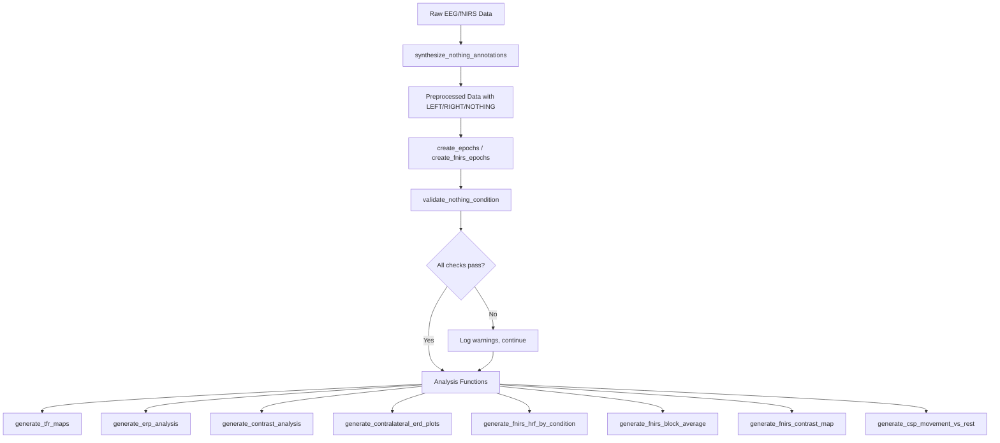

# Design Document: NOTHING (REST) Condition Integration

## Overview

This design integrates the NOTHING condition as a first-class third condition across all EEG and fNIRS analyses for sub-012. The changes fall into four categories:

1. **Timing fix**: Correct `synthesize_nothing_annotations()` parameters to produce 6-second NOTHING epochs (matching LEFT/RIGHT duration).
2. **Uncomment/extend**: Enable NOTHING in contralateral ERD/ERS plots (currently commented out) and add per-condition separation to fNIRS block average.
3. **Validation**: Add a `validate_nothing_condition()` function that checks epoch counts, durations, and presence in analysis outputs.
4. **No-regression**: Verify existing NOTHING support in TFR maps, ERP, contrast analysis, fNIRS HRF, and fNIRS contrast map continues to work.

The MOV vs NO_MOV CSP classifier already exists in `generate_csp_movement_vs_rest()` and requires no code changes — only validation that NOTHING epochs are correctly fed to it.

## Architecture



### Change Summary by File

| File | Change Type | Description |
|------|------------|-------------|
| `scripts/run_analysis_sub012.py` | Modify | Fix `rest_duration_cap` from 7.0 → 6.0, add logging of skipped trials |
| `scripts/run_analysis.py` → `generate_contralateral_erd_plots()` | Modify | Uncomment NOTHING lines in all 4 subplots (C3/C4 × alpha/beta) |
| `scripts/run_analysis.py` → `generate_fnirs_block_average()` | Modify | Add per-condition (LEFT/RIGHT/NOTHING) colored lines instead of grand average |
| `src/affective_fnirs/validation.py` | New file | `validate_nothing_condition()` function |
| `scripts/run_analysis_sub012.py` → `main()` | Modify | Call `validate_nothing_condition()` after epoch creation |
| `tests/test_nothing_condition.py` | New file | Unit tests and property tests for NOTHING validation |

## Components and Interfaces

### 1. `synthesize_nothing_annotations()` — Parameter Fix

Current call in `run_analysis_sub012.py` line ~187:
```python
raw_eeg = synthesize_nothing_annotations(raw_eeg, task_duration=7.0, rest_duration_cap=7.0)
```

Updated call:
```python
raw_eeg = synthesize_nothing_annotations(raw_eeg, task_duration=7.0, rest_duration_cap=6.0)
```

The function already computes `nothing_virtual_onset = task_end + 1.0`. With `rest_duration_cap=6.0`, the guard condition `available_rest_duration >= (rest_duration_cap + 1.0)` becomes `>= 7.0`, which is correct: 1s baseline gap + 6s epoch = 7s total needed from rest period.

The `duration` field on the annotation will be set to 6.0 (cosmetic for visualization; MNE epochs use tmin/tmax from config).

Additionally, the function needs enhanced logging:
```python
def synthesize_nothing_annotations(
    raw: mne.io.Raw,
    task_duration: float = 7.0,
    rest_duration_cap: float = 6.0,
) -> tuple[mne.io.Raw, dict[str, int]]:
```

Returns a tuple of (modified raw, synthesis_stats dict) where `synthesis_stats` contains:
- `n_created`: number of NOTHING annotations added
- `n_skipped`: number of trials skipped due to insufficient rest
- `n_source_trials`: total LEFT/RIGHT trials found

### 2. `generate_contralateral_erd_plots()` — Uncomment NOTHING

The function already computes `tfr_nothing` but the plotting lines are commented out. The change is to uncomment the 4 blocks (C3 alpha, C4 alpha, C3 beta, C4 beta) that plot NOTHING as a green dashed line.

Each block follows this pattern:
```python
if tfr_nothing is not None:
    c3_alpha_nothing = extract_band_power(tfr_nothing, 'C3', alpha_band)
    ax.plot(tfr_nothing.times, c3_alpha_nothing, linewidth=3,
            label='NOTHING (baseline)', color='#2ca02c', linestyle='--')
```

### 3. `generate_fnirs_block_average()` — Per-Condition Lines

Current implementation plots a single grand-average red line per channel. The redesign adds condition-separated lines:

```python
def generate_fnirs_block_average(
    fnirs_epochs: mne.Epochs,
    output_path: Path,
    config: SubjectConfig,
) -> Optional[Path]:
```

For each HbO channel subplot:
- Extract epochs per condition (LEFT, RIGHT, NOTHING)
- Plot mean ± std for each condition with distinct colors (blue, red, green)
- Fall back to grand average if no condition info available

### 4. `validate_nothing_condition()` — New Validation Function

```python
# src/affective_fnirs/validation.py

@dataclass
class NothingValidationResult:
    """Results from NOTHING condition validation checks."""
    epoch_count_ok: bool
    epoch_duration_ok: bool
    eeg_presence_ok: bool
    fnirs_presence_ok: bool
    n_nothing_epochs: int
    n_left_epochs: int
    n_right_epochs: int
    warnings: list[str]

def validate_nothing_condition(
    eeg_epochs: mne.Epochs | None,
    fnirs_epochs: mne.Epochs | None,
    nothing_annotations: mne.Annotations | None = None,
    expected_duration_sec: float = 6.0,
    count_tolerance_fraction: float = 0.1,
    duration_tolerance_sec: float = 0.1,
) -> NothingValidationResult:
```

Checks performed:
1. **Count parity**: `|n_nothing - n_left| / n_left <= 0.1` and same for RIGHT
2. **Duration**: All NOTHING annotation durations within `expected_duration_sec ± duration_tolerance_sec`
3. **EEG presence**: `'NOTHING'` key exists in `eeg_epochs.event_id`
4. **fNIRS presence**: `'NOTHING'` key exists in `fnirs_epochs.event_id` (if fnirs_epochs provided)

### 5. Integration in `run_analysis_sub012.py` `main()`

After epoch creation and before analysis, call validation:
```python
from affective_fnirs.validation import validate_nothing_condition

validation_result = validate_nothing_condition(
    eeg_epochs=eeg_results['epochs'],
    fnirs_epochs=fnirs_results['epochs'] if fnirs_results else None,
)
```

Log results and continue regardless (validation is advisory, not blocking).

## Data Models

### NothingValidationResult

```python
@dataclass
class NothingValidationResult:
    epoch_count_ok: bool
    epoch_duration_ok: bool
    eeg_presence_ok: bool
    fnirs_presence_ok: bool
    n_nothing_epochs: int
    n_left_epochs: int
    n_right_epochs: int
    warnings: list[str]

    @property
    def all_passed(self) -> bool:
        return (self.epoch_count_ok and self.epoch_duration_ok
                and self.eeg_presence_ok and self.fnirs_presence_ok)
```

### Synthesis Stats (returned by updated synthesize_nothing_annotations)

```python
@dataclass
class SynthesisStats:
    n_created: int
    n_skipped: int
    n_source_trials: int
```

### Config Parameters (already in `configs/sub-012.yml`)

No new config fields needed. The relevant existing fields:
- `trials.task_duration_sec: 7.0` — used as `task_duration` parameter
- `trials.rest_duration_sec: 7.0` — available rest (variable 8-16s in protocol)
- `epochs.eeg_tmin_sec: 0.0` / `epochs.eeg_tmax_sec: 7.0` — epoch window

The `rest_duration_cap=6.0` is passed as a function argument, not a config field, because it's derived from the epoch window (7.0 - 1.0 baseline gap = 6.0).


## Correctness Properties

*A property is a characteristic or behavior that should hold true across all valid executions of a system — essentially, a formal statement about what the system should do. Properties serve as the bridge between human-readable specifications and machine-verifiable correctness guarantees.*

### Property 1: Synthesis output correctness (onset + duration)

*For any* set of LEFT/RIGHT annotations with known onsets and a given `task_duration`, running `synthesize_nothing_annotations()` should produce NOTHING annotations where each virtual onset equals `source_onset + task_duration + 1.0` and each duration equals `rest_duration_cap` (6.0s), for all trials that have sufficient inter-trial rest.

**Validates: Requirements 1.1, 1.2**

### Property 2: Synthesis skip logic

*For any* set of LEFT/RIGHT annotations where some inter-trial rest periods are shorter than `rest_duration_cap + 1.0` seconds and some are longer, `synthesize_nothing_annotations()` should produce NOTHING annotations only for trials with sufficient rest (>= `rest_duration_cap + 1.0`s), and the count of created annotations plus the count of skipped trials should equal the total number of source LEFT/RIGHT trials.

**Validates: Requirements 1.3**

### Property 3: Validator correctness (count + duration checks)

*For any* triple of epoch counts `(n_left, n_right, n_nothing)` and any list of NOTHING durations, `validate_nothing_condition()` should return `epoch_count_ok=True` if and only if `|n_nothing - n_left| / n_left <= tolerance` AND `|n_nothing - n_right| / n_right <= tolerance`, and should return `epoch_duration_ok=True` if and only if all durations are within `expected_duration ± duration_tolerance`.

**Validates: Requirements 5.1, 5.2**

### Property 4: MOV/NO_MOV class composition

*For any* set of epochs containing LEFT, RIGHT, and NOTHING conditions, when constructing MOV vs NO_MOV labels for CSP classification, the MOV class should contain exactly `len(LEFT) + len(RIGHT)` trials and the NO_MOV class should contain exactly `len(NOTHING)` trials, with no trials lost or duplicated.

**Validates: Requirements 4.1**

## Error Handling

| Scenario | Handling | Requirement |
|----------|----------|-------------|
| No LEFT/RIGHT annotations found | Log warning, return raw unchanged with empty stats | 1.4 |
| Insufficient rest for all trials | Log warning with count, return raw with 0 NOTHING annotations | 1.3, 1.4 |
| NOTHING epochs absent when analysis expects them | Skip NOTHING-dependent plots/analyses, log warning, continue | 2.3, 4.4, 6.6 |
| Zero epochs for a condition in block average | Omit that condition's line, no error | 3.3 |
| Validation check fails | Log warning with details, continue analysis (non-blocking) | 5.4 |
| fNIRS data not available | Skip fNIRS validation checks, set `fnirs_presence_ok=True` by default | 5.3 |

All error handling follows the existing pipeline pattern: log and continue. No analysis function should raise an exception due to missing NOTHING condition.

## Testing Strategy

### Property-Based Testing

Library: `hypothesis` (already in `environment.yml` at version 6.98.0)

Each property test runs a minimum of 100 iterations. Tests are placed in `tests/test_nothing_condition.py`.

**Property 1**: Generate random annotation sets (random onsets with sufficient spacing, random task_duration in [5.0, 10.0]). Run `synthesize_nothing_annotations()` on a mock MNE Raw. Verify onset and duration of each output NOTHING annotation.
- Tag: **Feature: nothing-rest-condition, Property 1: Synthesis output correctness**

**Property 2**: Generate annotation sets with mixed inter-trial intervals (some < threshold, some >= threshold). Verify only valid trials produce NOTHING annotations and counts add up.
- Tag: **Feature: nothing-rest-condition, Property 2: Synthesis skip logic**

**Property 3**: Generate random `(n_left, n_right, n_nothing)` triples and random duration lists. Call the validator's logic and compare boolean outputs against the mathematical conditions.
- Tag: **Feature: nothing-rest-condition, Property 3: Validator correctness**

**Property 4**: Generate random epoch counts for LEFT, RIGHT, NOTHING. Verify label array construction preserves total count and class membership.
- Tag: **Feature: nothing-rest-condition, Property 4: MOV/NO_MOV class composition**

### Unit Tests

- Test `synthesize_nothing_annotations()` with a known 3-trial annotation set and verify exact output.
- Test `validate_nothing_condition()` with a passing case and a failing case.
- Test graceful degradation: call `generate_contralateral_erd_plots()` with epochs that have no NOTHING condition.
- Test `generate_fnirs_block_average()` with 3-condition epochs and verify figure has expected number of lines.
- Regression tests for existing NOTHING support in TFR, ERP, contrast, fNIRS HRF, fNIRS contrast.

### Running Tests

```powershell
micromamba run -n affective-fnirs pytest tests/test_nothing_condition.py -v
```
